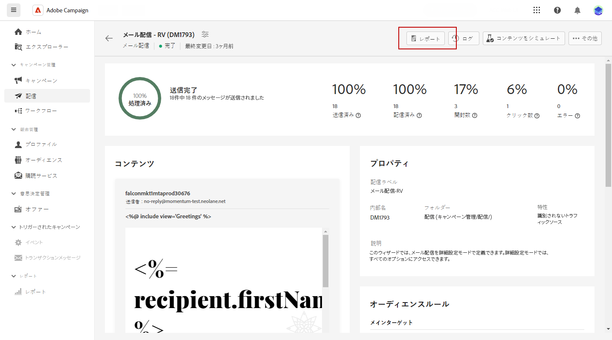
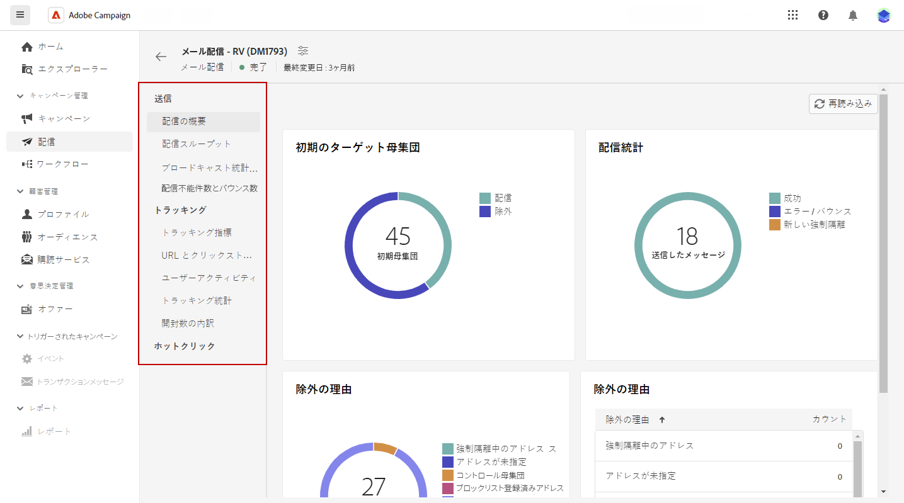

# 配信レポートへのアクセス {#reports}

Adobe Campaign には、配信ごとにアクセス可能な複数のタイプのレポートが用意されています。 これらのレポートを使用すると、メッセージの影響とパフォーマンスを組み込みダッシュボードで測定し視覚化できます。

レポートを表示するには、次の手順に従います。

1. 特定の配信のレポートを生成するには、 **[!UICONTROL 配信]** メニューを開き、レポートする配信を選択します。

1. お使いの **[!UICONTROL 配信]** ダッシュボードで、 **[!UICONTROL レポート]**.

   

1. 左メニューで、リストからレポートを選択します。

   

