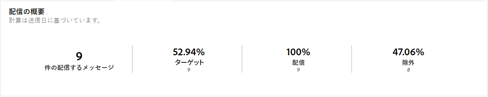
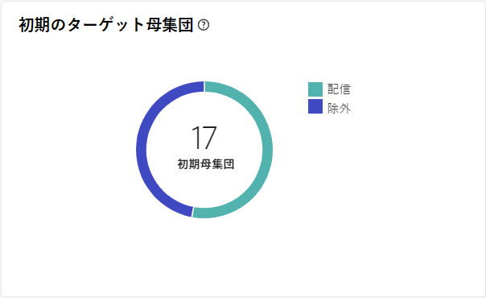
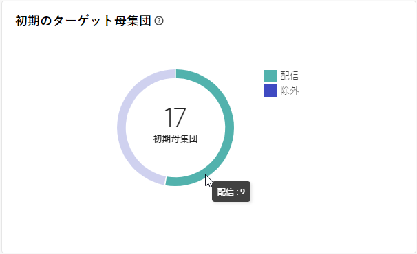
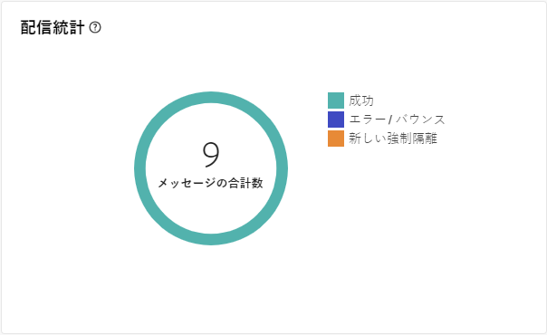
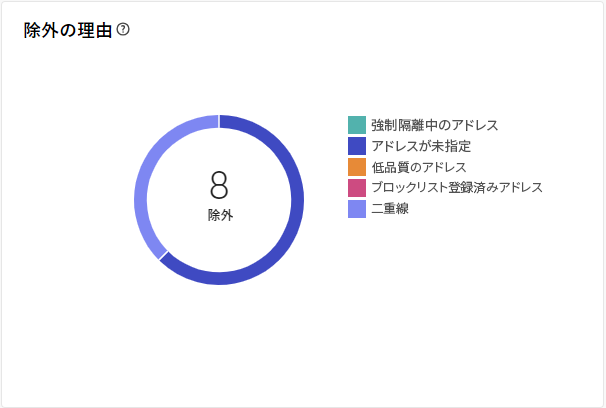
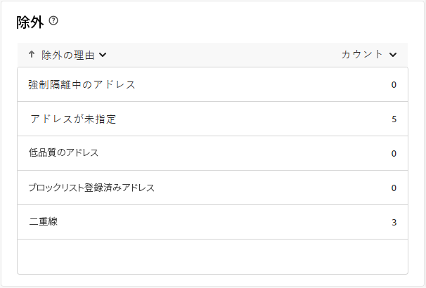

# ダイレクトメール配信レポート {#direct-mail-report}

**ダイレクトメール配信レポート** は、ダイレクトメール配信に固有の包括的なインサイトとデータを提供します。 個々の配信のパフォーマンス、有効性、結果に関する詳細情報が含まれ、完全な概要が提供されます。

## 配信の概要 {#delivery-summary-direct-mail}

### 配信の概要 {#delivery-overview-direct-mail}

>[!CONTEXTUALHELP]
>id="acw_delivery_reporting_delivery_overview_direct_mail"
>title="配信の概要"
>abstract="**配信の概要**&#x200B;には、各ダイレクトメール配信における訪問者のインタラクションに関する詳細なインサイトを提供する主要業績評価指標（KPI）が表示されます。指標の概要を以下に示します。"

**[!UICONTROL 配信の概要]** は、各ダイレクトメール配信との訪問者のインタラクションに関する詳細なインサイトを提供し、重要な主要業績評価指標（KPI）を示します。 指標の概要を以下に示します。

{zoomable="yes"}{align="center"}

+++配信の概要指標の詳細を説明します。

* **[!UICONTROL 配信メッセージ数]**：配信の準備中に処理されたメッセージの合計数。
* **[!UICONTROL ターゲット]**：ダイレクトメールメッセージのターゲットプロファイルとして認定されるユーザープロファイルの数。
* **[!UICONTROL 除外対象]**：ターゲットプロファイルから除外され、ダイレクトメールメッセージを受信しないユーザープロファイルの数。
+++

### 初期ターゲット母集団 {#direct-mail-delivery-targeted-population}

>[!CONTEXTUALHELP]
>id="acw_delivery_reporting_initial_target_direct_mail"
>title="初期ターゲット母集団"
>abstract="**初期ターゲット母集団**&#x200B;グラフには、配信準備の結果に基づいて、受信者とメッセージに関するデータが表示されます。"

**[!UICONTROL 初期ターゲット母集団]** グラフには、受信者に関連するデータが表示されます。 指標は配信の準備中に計算され、初期オーディエンス、送信するメッセージの数、除外された受信者の数が含まれます。

{zoomable="yes"}

グラフの一部にマウスを移動すると、正確な数値が表示されます。

{zoomable="yes"}

+++ダイレクトメール配信レポート指標の詳細を説明します。

* **[!UICONTROL 初期オーディエンス数]**：ターゲット受信者の合計数。
* **[!UICONTROL 配信]**：配信準備の後に配信されるメッセージの合計数。
* **[!UICONTROL 除外]**：ターゲット母集団から除外された受信者の合計数。
+++

### 配信統計 {#direct-mail-delivery-stats}

>[!CONTEXTUALHELP]
>id="acw_delivery_reporting_delivery_statistics_summary_direct_mail"
>title="配信統計"
>abstract="**配信統計**&#x200B;グラフには、ダイレクトメール配信の成功と発生したエラーの詳細が表示されます。"

**[!UICONTROL 配信統計]** グラフでは、配信パフォーマンスの概要が表示され、成功と有効性を測定するための詳細な指標が提供されます。

{zoomable="yes"}

+++ダイレクトメールキャンペーンレポート指標の詳細情報。

* **[!UICONTROL 送信済みメッセージ]**：配信準備の後に配信されるメッセージの合計数。
* **[!UICONTROL 成功]**：配信されるメッセージ数に対して、正常に処理されたメッセージ数、
* **[!UICONTROL エラー]**：配信と自動リバウンド処理の間に蓄積された、配信されるメッセージ数に対するエラーの合計数。
* **[!UICONTROL 新しい強制隔離]**：配信の失敗後（不明なユーザー、無効なドメインなど）に強制隔離されたアドレスの、配信されるメッセージ数に対する合計数。
+++

### 除外の理由 {#direct-mail-delivery-exclusions}

>[!CONTEXTUALHELP]
>id="acw_delivery_reporting_causes_exclusion_direct_mail"
>title="配信の除外の理由"
>abstract="**除外の理由**&#x200B;グラフには、配信の準備中に却下されたメッセージの配分がルールごとに分類されて表示されます。"

**[!UICONTROL 除外の原因]** グラフには、配信の準備中にメッセージが却下された理由の分類が表示されます。 この分類は、様々なルール別に整理され、メッセージの除外に貢献する要因の詳細なビューを提供します。 除外ルールについて詳しくは、[Campaign v8 （コンソール）ドキュメント ](https://experienceleague.adobe.com/docs/campaign/campaign-v8/send/failures/delivery-failures.html?lang=ja#email-error-types){_blank} を参照してください

{zoomable="yes"}{align="center" zoomable="yes"}

+++除外指標の原因の詳細はこちら。

* **[!UICONTROL 強制隔離中のアドレス]**：アドレスが強制隔離される際に生成されるエラータイプ。
* **[!UICONTROL アドレスが指定されていません]**：アドレスが存在しない場合に生成されるエラータイプ。
* **[!UICONTROL 低品質のアドレス]**：郵送先住所の品質評価が低すぎる場合に生成されるエラータイプ。
* **[!UICONTROL ブロックリストに加えるアドレス]**：受信者が配信中にブロックリストに加えるされたときに生成されたエラータイプ。
* **[!UICONTROL Double]**：一意でないキー値が原因で受信者が除外された場合に生成されるエラータイプ。
* **[!UICONTROL コントロール母集団]**：受信者のアドレスはコントロール母集団に含まれています。
* **[!UICONTROL サイズが制限されたターゲット]**：受信者に対する最大配信サイズに達しました。
+++

### 除外 {#direct-mail-exclusions}

>[!CONTEXTUALHELP]
>id="acw_delivery_reporting_exclusions_direct_mail"
>title="除外"
>abstract="**[!UICONTROL 除外]**&#x200B;テーブルには、配信準備プロセス中に却下されたメッセージの詳細な分類がルール別に表示されます。"

**[!UICONTROL 除外]** テーブルには、配信の準備中に却下されたメッセージの詳細な分類が、特定のルール別に分類されて表示されます。 この分類により、メッセージ除外の背後にある理由を明確に理解できます。

{zoomable="yes"}{align="center" zoomable="yes"}

使用可能な指標は、上記の[除外の理由](#direct-mail-delivery-exclusions)の指標と同じです。