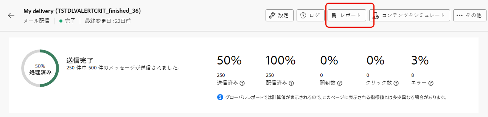

# 動的レポートの基本を学ぶ {#about-dynamic-reports}

動的レポートは、完全にカスタマイズ可能なリアルタイムのレポートを提供します。 プロファイルデータへのアクセスが追加され、開封数やクリック数などの機能的なメールキャンペーンデータに加えて、性別、市区町村、年齢などのプロファイルディメンション別のデモグラフィック分析が可能になります。 ドラッグ＆ドロップインターフェイスを使用してデータを分析し、最も重要な顧客セグメントに対するメールキャンペーンの効果や受信者への影響を測定できます。

## 動的レポートへのアクセス {#accessing-dynamic-reports}

「**レポート**」をクリックすると、各キャンペーンおよび配信のレポートにアクセスできます。 ポップアップウィンドウが開き、新しいブラウザータブで&#x200B;**動的レポート**&#x200B;ページにリダイレクトされることを通知します。

情報の収集と処理にかかる時間によっては、配信後すぐに利用できないレポートもあります。

動的レポートは次の 2 つのカテゴリに分かれています。

* **テンプレート**&#x200B;は、テンプレートの「**名前を付けて保存**」オプション（**プロジェクト／名前を付けて保存…**）を使用してコピーすることで変更できます 。
* **カスタムレポート**（青色で表示）は、**レポート**&#x200B;ホームページの「**新規プロジェクトの作成**」ボタンをクリックすることで、直接作成できます。

