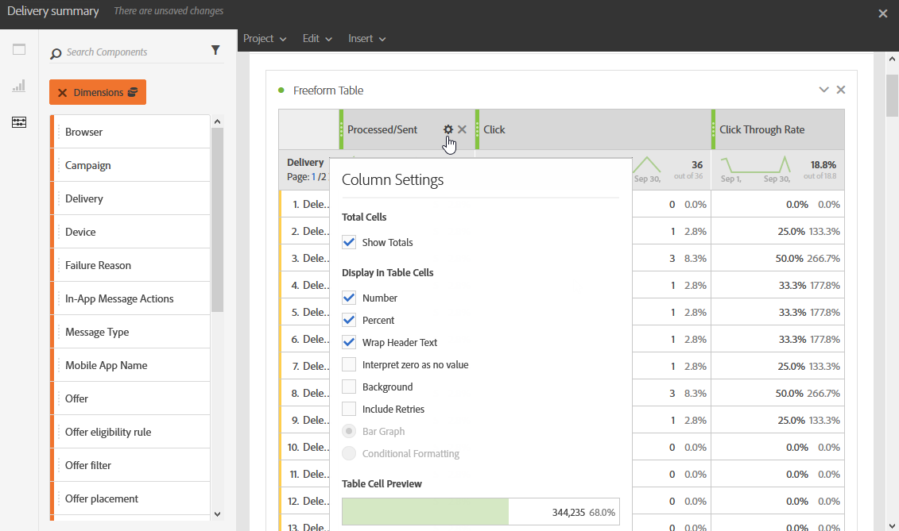

# パネルの追加{#adding-panels}

## 空のパネルの追加 {#adding-a-blank-panel}

レポートを開始するには、標準またはカスタムのレポートに一連のパネルを追加します。各パネルは、様々なデータセットを含み、フリーフォームテーブルとビジュアライゼーションで構成されています。

このパネルを使用すると、必要に応じてレポートを作成できます。異なる期間でデータをフィルタリングするために、レポートに必要な数のパネルを追加できます。

1. 「**パネル**」アイコンをクリックします。また、「**タブを挿入**」をクリックして「**新しい空のパネルl**」を選択することで、パネルを追加することもできます。

   

1. **空のパネル**&#x200B;をダッシュボードにドラッグ＆ドロップします。

   

これで、パネルにフリーフォームテーブルを追加して、データのターゲティングを開始できるようになりました。

## フリーフォームテーブルの追加 {#adding-a-freeform-table}

フリーフォームテーブルでは、**コンポーネント**&#x200B;テーブルにある様々な指標やディメンションを使ってテーブルを作成し、データを分析できます。

各テーブルとビジュアライゼーションはサイズ変更したり、移動したりしてレポートをカスタマイズできます。

1. **[!UICONTROL パネル]**&#x200B;アイコンをクリックします。

   

1. **[!UICONTROL フリーフォーム]**&#x200B;項目をダッシュボードにドラッグ＆ドロップします。

   また、「**[!UICONTROL 挿入]**」タブをクリックして「**[!UICONTROL 新しいフリーフォーム]**」を選択するか、空のパネルで「**[!UICONTROL フリーフォームテーブルを追加]**」をクリックして、テーブルを追加することもできます。

   

1. 「**[!UICONTROL セグメントをここにドロップ]**」フィールドで、上部のバーに「**[!UICONTROL コンポーネント]**」タブの&#x200B;**[!UICONTROL セグメント]**&#x200B;を追加します。

   

1. 列と行に「**[!UICONTROL コンポーネント]**」タブの項目をドラッグ＆ドロップして、テーブルを作成します。

   

1. 「**[!UICONTROL 設定]**」アイコンをクリックして、列のデータの表示方法を変更します。

   

   「**[!UICONTROL 列設定]**」の構成要素は次のとおりです。

   * **[!UICONTROL 数値]**：列の概要の数値を表示または非表示にできます。
   * **[!UICONTROL パーセント]**：列のパーセントを表示または非表示にできます。
   * **[!UICONTROL ゼロを値なしとして解釈]**：値が 0 と等しい場合に表示または非表示にできます。
   * **[!UICONTROL 背景]**：セル内の水平プログレスバーを表示または非表示にできます。
   * **[!UICONTROL 再試行を含める]**：結果に再試行を含めることができます。これは、**[!UICONTROL 送信済み]**&#x200B;および&#x200B;**[!UICONTROL バウンス数 + エラー数]**&#x200B;でのみ使用できます。

1. 1 つまたは複数の行を選択して、「**[!UICONTROL 視覚化]**」アイコンをクリックします。ビジュアライゼーションが追加され、選択した行が反映されます。

   

必要な数のコンポーネントを追加し、ビジュアライゼーションを追加して、データをグラフで表示できるようになりました。
