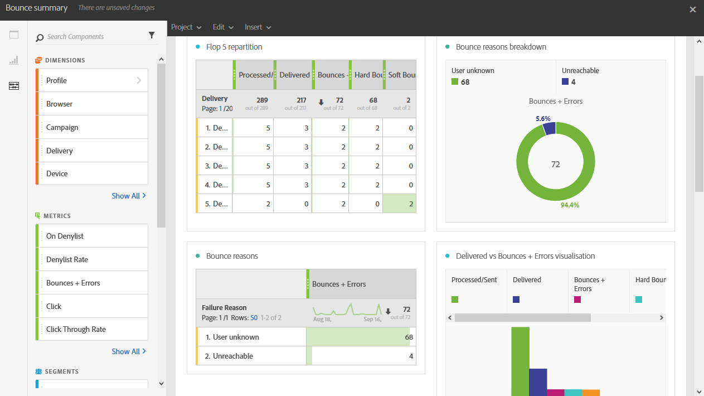

# バウンス概要{#bounce-summary}

このレポートには、配信中に発生したハードエラーとソフトエラーの全般、およびバウンスの自動処理の詳細が記載されます。

各テーブルは、概要の数値とグラフで表されています。 それぞれのビジュアライゼーション設定で、詳細の表示方法を変更できます。

**フロップ 5 の再区分**&#x200B;には、強制隔離数が最も多い 5 つの配信が一覧表示されます。

**バウンスの理由**&#x200B;テーブルには、各配信でバウンスの原因となったエラーの種類に関する利用可能なデータが含まれています。

* **[!UICONTROL 不明なユーザー]**：配信が無効なメールアドレスに送信されたときに生成されるエラーの種類。
* **[!UICONTROL 無効なドメイン]**：ドメインが正しくないか、存在しないメールアドレスに配信が送信されたときに生成されるエラーの種類。
* **[!UICONTROL 未到達]**：ドメインに一時的にアクセスできないなど、メッセージ配信文字列で発生したエラーの種類。
* **[!UICONTROL 無効なアカウント]**：存在しないメールアドレスに配信が送信された場合に生成されるエラーの種類。
* **[!UICONTROL メールボックス容量超過]**：受信者のインボックスがいっぱいであるときに生成されるエラーの種類。 このエラーが生成されるまで、メッセージを配信する試みは 5 回あります。
* **[!UICONTROL 未接続]**：受信者の携帯電話がオフになっているか、メッセージの送信時にネットワークに接続されていない場合に生成されるエラーの種類。

  >[!NOTE]
  >
  >この種のエラーは、モバイルチャネルでの配信のみに該当します。

* **[!UICONTROL 拒否]**：アドレスがインターネットサービスプロバイダー（ISP）によって拒否される場合に生成されるエラーの種類。 例えば、スパム対策ソフトウェアによってセキュリティルールが適用された場合などです。

**ドメインの再区分**&#x200B;テーブルには、受信者ドメインに応じた、配信中に発生した全体的な問題が表示されます。
