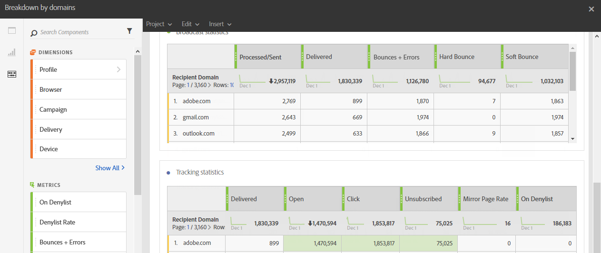

# ドメイン別の分類{#breakdown-by-domains}

このレポートには、メール配信のオーディエンスで表される各ドメインのパフォーマンスデータが含まれています。 キャンペーンレポートまたはプログラムレポートの場合は、パフォーマンスデータを複数のオーディエンスで使用できます。 このデータを使用して、特定のイベントに対する各ドメインの反応を分析できます。 例えば、リンク表示、ブロックリストに登録されている URL などです。

**ブロードキャスト統計情報**&#x200B;テーブルには、各ドメインで発生する可能性のあるエラーに関する次のような利用可能なデータが含まれています。

* **処理済み / 送信済み**：送信されたメールの数。
* **配信済み**：配信されたメールの数。
* **バウンス数 + エラー数**：配信できなかったメッセージの数。
* **ハードバウンス**：永続的なエラー（メールアドレスの間違いなど）の合計数。
* **ソフトバウンス**：一時的なエラー（受信トレイが満杯など）の合計数。

2 つ目のテーブルの&#x200B;**トラッキング統計**&#x200B;には、配信に対する受信者の反応についての次のような利用可能なデータが含まれます。

* **配信済み**：正常に配信されたメールの数。
* **開封**：1 つの配信で、あるメッセージが開かれた回数。
* **クリック**：1 つの配信で、あるコンテンツがクリックされた回数。
* **購読解除済み**：購読リンクがクリックされた回数。
* **ミラーページ**：ミラーページリンクがクリックされた回数。
* **ブロックリスト登録済み**：メールをスパムまたは迷惑メールとして報告した受信者の数。
