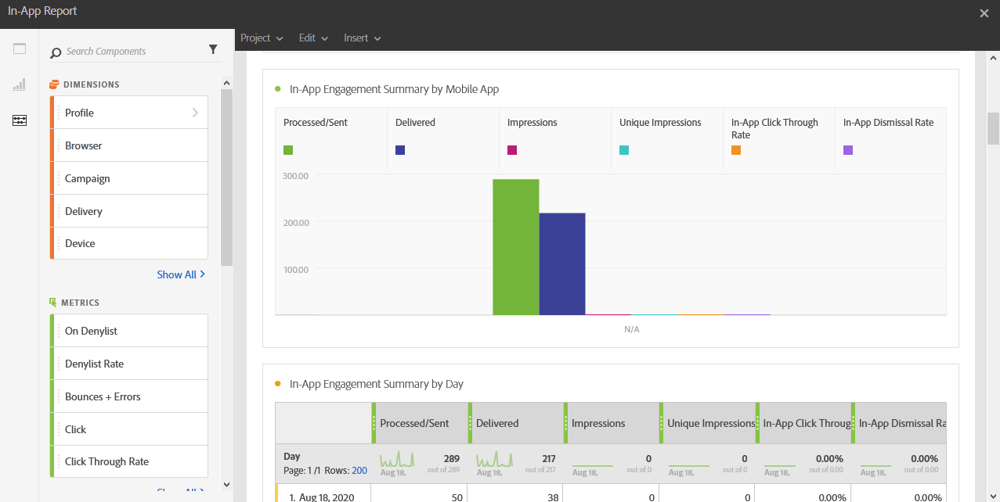

# アプリ内レポート{#in-app-report}

>[!CAUTION]
>
>配信タイプ（この場合はアプリ内配信）に応じてデータを分割するには、**[!UICONTROL メッセージタイプ]**&#x200B;の指標をテーブルにドラッグ＆ドロップする必要があります。

**アプリ内**&#x200B;レポートは、アプリ内配信に関連する詳細を提供します。

各テーブルは、概要の数値とグラフで表されています。それぞれのビジュアライゼーション設定で、詳細の表示方法を変更できます。

最初のテーブルの&#x200B;**アプリ内エンゲージメントの概要**&#x200B;は、日別、モバイルアプリ別および配信別の 3 つのカテゴリに分類されています。カテゴリには、配信に対する受信者の反応についての次のような利用可能なデータが含まれます。

* **[!UICONTROL 処理済み / 送信済み]**：アプリ内配信の送信の合計数。
* **[!UICONTROL 配信済み数]**：送信されたアプリ内メッセージの合計数に対して、正常に送信できたメッセージの数。
* **[!UICONTROL インプレッション数]**：トリガー基準を満たしているかどうかに応じて、受信者に表示されるアプリ内メッセージの合計数。
* **[!UICONTROL ユニークインプレッション数]**：受信者ごとのインプレッション数。
* **[!UICONTROL アプリ内クリックスルー率]**：メッセージを表示したユーザーと比較した、ボタン 1 またはボタン 2 をクリックしたユーザーの割合。
* **[!UICONTROL アプリ内解除率]**：受信者が解除したアプリ内メッセージの割合。

2 つ目のテーブルの&#x200B;**アプリ内のクリック数および解除率**&#x200B;は、日別、モバイルアプリ別および配信別の 3 つのカテゴリに分類されます。カテゴリには、配信ごとの受信者の行動に関する利用可能なデータが含まれます。

* **[!UICONTROL アプリ内クリック数]**：ボタン 1 またはボタン 2 をクリックした受信者の合計数。
* **[!UICONTROL ユニークアプリ内クリック数]**：受信者がボタン 1 またはボタン 2 をクリックした回数。
* **[!UICONTROL アプリ内解除]**：受信者が「閉じる」ボタンをクリックするか、自動解除することによって解除したメッセージの合計数。
* **[!UICONTROL ユニークアプリ内解除]**：受信者がアプリ内メッセージを解除した回数。
