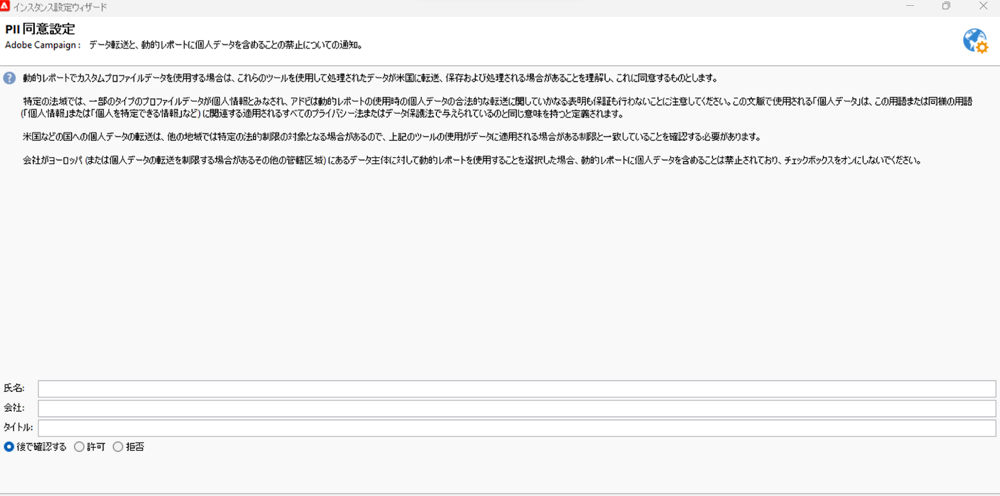

# 動的レポートの使用契約 {#pii-agreement}

動的レポートの使用契約の目的は、データ処理のポップアップ同意として機能することです。デフォルトでは、この契約書は表示のみ可能で、管理権限を割り当てられたユーザーのみが承諾または拒否できます。

動的レポートの使用契約にアクセスするには、**[!UICONTROL ツール]**／**[!UICONTROL 詳細]**／**[!UICONTROL デプロイメントウィザード]**&#x200B;を選択します。

次の 3 つのオプションを選択できます。

* **[!UICONTROL 後で確認する]**：契約を承諾または拒否するまで、プロファイルディメンションはレポートに表示されず、顧客の個人情報は収集または送信されません。
* **[!UICONTROL 承諾する]**：本契約を承諾することにより、ユーザーは、Adobe Campaign が顧客の個人情報を収集し、それをレポートセンターまたはデータセンターに転送することを許可するものとします。
* **[!UICONTROL 拒否する]**：本契約を拒否すると、プロファイルディメンションはレポートに表示されず、顧客の個人情報は収集または送信されません。この場合でも、externalID は引き続き収集され、エンドユーザーの識別に使用されます。

次の表は、この契約書を承諾した後に行われる内容を地域別に示したものです。

|  | 動的レポート | Microsoft Dynamics 365 コネクタ |
|---|---|---|
| 南北アメリカおよび APAC（アジア太平洋） | **利用可能な機能**。 米国レポートセンターにプッシュされるすべての標準（市区町村、国／地域、都道府県、性別、年齢ベースのセグメント）およびカスタムのプロファイル。 | **利用可能な機能**。 すべての標準およびカスタムのプロファイルフィールドとAdobe Campaign イベントフィールドは、米国データセンターで処理されます。 |
| EMEA（ヨーロッパ、中東、アフリカ） | **利用可能な機能**。 EMEA レポートセンターにプッシュされるすべての標準（市区町村、国／地域、都道府県、性別、年齢ベースのセグメント）とカスタムのプロファイル。 | **利用可能な機能。**  EMEA データセンターで処理されるすべての標準およびカスタムのプロファイルフィールドと Adobe Campaign イベントフィールド。米国データセンターで送信および保存される、Adobe I/O の登録データと顧客のエンドユーザーイベントの ID が含まれる **[!UICONTROL コントロールデータ&#x200B;]**。 |

次の表は、この契約を拒否した後に行われる内容を地域別に示したものです。この契約を拒否した場合でも、配信と Microsoft Dynamics 365 の統合に関するレポートは引き続き使用できます。

| 地域 | 動的レポート | Microsoft Dynamics 365 コネクタ |
|---|---|---|
| 南北アメリカおよび APAC（アジア太平洋） | **利用可能な機能**。 米国のレポートセンターにプッシュされる標準およびカスタムのプロファイル情報はありません（ExternalID を除く）。 | **利用可能な機能**。 外部 ID と受信者 ID を除き、米国データセンターに送信される標準またはカスタムのプロファイルフィールドはありません。 米国データセンターで処理されるすべての Adobe Campaign イベントフィールド（ミラーページ ID を除く）。 |
| EMEA（ヨーロッパ、中東、アフリカ） | **利用可能な機能**。 ExternalID を除き、EMEA のレポートセンターにプッシュされる標準およびカスタムのプロファイル情報はありません。 | **利用可能な機能。**  外部 ID と受信者 ID を除き、EMEA データセンターに送信される標準またはカスタムのプロファイルフィールドはありません。 EMEA データセンターで処理されるすべての Adobe Campaign イベントフィールド（ミラーページ ID を除く）。 |

この選択は最終的なものではありません。**[!UICONTROL 管理]**／**[!UICONTROL プラットフォーム]**／**[!UICONTROL オプション]** の順にクリックし、**[!UICONTROL realtimeReporting_collectPII]** オプションを選択することで、いつでも変更できます。

この値はいつでも変更できます。値 1 は&#x200B;**[!UICONTROL 後で確認する]**、値 2 は&#x200B;**[!UICONTROL 拒否する]**、値 3 は&#x200B;**[!UICONTROL 承諾する]**&#x200B;にそれぞれ対応します。
