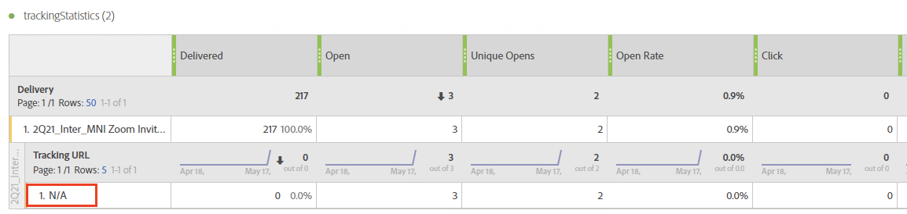

# トラブルシューティング{#troubleshooting}

このセクションでは、動的レポートに関するよくある質問を紹介します。

## 動的レポートは使用できる言語は何ですか？ {#langages}

現在、動的レポートは英語でのみ使用できます。

## ユニーク開封数およびユニーククリック数で、集計行のカウントが個々の行のカウントと一致しない {#unique-open-clicks-no-match}

これは想定されている動作です。
この動作について、次の例を使って説明します。

プロファイル P1 および P2 にメールが送信されます。

P1 が 1 日目にメールを 2 回開き、2 日目に 3 回開きました。

一方、P2 は、最初の日にメールを 1 回開き、次の日以降は再度開きませんでした。
次に、送信されたメールに対するプロファイルのインタラクションを視覚的に表します。

<table> 
 <thead> 
  <tr> 
   <th align="center"> <strong>日</strong>   </th> 
   <th align="center"> <strong>開封数</strong>   </th> 
   <th align="center"> <strong>ユニーク開封数</strong>   </th> 
  </tr> 
 </thead> 
 <tbody> 
  <tr> 
   <td align="center"> 1 日目  </td> 
   <td align="center"> 2 + 1 = 3  </td> 
   <td align="center"> 1 + 1 = 2  </td> 
  </tr> 
  <tr> 
   <td align="center"> 2 日目  </td> 
   <td align="center"> 3 + 0 = 3  </td> 
   <td align="center"> 1 + 0 = 1  </td> 
  </tr>
 </tbody> 
</table>

ユニーク開封数の合計を把握するには、**[!UICONTROL ユニーク開封数]**&#x200B;の行カウントの合計を求める必要があります。この場合、値は 3 になります。ただし、メールのターゲットとなったプロファイルは 2 つだけなので、開封率は 150％です。

100％を超える開封率を取得しないようにするため、**[!UICONTROL ユニーク開封数]**&#x200B;の定義は、開封された一意の broadlog の数に維持されます。この場合、P1 が 1 日目と 2 日目にメールを開いても、ユニーク開封数は 1 のままになります。

結果は以下の表のようになります。

<table> 
 <thead> 
  <tr> 
   <th align="center"> <strong></strong>   </th> 
   <th align="center"> <strong>開封数</strong>   </th> 
   <th align="center"> <strong>ユニーク開封数</strong>   </th> 
  </tr> 
 </thead> 
 <tbody> 
  <tr> 
   <td align="center"> <strong>日</strong>  </td> 
   <td align="center"> <strong>6</strong>  </td> 
   <td align="center"> <strong>2</strong>  </td>
  </tr> 
  <tr> 
   <td align="center"> 1 日目  </td> 
   <td align="center"> 3  </td> 
   <td align="center"> 2  </td>
  </tr> 
  <tr> 
   <td align="center"> 2 日目  </td> 
   <td align="center"> 3  </td> 
   <td align="center"> 1  </td> 
  </tr> 
 </tbody> 
</table>

>[!NOTE]
>
>ユニークカウントは HLL ベースのスケッチに基づいています。大きなカウントでは、わずかな不正確さが生じる場合があります。

## 開封のカウントがデータベースのカウントと一致しない {#open-counts-no-match-database}

これは、**[!UICONTROL 開封]**&#x200B;アクションを追跡できない場合でも、動的レポートでヒューリスティックを使用して、開封数を追跡していることが原因である可能性があります。

例えば、ユーザーがクライアントで画像を無効にし、メール内のリンクをクリックした場合、**[!UICONTROL 開封]**&#x200B;はデータベースで追跡されませんが、**[!UICONTROL クリック]**&#x200B;は追跡されます。

そのため、**[!UICONTROL 開封]**&#x200B;のトラッキングログのカウントが、データベース内のカウントと同じにならない場合があります。

このような状況は、「**メールのクリックはメールを開封したことを意味する**」として、カウントに追加されます。

>[!NOTE]
>
>ユニークカウントは HLL ベースのスケッチに基づいているため、カウント間でわずかな不一致が生じる場合があります。

## 繰り返し配信またはトランザクション配信のカウントはどのように計算されますか？ {#counts-recurring-deliveries}

繰り返し配信とトランザクション配信を操作する場合、カウントは親と子の両方の配信に関連付けられます。
例えば、**R1** という名前の繰り返し配信を、1 日目（RC1）、2 日目（RC2）、3 日目（RC3）に毎日実行するように設定するとします。
1 人のユーザーのみが、すべての子配信を複数回開いたとします。この場合、個々の繰り返し子配信では、**[!UICONTROL 開封数]**のカウントがそれぞれ 1 として表示されます。
ただし、同じユーザーがすべての配信をクリックしているため、親の繰り返し配信にも**[!UICONTROL ユニーク開封数]**&#x200B;が 1 として表示されます。

レポートは次のようになります。

<table> 
 <thead> 
  <tr> 
   <th align="center"> <strong>配信</strong>   </th> 
   <th align="center"> <strong>送信済み</strong>   </th> 
   <th align="center"> <strong>配信済み</strong>   </th>
   <th align="center"> <strong>開封数</strong>   </th> 
   <th align="center"> <strong>ユニーク開封数</strong>   </th>
  </tr> 
 </thead> 
 <tbody> 
  <tr> 
   <td align="center"> <strong>R1</strong>  </td> 
   <td align="center"> <strong>100</strong>  </td> 
   <td align="center"> <strong>90</strong>  </td> 
   <td align="center"> <strong>10</strong>  </td> 
   <td align="center"> <strong>3</strong>  </td> 
  </tr> 
  <tr> 
   <td align="center"> RC1  </td> 
   <td align="center"> 20  </td> 
   <td align="center"> 20  </td> 
   <td align="center"> 6  </td> 
   <td align="center"> 1  </td> 
  </tr>
    <tr> 
   <td align="center"> RC2  </td> 
   <td align="center"> 40  </td> 
   <td align="center"> 30  </td> 
   <td align="center"> 2  </td> 
   <td align="center"> 1  </td> 
  </tr> 
    <tr> 
   <td align="center"> RC3  </td> 
   <td align="center"> 40  </td> 
   <td align="center"> 40  </td> 
   <td align="center"> 2  </td> 
   <td align="center"> 1  </td> 
  </tr> 
 </tbody> 
</table>

## レポートの表の色は何を示していますか？ {#reports-color-signification}

レポートに表示される色はランダムになっており、パーソナライズすることはできません。これらは進捗バーを表し、レポートで到達した最大値を適切に強調するためのものです。

次の例では、値が 100％であるため、セルは同じ色です。

**[!UICONTROL 条件付き書式]**&#x200B;をカスタムに変更した場合、値が上限に達すると、セルの色が緑色になります。一方、値が下限に達すると赤色になります。

例えば、**[!UICONTROL 上限]**&#x200B;を 500 に、**[!UICONTROL 下限]**&#x200B;を 0 に設定します。

## 値「N/A」がレポートに表示されるのはなぜですか？

動的レポートには **N/A** という値が表示されることがあります。表示される理由として、次の 3 つが考えられます。

* 配信が削除されており、結果に不一致が生じないようにするため、その配信が **N/A** として表示されている場合。
* **[!UICONTROL トランザクション配信]**&#x200B;ディメンションをレポートにドラッグ＆ドロップすると、**N/A** という値が表示される場合があります。この値が表示されるのは、配信がトランザクションでない場合であっても、動的レポートがすべての配信を取得するためです。この状態は、**[!UICONTROL 配信]**&#x200B;ディメンションをレポートにドラッグ＆ドロップしたときにも発生することがありますが、この場合、**N/A** 値はトランザクション配信を表します。
* ディメンションに関連しない指標と共にディメンションが使用される場合。次の例では、この配信で&#x200B;**[!UICONTROL クリック]**&#x200B;カウントが 0 に設定されていても、**[!UICONTROL トラッキング URL]** ディメンションで分類が追加されます。

  

## カスタムターゲットマッピングを使用すると、配信のレポートに不完全なデータが表示される

読み込んだカスタムターゲットマッピングを配信で使用していて、別のレポートにデータが表示されない場合は、これらのターゲットマッピングに対してレポートエンリッチメントが作成されなかった可能性があります。

これを解決するには、以下を行います。

* XML からターゲットマッピングを読み込んだ後、レポートエンリッチメントも読み込む必要があります。

* ターゲットマッピングを読み込む代わりに、Adobe Campaign web ユーザーインターフェイスで直接作成すると、レポートエンリッチメントが自動的に作成されます。

## 列ヘッダー番号と行の合計が一致しない

次の場合には、列ヘッダー番号とすべての行の合計が一致しないことが予想されます。

* **ユニーク数指標**：ユニーク数指標を使用すると、単純な行数の合計ではなく受信者 ID に基づいて計算されるため、ヘッダーに表示される合計カウントが変わります。その結果、1 つのプロファイルが様々なディメンションにわたって多数のイベントをトリガーするため、データセットに複数の行が含まれる場合があります。ただし、ヘッダーでは、各プロファイルは 1 回だけカウントされます。

  例：

   * プロファイル A が 3 つの異なる日にメールを開封した場合、日別の分類では A が 3 行で表示されますが、ヘッダーでは A は 1 としてカウントされます。

   * プロファイル A が同じ日にメール内の 3 つの異なるリンクをクリックすると、トラッキング URL 別の分類では A が 3 行で表示されますが、ヘッダーでは A は 1 としてカウントされます。デバイスとブラウザー別の分類でも同様にカウントされます。

* **開封数指標**：開封カウントは、実際の開封イベントとユニーククリックイベント（受信者 ID あたり）の両方の合計を集計することによって決定されます。ただし、開封イベントが発生しなければメールリンクをクリックできないため、開封イベントが発生していない場合を除きます。

  例：

   * プロファイル A がトラッキング対象のメール（URL U1 を含む）を開くと、null と示された URL を含む開封イベントとして登録されます。U1 を後でクリックすると、クリックイベントが生成されます。A が U1 をクリックすると開封イベントとしてカウントされますが、U1 に対する特定の開封イベントはありません。したがって、A はユニーク開封カウントで 1 回のみカウントされます。

   * プロファイル R が 1 日目にメールを開き、開封イベントを登録して、リンクをクリックします。次の 2 日間で、R はメールを再度開き、リンクを再度クリックして、毎日クリックイベントを生成します。R のエンゲージメントは、開封数では毎日トラッキングされますが、一意のエンゲージメントに焦点が当てられるため、R は列ヘッダーでは1 回のみカウントされます。

* **否定されたイベント**：レポートでは、否定されたイベントとは、最初に成功とマークされたが、再試行した後に最終的に失敗した配信を指します。これらのイベントは、–1 としてカウントされます。混乱を避けるために、これらの負の数は、表示される配信指標数から除外されます。その結果、配信指標のすべての行の合計が列ヘッダー番号と一致しない場合があります。
