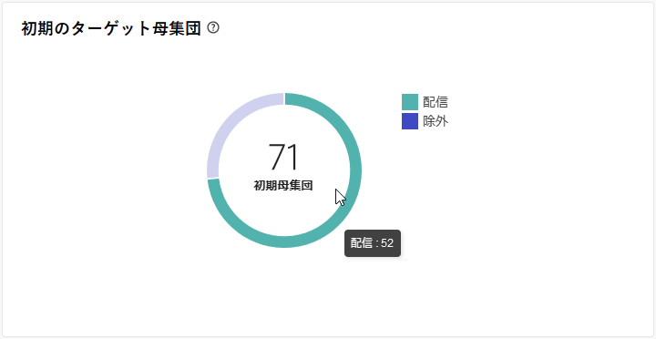
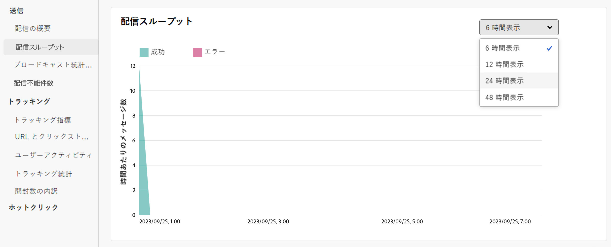
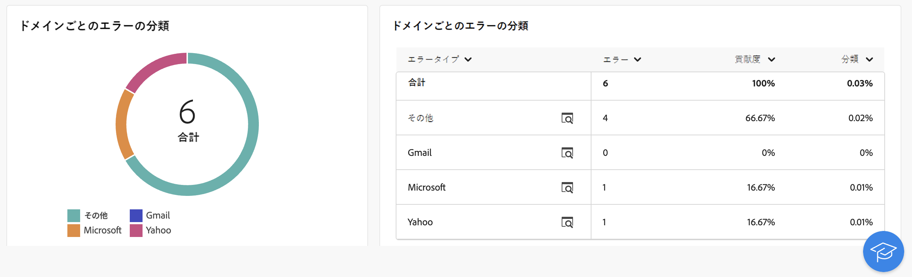
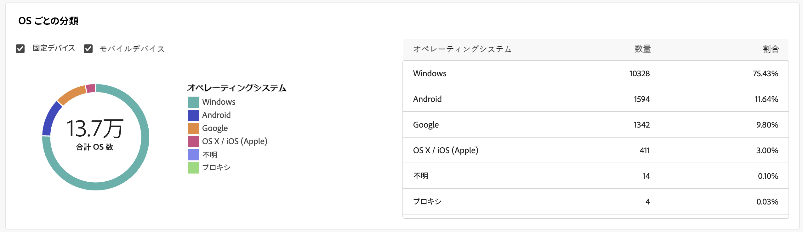

# メール配信レポート {#email-report}

**メール配信レポート**&#x200B;では、メールチャネルに固有の包括的なインサイトとデータが提供されます。個々の配信のパフォーマンス、有効性、結果に関する詳細情報が提供され、包括的な概要が得られます。

## 配信の概要 {#delivery-summary-email}

>[!CONTEXTUALHELP]
>id="acw_delivery_reporting_sending_email"
>title="送信のレポート"
>abstract="レポート内の「**送信**」タブでは、訪問者の配信とのやり取りや、訪問者が遭遇した可能性のある潜在的なエラーに関する詳細なインサイトを提供します。"

### 初期のターゲット母集団 {#email-delivery-targeted-population}

>[!CONTEXTUALHELP]
>id="acw_delivery_reporting_initial_target"
>title="初期のターゲット母集団"
>abstract="The **初期ターゲット母集団** グラフには、配信準備の結果に基づいて、受信者とメッセージに関するデータが表示されます。"

The **[!UICONTROL 初期ターゲット母集団]** グラフには、受信者に関連するデータが表示されます。 配信の準備および表示中に指標が計算されます。初期オーディエンス、送信するメッセージ数、除外された受信者数が表示されます。

{width="50%" align="left" zoomable="yes"}

グラフの一部にマウスポインターを置くと、正確な数が表示されます。

{width="50%" align="left" zoomable="yes"}

+++詳しくは、メール配信レポート指標を参照してください。

* **[!UICONTROL 初期オーディエンス]**：ターゲット受信者の合計数。

* **[!UICONTROL 配信]**：配信準備の後に配信されるメッセージの合計数。

* **[!UICONTROL 除外]**：ターゲット母集団から除外された受信者の合計数。
+++

### 配信統計 {#email-delivery-stats}

>[!CONTEXTUALHELP]
>id="acw_delivery_reporting_delivery_statistics_summary"
>title="配信統計"
>abstract="The **配信統計** グラフには、配信の成功と発生したエラーの詳細が表示されます。"

The **[!UICONTROL 配信統計]** グラフには、配信の成功の詳細が表示されます。 以下に、指標について詳しく説明します。

{width="50%" align="left" zoomable="yes"}

+++詳しくは、メールキャンペーンレポート指標を参照してください。

* **[!UICONTROL 送信済みメッセージ]**：配信準備の後に配信されるメッセージの合計数。

* **[!UICONTROL 成功]**：配信されるメッセージ数に関して正常に処理されたメッセージ数。

* **[!UICONTROL エラー]**：配信と自動リバウンド処理の間に、配信されるメッセージ数に関して累積したエラーの合計数。

* **[!UICONTROL 新しい強制隔離]**：配信の失敗後（不明なユーザー、無効なドメイン）に、配信されるメッセージ数に関して強制隔離されたアドレスの合計数。

+++

### 除外の理由  {#email-delivery-exclusions}

>[!CONTEXTUALHELP]
>id="acw_delivery_reporting_exclusion"
>title="配信統計"
>abstract="The **除外の理由** グラフおよび表は、配信の準備中に却下されたメッセージのルールごとの分類を示します。"

The **[!UICONTROL 除外の理由]** グラフおよび表は、配信の準備中に却下されたメッセージのルールごとの分類を示します。 除外ルールについて詳しくは、 [Campaign v8（コンソール）ドキュメント](https://experienceleague.adobe.com/docs/campaign/campaign-v8/send/failures/delivery-failures.html#email-error-types){_blank}.

{align="center" zoomable="yes"}

+++詳しくは、メール配信レポート指標を参照してください。

* **[!UICONTROL 不明なユーザー]**：メールアドレスが無効であることを示すエラータイプで、配信中に生成される。

* **[!UICONTROL 無効なドメイン]**：メールアドレスが正しくないか存在しないことを示すエラータイプ。配信の送信中に生成される。

* **[!UICONTROL メールボックス容量超過]**：受信者の受信ボックスにあるメッセージの数が多すぎることを示すエラータイプで、5 回の配信の試行後に生成される。

* **[!UICONTROL 無効なアカウント]**：アドレスが存在しないことを示すエラータイプ。配信の送信中に生成される。

* **[!UICONTROL 拒否]**：アドレスが IAP（インターネットアクセスプロバイダー）によって却下される場合に生成されるエラータイプ。例えば、セキュリティルールのアプリケーション（スパム対策ソフトウェア）によって却下された場合に生成される。

* **[!UICONTROL 未到達]**：SMTP リレーでのインシデント、ドメインへの一時的な未到達など、メッセージ配分文字列で発生するエラータイプ。

* **[!UICONTROL 未接続]**：受信者の携帯電話の電源が入っていない、または送信時にネットワーク接続が切断されていることを示すエラータイプ。

+++

## 配信スループット {#delivery-throughtput}

>[!CONTEXTUALHELP]
>id="acw_delivery_reporting_throughput_email"
>title="配信スループット"
>abstract="**配信スループット**&#x200B;レポートには、指定した期間内のプラットフォーム全体の配信スループットに関する詳細情報が表示されます。"

このレポートには、指定した期間内のプラットフォーム全体の配信スループットに関する詳細情報が表示されます。メッセージ配信速度の測定に使用される主な指標は、1 時間あたりに送信されるメッセージの数です。

{align="center" zoomable="yes"}

## ブロードキャスト統計情報 {#broadcast-statistics}

>[!CONTEXTUALHELP]
>id="acw_delivery_reporting_broadcast_statistics"
>title="ブロードキャスト統計情報"
>abstract="The **ブロードキャスト統計** レポートには、各ドメインで発生した可能性のあるエラーに関する使用可能なデータが含まれます。"

**[!UICONTROL ブロードキャスト統計]**&#x200B;テーブルには、各ドメインで発生する可能性のあるエラーに関する使用可能なデータが含まれます。以下に、指標について詳しく説明します。

{align="center" zoomable="yes"}

+++詳しくは、メール配信レポート指標を参照してください。

* **[!UICONTROL 処理済みのメール]**：配信サーバーによって処理されたメッセージの合計数。

* **[!UICONTROL 配信済み]**：処理されたメッセージの合計数に対する、正常に処理されたメッセージ数の割合。

* **[!UICONTROL ハードバウンス]**：処理されたメッセージの合計数に対する、誤ったメールアドレスなどの、ハードバウンス数の割合。

* **[!UICONTROL ソフトバウンス]**：処理されたメッセージの合計数に対する、メールボックス容量超過などの一時的なエラーである、ソフトバウンス数の割合。

* **[!UICONTROL 開封数]**：正常に処理されたメッセージ数に対する、メッセージを少なくとも 1 回開封したターゲット受信者数の割合。

* **[!UICONTROL クリック数]**：正常に処理されたメッセージ数に対する、配信で少なくとも 1 回クリックしたユーザー数の割合。

* **[!UICONTROL 購読解除]**：正常に処理されたメッセージ数に対する、購読解除リンクでのクリック数の割合。
+++

## 配信不能件数 {#non-deliverables-email}

### タイプごとのエラーの分類 {#email-delivery-breakdown-type}

>[!CONTEXTUALHELP]
>id="acw_delivery_reporting_error_type"
>title="タイプごとのエラーの分類"
>abstract="The **タイプごとのエラーの分類** テーブルとグラフには、不明なユーザー、メールボックス容量超過、無効なドメインなど、発生した各エラータイプに対して使用可能なデータが含まれています。"

The **[!UICONTROL タイプごとのエラーの分類]** テーブルとグラフには、エラータイプに使用できるデータが含まれています。 以下に、指標について詳しく説明します。

このレポートに表示されるエラーにより、強制隔離プロセスが実行されることになります。強制隔離の管理について詳しくは、[Campaign v8（クライアントコンソール）ドキュメント](https://experienceleague.adobe.com/docs/campaign/campaign-v8/campaigns/send/failures/delivery-failures.html?lang=ja){target="_blank"}を参照してください。

{align="left" zoomable="yes"}

+++詳しくは、メール配信レポート指標を参照してください。

* **[!UICONTROL 不明なユーザー]**：メールアドレスが無効であることを示すエラータイプで、配信中に生成される。

* **[!UICONTROL 無効なドメイン]**：メールアドレスが正しくないか存在しないことを示すエラータイプ。配信の送信中に生成される。

* **[!UICONTROL メールボックス容量超過]**：受信者の受信ボックスにあるメッセージの数が多すぎることを示すエラータイプで、5 回の配信の試行後に生成される。

* **[!UICONTROL 無効なアカウント]**：アドレスが存在しないことを示すエラータイプ。配信の送信中に生成される。

* **[!UICONTROL 拒否]**：アドレスが IAP（インターネットアクセスプロバイダー）によって却下される場合に生成されるエラータイプ。例えば、セキュリティルールのアプリケーション（スパム対策ソフトウェア）によって却下された場合に生成される。

* **[!UICONTROL 未到達]**：SMTP リレーでのインシデント、ドメインへの一時的な未到達など、メッセージ配分文字列で発生するエラータイプ。

* **[!UICONTROL 未接続]**：受信者の携帯電話の電源が入っていない、または送信時にネットワーク接続が切断されていることを示すエラータイプ。

+++

### ドメインごとのエラーの分類 {#email-delivery-breakdown-domain}

>[!CONTEXTUALHELP]
>id="acw_delivery_reporting_error_domain"
>title="ドメインごとのエラーの分類"
>abstract="The **ドメインごとのエラーの分類** テーブルおよびグラフには、各ドメインに応じて発生した各エラータイプで使用可能なデータが表示されます。"

The **[!UICONTROL ドメインごとのエラーの分類]** テーブルおよびグラフには、各ドメインで発生した可能性のあるエラーに関して使用可能なデータが表示されます。

{align="left" zoomable="yes"}

詳細を表示するには、各ドメインの名前の横にあるアイコンをクリックします。

{align="left" zoomable="yes"}

使用可能な指標は、 [タイプ別のエラーの分類](#email-delivery-breakdown-type) 上記の説明。

## トラッキング指標 {#tracking-indicators-email}

>[!CONTEXTUALHELP]
>id="acw_delivery_reporting_tracking_email"
>title="追跡のレポート"
>abstract="レポート内の「**トラッキング**」タブには、受信者のリンクごとの行動、開封数およびクリック数の分類、配信中に最も頻繁にクリックされた URL に関する詳細情報など、有用なデータが表示されます。"

### 配信統計  {#email-tracking-delivery-stats}

>[!CONTEXTUALHELP]
>id="acw_delivery_reporting_delivery_statistics_indicators"
>title=" 配信統計"
>abstract="The **配信統計** レポートには、送信された E メールで使用できるデータ（成功、開封、クリックなど）に関する詳細情報を提供する主要業績評価指標 (KPI) が表示されます。"

The **[!UICONTROL 配信統計]** レポートには、送信された E メールで使用できるデータの詳細情報を提供する主要業績評価指標 (KPI) が表示されます。 以下に、指標について詳しく説明します。

{align="center"}

+++詳しくは、メール配信レポート指標を参照してください。

* **[!UICONTROL 成功]**：配信されるメッセージ数に関して正常に処理されたメッセージ数。

* **[!UICONTROL ユニーク開封数]**：メッセージを少なくとも 1 回開封したターゲット受信者の合計数。

* **[!UICONTROL 開封数]**：メッセージを少なくとも 1 回開封した、このドメインのユニークターゲット受信者の数。

* **[!UICONTROL オプトアウトリンクのクリック数]**：購読解除リンクのクリック数。

* **[!UICONTROL ミラーリンクのクリック数]**：ミラーページへのリンクのクリック数。

* **[!UICONTROL 推定転送数]**：ターゲット受信者によって転送されるメール数の推定値。
+++

### 開封率およびクリックスルー率 {#email-tracking-click-through}

>[!CONTEXTUALHELP]
>id="acw_delivery_reporting_open_clickthrough"
>title="開封率およびクリックスルー率"
>abstract="**開封率およびクリックスルー率**&#x200B;テーブルには、配信に対する受信者のエンゲージメントに関するデータが表示されます。"

The **[!UICONTROL 開封率およびクリックスルー率]** テーブルには、受信者に関連するデータが表示されます。 以下に、指標について詳しく説明します。

{align="center"}

+++詳しくは、メール配信レポート指標を参照してください。

* **[!UICONTROL 送信済み]**：送信されたメッセージの合計数。

* **[!UICONTROL 苦情件数]**：受信者によって望ましくないとレポートされた、このドメインのメッセージ数。

* **[!UICONTROL 開封数]**：メッセージを少なくとも 1 回開封した、このドメインのユニークターゲット受信者の数。

* **[!UICONTROL クリック数]**：同じ配信で少なくとも 1 回クリックしたユニークターゲット受信者の数。

* **[!UICONTROL 反応率（生データ）]**：配信を少なくとも 1 回開封した受信者数に対する、配信で少なくとも 1 回クリックした受信者数の割合。
+++

## URL とクリックストリーム {#url-email}

>[!CONTEXTUALHELP]
>id="acw_delivery_reporting_urls_clickstreams"
>title="URL とクリックストリーム"
>abstract="The **URL とクリックストリーム** レポートには、配信中に最もクリックされた URL に関する詳細情報を提供する主要業績評価指標 (KPI) が表示されます。"

The **[!UICONTROL URL とクリックストリーム]** レポートには、配信中に最もクリックされた URL に関する詳細情報を提供する主要業績評価指標 (KPI) が表示されます。

{align="center"}

+++詳しくは、メール配信レポート指標を参照してください。

* **[!UICONTROL 反応度]**：配信を開封した推定ターゲット受信者数に対する、配信でクリックしたターゲット受信者数の割合。

* **[!UICONTROL ユニーククリック数]**：配信で少なくとも 1 回クリックしたユニーク受信者の合計数。

* **[!UICONTROL クリック数]**：配信におけるリンクの合計クリック数。

* **[!UICONTROL プラットフォームの平均]**：この平均率は、それぞれの率（反応度、ユニーククリック数および累積クリック数）の下に表示され、過去 6 ヶ月間に送信された配信に対して計算されます。同じタイポロジを持つ、同じチャネルでの配信のみが考慮されます。配達確認は除外されます。

+++

### 最も訪問されたリンク上位 10 件 {#email-tracking-top10}

>[!CONTEXTUALHELP]
>id="acw_delivery_reporting_urls_clickstreams_top10"
>title="最も訪問されたリンク上位 10 件"
>abstract="The **最も多く訪問された上位 10 件のリンク** グラフとテーブルには、リンクごとの受信者の行動に使用できるデータが含まれています。"

The **[!UICONTROL 最も多く訪問された上位 10 件のリンク]** グラフとテーブルには、リンクごとの受信者の行動に使用できるデータが含まれています。

{align="center"}

+++詳しくは、メール配信レポート指標を参照してください。

* **[!UICONTROL クリック数]**：配信におけるリンクの合計クリック数。

* **[!UICONTROL 割合]**：配信で操作したユーザーの割合。

+++

### 時間の経過に伴うクリック数の分類 {#email-tracking-breakdown-over-time}

>[!CONTEXTUALHELP]
>id="acw_delivery_reporting_urls_click_breakdown"
>title="時間の経過に伴うクリック数の分類"
>abstract="The **時間の経過に伴うクリック数の分類** グラフには、リンクごとの受信者の行動に使用可能なデータが表示されます。"

The **[!UICONTROL 時間の経過に伴うクリック数の分類]** グラフには、リンクごとの受信者の行動に使用できるデータが含まれます。

{align="center"}

## ユーザーアクティビティ {#user-activities-email}

>[!CONTEXTUALHELP]
>id="acw_delivery_reporting_user_activities"
>title="ユーザーアクティビティウィジェット"
>abstract="**ユーザーアクティビティ**&#x200B;グラフでは、開封数とクリック数の分類をグラフ形式で表示します。データをターゲットにする期間を、最終日、時間、または 30 分から選択できます。"

The **[!UICONTROL ユーザーアクティビティ]** レポートは、開封数とクリック数の分類をグラフの形式で表示します。 データをターゲットにする期間を、最終日、時間、または 30 分から選択できます。

{align="center"}

+++詳しくは、メール配信レポート指標を参照してください。

* **[!UICONTROL クリック数]**：配信におけるリンクの合計クリック数。

* **[!UICONTROL 開封数]**：メッセージを少なくとも 1 回開封した、このドメインのユニークターゲット受信者の数。

+++

## トラッキング統計 {#tracking-statistics}

>[!CONTEXTUALHELP]
>id="acw_delivery_reporting_statistics"
>title="トラッキング統計ウィジェット"
>abstract="**トラッキング統計**&#x200B;グラフでは、開封数とクリック数の統計を表示します。データをターゲットにする特定の時間枠を選択することもできます。"

**[!UICONTROL トラッキング統計]**&#x200B;グラフでは、開封数とクリック数の統計を表示します。データをターゲットにする特定の時間枠を選択することもできます。

{align="center"}

+++詳しくは、メール配信レポート指標を参照してください。

* **[!UICONTROL クリック数]**：配信におけるリンクの合計クリック数。

* **[!UICONTROL 開封数]**：メッセージを少なくとも 1 回開封した、このドメインのユニークターゲット受信者の数。

+++

## 開封数の分類 {#breakdown-opens}

### 開封数のデバイス別分類 {#breakdown-opens-devices}

>[!CONTEXTUALHELP]
>id="acw_delivery_reporting_breakdown_device"
>title="デバイスごとの分類"
>abstract="The **デバイス別の分類** レポートは、その期間の開封数のデバイス別分類を表示します。 それぞれのカテゴリで、2 つのグラフが使用されます。最初のグラフは、コンピューターおよびモバイルデバイスでの開封数に関する統計を示しています。2 つ目の「 」には、各デバイスタイプの正確な数と割合が表示されます。"

The **デバイス別の分類** レポートは、パソコン、Android デバイス、Appleデバイスなど、期間中のデバイス別の開封数の分類を表示します。

それぞれのカテゴリで、2 つのグラフが使用されます。最初のグラフは、コンピューターおよびモバイルデバイスでの開封数に関する統計を示しています。2 つ目の「 」には、各デバイスタイプの正確な数と割合が表示されます。

{align="center"}

### 開封数の OS 別分類 {#breakdown-opens-os}

>[!CONTEXTUALHELP]
>id="acw_delivery_reporting_breakdown_os"
>title="オペレーティングシステムによる分類"
>abstract="The **OS で分類** レポートは、該当する期間の、オペレーティングシステムごとの開封数の分類を表示します。 最初のグラフは、コンピューターおよびモバイルデバイスでの開封数に関する統計を示しています。2 つ目は、各 OS の正確な数と割合を示しています。"

The **OS で分類** レポートは、期間中の開封数の分類をオペレーティングシステム別に表示します (Windows システム、Android システム、iOSシステムなど )。

それぞれのカテゴリで、2 つのグラフが使用されます。1 つ目のグラフには、コンピューターおよびモバイルオペレーティングシステムでの開封数に関する統計が表示されます。 2 つ目は、各オペレーティングシステムの正確な数と割合を示しています。

{align="center"}

### 開封数のブラウザー別分類 {#breakdown-opens-browser}

>[!CONTEXTUALHELP]
>id="acw_delivery_reporting_breakdown_browser"
>title="ブラウザーによる分類"
>abstract="The **ブラウザーによる分類** は、その期間の開封数のブラウザー別分類を表示します。 最初のグラフは、コンピューターおよびモバイルデバイスでの開封数に関する統計を示しています。2 つ目の「 」には、各ブラウザーの正確な数と割合が表示されます。"

The **ブラウザーによる分類** レポートは、開封の分類をブラウザー別に表示します（Chrome、Safari、Internet Explorer など）。

それぞれのカテゴリで、2 つのグラフが使用されます。1 つ目のグラフには、コンピューターおよびモバイルオペレーティングシステムでの開封数に関する統計が表示されます。 2 つ目の「 」には、各ブラウザーの正確な数と割合が表示されます。

{align="center"}

## ホットクリック数 {#hotclicks}

>[!CONTEXTUALHELP]
>id="acw_delivery_reporting_hotclicks"
>title="ホットクリック数レポート"
>abstract="**ホットクリック数**&#x200B;レポートでは、各リンクでのメールのコンテンツ（HTML および／またはテキスト）を、リンクでのクリック率と共に表示します。パーソナライゼーションブロックの購読解除リンク、ミラーページリンクおよびオファーリンクは、累積クリック数の合計では考慮されますが、レポートには表示されません。"

このレポートは、各リンクでのメッセージのコンテンツ（HTML および／またはテキスト）を、リンクでのクリック率と共に表示します。パーソナライゼーションブロックの購読解除リンク、ミラーページリンクおよびオファーリンクは、累積クリック数の合計では考慮されますが、レポートには表示されません。

