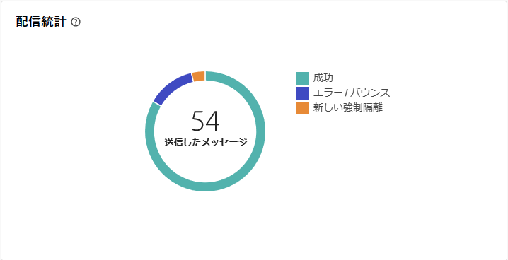
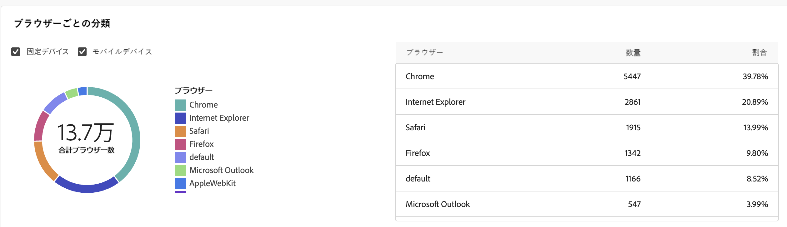

# メール配信レポート {#email-report}

**メール配信レポート**&#x200B;では、メールチャネルに固有の包括的なインサイトとデータが提供されます。個々の配信のパフォーマンス、有効性、結果に関する詳細情報が提供され、包括的な概要が得られます。

## 配信の概要 {#delivery-summary-email}

>[!CONTEXTUALHELP]
>id="acw_delivery_reporting_sending_email"
>title="送信のレポート"
>abstract="レポート内の「**送信**」タブでは、訪問者の配信とのやり取りや、訪問者が遭遇した可能性のある潜在的なエラーに関する詳細なインサイトを提供します。"

### 初期ターゲット母集団 {#email-delivery-targeted-population}

>[!CONTEXTUALHELP]
>id="acw_delivery_reporting_initial_target"
>title="初期ターゲット母集団"
>abstract="**初期ターゲット母集団**&#x200B;グラフには、配信準備の結果に基づいて、受信者とメッセージに関するデータが表示されます。"

**[!UICONTROL 初期ターゲット母集団]**&#x200B;グラフには、受信者に関するデータが表示されます。指標は配信の準備中に計算され、初期オーディエンス、送信するメッセージの数、除外された受信者の数を示します。

{zoomable="yes"}

グラフの一部にマウスを合わせると、正確な数が表示されます。

{zoomable="yes"}

+++メール配信レポート指標の詳細情報

* **[!UICONTROL 初期オーディエンス数]**：ターゲット受信者の合計数。

* **[!UICONTROL 配信]**：配信準備の後に配信されるメッセージの合計数。

* **[!UICONTROL 除外]**：ターゲット母集団から除外された受信者の合計数。
+++

### 配信統計 {#email-delivery-stats}

>[!CONTEXTUALHELP]
>id="acw_delivery_reporting_delivery_statistics_summary"
>title="配信統計"
>abstract="**配信統計**&#x200B;グラフには、配信の成功と発生したエラーの詳細が表示されます。"

**[!UICONTROL 配信統計]**&#x200B;グラフには、配信の成功の詳細が表示されます。指標について詳しくは、以下で説明します。

{zoomable="yes"}

+++メールキャンペーンレポート指標の詳細情報

* **[!UICONTROL 送信済みメッセージ]**：配信準備の後に配信されるメッセージの合計数。

* **[!UICONTROL 成功]**：配信されるメッセージ数に関して正常に処理されたメッセージ数。

* **[!UICONTROL エラー]**：配信と自動リバウンド処理の間に、配信されるメッセージ数に関して累積したエラーの合計数。

* **[!UICONTROL 新しい強制隔離]**：配信されるメッセージ数に関して、配信の失敗後（不明なユーザー、無効なドメイン）に強制隔離されたアドレスの合計数。

+++

### 除外の理由  {#email-delivery-exclusions}

>[!CONTEXTUALHELP]
>id="acw_delivery_reporting_exclusion"
>title="配信の除外の理由"
>abstract="**除外の理由**&#x200B;グラフとテーブルには、配信準備中に却下されたメッセージの分類がルールごとに示されています。"

**[!UICONTROL 除外の理由]**&#x200B;グラフとテーブルには、配信準備中に却下されたメッセージの分類がルールごとに示されています。除外ルールについて詳しくは、[Campaign v8（コンソール）ドキュメント](https://experienceleague.adobe.com/docs/campaign/campaign-v8/send/failures/delivery-failures.html?lang=ja#email-error-types){_blank}を参照してください。

{zoomable="yes"}{align="center" zoomable="yes"}

+++メール配信レポート指標の詳細情報

* **[!UICONTROL 不明なユーザー]**：メールアドレスが無効であることを示すエラータイプで、配信中に生成される。

* **[!UICONTROL 無効なドメイン]**：メールアドレスが正しくないか存在しないことを示すエラータイプ。配信の送信中に生成される。

* **[!UICONTROL メールボックス容量超過]**：受信者の受信ボックスにあるメッセージの数が多すぎることを示すエラータイプで、5 回の配信の試行後に生成される。

* **[!UICONTROL 無効なアカウント]**：アドレスが存在しないことを示すエラータイプ。配信の送信中に生成される。

* **[!UICONTROL 拒否]**：アドレスが IAP（インターネットアクセスプロバイダー）によって却下される場合に生成されるエラータイプ。例えば、セキュリティルールのアプリケーション（スパム対策ソフトウェア）によって却下された場合に生成される。

* **[!UICONTROL 未到達]**：SMTP リレーでのインシデント、ドメインへの一時的な未到達など、メッセージ配分文字列で発生するエラータイプ。

* **[!UICONTROL 未接続]**：受信者の携帯電話の電源が入っていない、または送信時にネットワーク接続が切断されていることを示すエラータイプ。

+++

## 配信スループット {#delivery-throughtput}

>[!CONTEXTUALHELP]
>id="acw_delivery_reporting_throughput_email"
>title="配信スループット"
>abstract="**配信スループット**&#x200B;レポートには、指定した期間内のプラットフォーム全体の配信スループットに関する詳細情報が表示されます。"

このレポートには、指定した期間内のプラットフォーム全体の配信スループットに関する詳細情報が表示されます。メッセージ配信速度の測定に使用される主な指標は、1 時間あたりに送信されるメッセージの数です。

{zoomable="yes"}{align="center" zoomable="yes"}

## ブロードキャスト統計 {#broadcast-statistics}

>[!CONTEXTUALHELP]
>id="acw_delivery_reporting_broadcast_statistics"
>title="ブロードキャスト統計"
>abstract="**ブロードキャスト統計**&#x200B;レポートには、各ドメインで発生する可能性のあるエラーに関する入手可能なデータが表示されます。"

**[!UICONTROL ブロードキャスト統計]**&#x200B;テーブルには、各ドメインで発生する可能性のあるエラーに関する入手可能なデータが表示されます。指標について詳しくは、以下で説明します。

{zoomable="yes"}{align="center" zoomable="yes"}

+++メール配信レポート指標の詳細情報

* **[!UICONTROL 処理済みのメール]**：配信サーバーによって処理されたメッセージの合計数。

* **[!UICONTROL 配信済み]**：処理されたメッセージの合計数に対する、正常に処理されたメッセージ数の割合。

* **[!UICONTROL ハードバウンス]**：処理されたメッセージの合計数に対する、誤ったメールアドレスなどの、ハードバウンス数の割合。

* **[!UICONTROL ソフトバウンス]**：処理されたメッセージの合計数に対する、メールボックス容量超過などの一時的なエラーである、ソフトバウンス数の割合。

* **[!UICONTROL 開封数]**：正常に処理されたメッセージ数に対する、メッセージを少なくとも 1 回開封したターゲット受信者数の割合。

* **[!UICONTROL クリック数]**：正常に処理されたメッセージ数に対する、配信で少なくとも 1 回クリックしたユーザー数の割合。

* **[!UICONTROL 購読解除]**：正常に処理されたメッセージ数に対する、購読解除リンクでのクリック数の割合。
+++

## 配信不能件数 {#non-deliverables-email}

### タイプ別のエラー分類 {#email-delivery-breakdown-type}

>[!CONTEXTUALHELP]
>id="acw_delivery_reporting_error_type"
>title="タイプ別のエラー分類"
>abstract="**タイプ別のエラー分類**&#x200B;グラフには、不明なユーザー、メールボックス容量超過、無効なドメインなど、発生した各エラータイプに関する入手可能なデータが表示されます。"

>[!CONTEXTUALHELP]
>id="acw_delivery_reporting_error_type_table"
>title="タイプ別のエラー分類"
>abstract="**タイプ別のエラーの分類**&#x200B;テーブルには、各エラータイプの発生の包括的な分類が表示されます。"

**[!UICONTROL タイプごとのエラーの分類]**&#x200B;テーブルおよびグラフには、エラーのタイプごとに入手可能なデータが表示されます。指標について詳しくは、以下で説明します。

このレポートに表示されるエラーにより、強制隔離プロセスが実行されることになります。強制隔離の管理について詳しくは、[Campaign v8（クライアントコンソール）ドキュメント](https://experienceleague.adobe.com/docs/campaign/campaign-v8/campaigns/send/failures/delivery-failures.html?lang=ja){target="_blank"}を参照してください。

{zoomable="yes"}{align="left" zoomable="yes"}

+++メール配信レポート指標の詳細情報

* **[!UICONTROL 不明なユーザー]**：メールアドレスが無効であることを示すエラータイプで、配信中に生成される。

* **[!UICONTROL 無効なドメイン]**：メールアドレスが正しくないか存在しないことを示すエラータイプ。配信の送信中に生成される。

* **[!UICONTROL メールボックス容量超過]**：受信者の受信ボックスにあるメッセージの数が多すぎることを示すエラータイプで、5 回の配信の試行後に生成される。

* **[!UICONTROL 無効なアカウント]**：アドレスが存在しないことを示すエラータイプ。配信の送信中に生成される。

* **[!UICONTROL 拒否]**：アドレスが IAP（インターネットアクセスプロバイダー）によって却下される場合に生成されるエラータイプ。例えば、セキュリティルールのアプリケーション（スパム対策ソフトウェア）によって却下された場合に生成される。

* **[!UICONTROL 未到達]**：SMTP リレーでのインシデント、ドメインへの一時的な未到達など、メッセージ配分文字列で発生するエラータイプ。

* **[!UICONTROL 未接続]**：受信者の携帯電話の電源が入っていない、または送信時にネットワーク接続が切断されていることを示すエラータイプ。

+++

### ドメイン別のエラー分類 {#email-delivery-breakdown-domain}

>[!CONTEXTUALHELP]
>id="acw_delivery_reporting_error_domain"
>title="ドメイン別のエラー分類"
>abstract="**ドメイン別のエラー分類**&#x200B;グラフには、各ドメインに応じて発生した各エラータイプに関する入手可能なデータが表示されます。"

>[!CONTEXTUALHELP]
>id="acw_delivery_reporting_error_domain_table"
>title="ドメイン別のエラー分類"
>abstract="**ドメイン別のエラー分類**&#x200B;テーブルには、使用するドメインに応じて各エラーの発生の包括的な分類が表示されます。"

**[!UICONTROL ドメインごとのエラーの分類]**&#x200B;テーブルおよびグラフには、各ドメインで発生する可能性のあるエラーに関する入手可能なデータが表示されます。

{zoomable="yes"}{align="left" zoomable="yes"}

詳細を表示するには、各ドメインの名前の横にあるアイコンをクリックします。

{zoomable="yes"}{align="left" zoomable="yes"}

使用可能な指標は、上記の[タイプごとのエラーの分類](#email-delivery-breakdown-type)の指標と同じです。

## トラッキング指標 {#tracking-indicators-email}

>[!CONTEXTUALHELP]
>id="acw_delivery_reporting_tracking_email"
>title="追跡のレポート"
>abstract="レポート内の「**トラッキング**」タブには、受信者のリンクごとの行動、開封数およびクリック数の分類、配信中に最も頻繁にクリックされた URL に関する詳細情報など、有用なデータが表示されます。"

### 配信統計  {#email-tracking-delivery-stats}

>[!CONTEXTUALHELP]
>id="acw_delivery_reporting_delivery_statistics_indicators"
>title=" 配信統計"
>abstract="**配信統計**&#x200B;レポートは、送信されたメールに関して入手可能なデータの詳細（成功、開封数、クリック数など）を示す主要業績評価指標（KPI）を提供します。"

**[!UICONTROL 配信統計]**&#x200B;レポートは、送信されたメールに関して入手可能なデータの詳細を示す主要業績評価指標（KPI）を提供します。指標について詳しくは、以下で説明します。

{zoomable="yes"}{align="center"}

+++メール配信レポート指標の詳細情報

* **[!UICONTROL 成功]**：配信されるメッセージ数に関して正常に処理されたメッセージ数。

* **[!UICONTROL ユニーク開封数]**：メッセージを少なくとも 1 回開封したターゲット受信者の合計数。

* **[!UICONTROL 開封数]**：メッセージを少なくとも 1 回開封した、このドメインのユニークターゲット受信者の数。

* **[!UICONTROL オプトアウトリンクのクリック数]**：購読解除リンクのクリック数。

* **[!UICONTROL ミラーリンクのクリック数]**：ミラーページへのリンクのクリック数。

* **[!UICONTROL 推定転送数]**：ターゲット受信者によって転送されるメール数の推定値。
+++

### 開封率とクリックスルー率 {#email-tracking-click-through}

>[!CONTEXTUALHELP]
>id="acw_delivery_reporting_open_clickthrough"
>title="開封率とクリックスルー率"
>abstract="**開封率とクリックスルー率**&#x200B;テーブルには、配信に対する受信者のエンゲージメントに関連するデータが表示されます。"

**[!UICONTROL 開封率とクリックスルー率]**&#x200B;テーブルには、受信者に関連するデータが表示されます。指標について詳しくは、以下で説明します。

{zoomable="yes"}{align="center"}

+++メール配信レポート指標の詳細情報

* **[!UICONTROL 送信済み]**：送信されたメッセージの合計数。

* **[!UICONTROL 苦情件数]**：受信者によって望ましくないとレポートされた、このドメインのメッセージ数。

* **[!UICONTROL 開封数]**：メッセージを少なくとも 1 回開封した、このドメインのユニークターゲット受信者の数。

* **[!UICONTROL クリック数]**：同じ配信で少なくとも 1 回クリックしたユニークターゲット受信者の数。

* **[!UICONTROL 反応率（生データ）]**：配信を少なくとも 1 回開封した受信者数に対する、配信で少なくとも 1 回クリックした受信者数の割合。
+++

## URL とクリックストリーム {#url-email}

>[!CONTEXTUALHELP]
>id="acw_delivery_reporting_urls_clickstreams"
>title="URL とクリックストリーム"
>abstract="**URL とクリックストリーム**&#x200B;レポートは、配信中に最もクリックされた URL の詳細を示す主要業績評価指標（KPI）を提供します。"

**[!UICONTROL URL とクリックストリーム]**&#x200B;レポートは、配信中に最もクリックされた URL の詳細を示す主要業績評価指標（KPI）を提供します。

{zoomable="yes"}{align="center"}

+++メール配信レポート指標の詳細情報

* **[!UICONTROL 反応度]**：配信を開封した推定ターゲット受信者数に対する、配信でクリックしたターゲット受信者数の割合。

* **[!UICONTROL ユニーククリック数]**：配信で少なくとも 1 回クリックしたユニーク受信者の合計数。

* **[!UICONTROL クリック数]**：配信におけるリンクの合計クリック数。

* **[!UICONTROL プラットフォームの平均]**：この平均率は、それぞれの率（反応度、ユニーククリック数および累積クリック数）の下に表示され、過去 6 か月間に送信された配信に対して計算されます。同じタイポロジを持つ、同じチャネルでの配信のみが考慮されます。配達確認は除外されます。

+++

### 最も訪問されたリンク上位 10 件 {#email-tracking-top10}

>[!CONTEXTUALHELP]
>id="acw_delivery_reporting_urls_clickstreams_top10"
>title="最も訪問されたリンク上位 10 件"
>abstract="**最も訪問されたリンク上位 10 件**&#x200B;のグラフとテーブルには、リンクごとの受信者の行動に関する利用可能なデータが表示されます。"

**[!UICONTROL 最も訪問されたリンク上位 10 件]**&#x200B;のグラフとテーブルには、リンクごとの受信者の行動に関する利用可能なデータが表示されます。

{zoomable="yes"}{align="center"}

+++メール配信レポート指標の詳細情報

* **[!UICONTROL クリック数]**：配信におけるリンクの合計クリック数。

* **[!UICONTROL 割合]**：配信で操作したユーザーの割合。

+++

### 時間の経過に伴うクリック数の分類 {#email-tracking-breakdown-over-time}

>[!CONTEXTUALHELP]
>id="acw_delivery_reporting_urls_click_breakdown"
>title="時間の経過に伴うクリック数の分類"
>abstract="**時間の経過に伴うクリック数の分類**&#x200B;グラフには、リンクごとの受信者の行動に関する入手可能なデータが表示されます。"

**[!UICONTROL 時間の経過に伴うクリック数の分類]**&#x200B;グラフには、リンクごとの受信者の行動に関する入手可能なデータが表示されます。

{zoomable="yes"}{align="center"}

## ユーザーアクティビティ {#user-activities-email}

>[!CONTEXTUALHELP]
>id="acw_delivery_reporting_user_activities"
>title="ユーザーアクティビティ"
>abstract="**ユーザーアクティビティ**&#x200B;グラフでは、開封数とクリック数の分類をグラフ形式で表示します。データをターゲットにする期間を、最終日、時間、または 30 分から選択できます。"

**[!UICONTROL ユーザーアクティビティ]**&#x200B;レポートには、開封数とクリック数の分類がチャート形式で表示されます。データをターゲットにする期間を、最終日、時間、または 30 分から選択できます。

{zoomable="yes"}{align="center"}

+++メール配信レポート指標の詳細情報

* **[!UICONTROL クリック数]**：配信におけるリンクの合計クリック数。

* **[!UICONTROL 開封数]**：メッセージを少なくとも 1 回開封した、このドメインのユニークターゲット受信者の数。

+++

## トラッキング統計 {#tracking-statistics}

>[!CONTEXTUALHELP]
>id="acw_delivery_reporting_statistics"
>title="トラッキング統計"
>abstract="**トラッキング統計**&#x200B;グラフでは、開封数とクリック数の統計を表示します。データをターゲットにする特定の時間枠を選択することもできます。"

**[!UICONTROL トラッキング統計]**&#x200B;グラフでは、開封数とクリック数の統計を表示します。データをターゲットにする特定の時間枠を選択することもできます。

{zoomable="yes"}{align="center"}

+++メール配信レポート指標の詳細情報

* **[!UICONTROL クリック数]**：配信におけるリンクの合計クリック数。

* **[!UICONTROL 開封数]**：メッセージを少なくとも 1 回開封した、このドメインのユニークターゲット受信者の数。

+++

## 開封数の分類 {#breakdown-opens}

### 開封数のデバイス別分類 {#breakdown-opens-devices}

>[!CONTEXTUALHELP]
>id="acw_delivery_reporting_breakdown_device"
>title="デバイス別分類"
>abstract="**デバイス別分類**&#x200B;には、期間中の開封数のデバイス別分類が表示されます。それぞれのカテゴリで、2 つのグラフが使用されます。最初のグラフは、コンピューターおよびモバイルデバイスでの開封数に関する統計を示しています。2 つ目のグラフは、デバイスタイプごとの正確な数と割合を示しています。"

**デバイス別分類**&#x200B;レポートには、パソコン、Android デバイス、Apple デバイスなどのデバイス別に、期間中の開封数が表示されます。

それぞれのカテゴリで、2 つのグラフが使用されます。最初のグラフは、コンピューターおよびモバイルデバイスでの開封数に関する統計を示しています。2 つ目のグラフは、デバイスタイプごとの正確な数と割合を示しています。

{zoomable="yes"}{align="center"}

### 開封数の OS 別分類 {#breakdown-opens-os}

>[!CONTEXTUALHELP]
>id="acw_delivery_reporting_breakdown_os"
>title="オペレーティングシステム別分類"
>abstract="**OS 別分類**&#x200B;レポートには、対象期間中の開封数がオペレーティングシステム別に表示されます。最初のグラフは、コンピューターおよびモバイルデバイスでの開封数に関する統計を示しています。2 つ目のグラフは、OS ごとの正確な数と割合を示しています。"

**OS 別分類**&#x200B;レポートには、Windows システム、Android システム、iOS システムなどのオペレーティングシステム別に、期間中の開封数が表示されます。

それぞれのカテゴリで、2 つのグラフが使用されます。最初のグラフは、コンピューターおよびモバイルのオペレーティングシステムでの開封数に関する統計を示しています。2 つ目のグラフは、オペレーティングシステムごとの正確な数と割合を示しています。

{zoomable="yes"}{align="center"}

### 開封数のブラウザー別分類 {#breakdown-opens-browser}

>[!CONTEXTUALHELP]
>id="acw_delivery_reporting_breakdown_browser"
>title="ブラウザー別分類"
>abstract="**ブラウザー別分類**&#x200B;では、期間中の開封数がブラウザー別に表示されます。最初のグラフは、コンピューターおよびモバイルデバイスでの開封数に関する統計を示しています。2 つ目のグラフは、ブラウザーごとの正確な数と割合を示しています。"

**ブラウザー別分類**&#x200B;レポートには、Chrome、Safari、Internet Explorer などのブラウザー別に、開封数が表示されます。

それぞれのカテゴリで、2 つのグラフが使用されます。最初のグラフは、コンピューターおよびモバイルのオペレーティングシステムでの開封数に関する統計を示しています。2 つ目のグラフは、ブラウザーごとの正確な数と割合を示しています。

{zoomable="yes"}{align="center"}

## ホットクリック数 {#hotclicks}

>[!CONTEXTUALHELP]
>id="acw_delivery_reporting_hotclicks"
>title="ホットクリック数レポート"
>abstract="**ホットクリック数**&#x200B;レポートでは、各リンクでのメールのコンテンツ（HTML および／またはテキスト）を、リンクでのクリック率と共に表示します。パーソナライゼーションブロックの購読解除リンク、ミラーページリンクおよびオファーリンクは、累積クリック数の合計では考慮されますが、レポートには表示されません。"

このレポートは、各リンクでのメッセージのコンテンツ（HTML および／またはテキスト）を、リンクでのクリック率と共に表示します。パーソナライゼーションブロックの購読解除リンク、ミラーページリンクおよびオファーリンクは、累積クリック数の合計では考慮されますが、レポートには表示されません。

{zoomable="yes"}