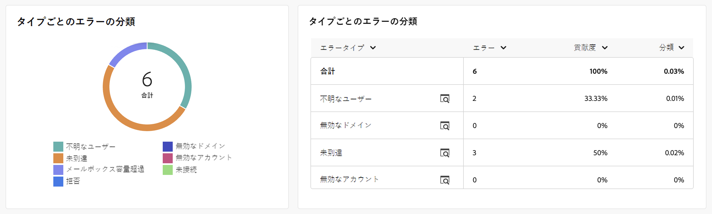

# E メール配信レポート {#email-report}

この **E メール配信レポート** は、e メールチャネルに固有の包括的なインサイトとデータを提供します。 個々の配信のパフォーマンス、効果、結果に関する詳細な情報を提供し、包括的な概要を提供します。

## 配信の概要 {#delivery-summary-email}

* **[!UICONTROL 初期ターゲットオーディエンス統計]** テーブルには、受信者に関連するデータが表示されます。

  {align="left" zoomable="yes"}

  +++メール配信レポート指標の詳細を説明します。

   * **[!UICONTROL 初期オーディエンス]**:ターゲット受信者の合計数。

   * **[!UICONTROL 配信する]**:配信の分析後に配信されるメッセージの合計数。

   * **[!UICONTROL 除外]**:送信されたターゲットから除外されたメッセージの合計数。
+++

* **[!UICONTROL 配信統計]** テーブルには、配信の成功の詳細が表示されます。

  {align="left"}

  +++電子メールキャンペーンレポート指標の詳細を説明します。

   * **[!UICONTROL 送信されたメッセージ]**:配信の分析後に配信されるメッセージの合計数。

   * **[!UICONTROL 成功]**:配信されるメッセージ数に関して正常に処理されたメッセージ数。

   * **[!UICONTROL エラー]**:配信と自動リバウンド処理の間に、配信されるメッセージ数に関して累積したエラーの合計数。

   * **[!UICONTROL 新しい強制隔離]**:配信に失敗した配信（不明なユーザー、無効なドメイン）後に、配信されるメッセージの数に関して強制隔離されたアドレスの合計数。

+++

* **[!UICONTROL 除外の理由]** グラフおよび表は、分析中に却下されたメッセージのルールごとの分類を示します。

  {align="center"}

  +++メール配信レポート指標の詳細を説明します。

   * **[!UICONTROL 不明なユーザー]**：E メールアドレスが無効であることを示すエラータイプで、配信中に生成される。

   * **[!UICONTROL 無効なドメイン]**：E メールアドレスが正しくないか存在しないことを示すエラータイプで、配信の送信中に生成される。

   * **[!UICONTROL メールボックス容量超過]**:受信者の受信ボックスに含まれるメッセージの数が多すぎることを示すエラータイプで、5 回の配信の試行後に生成される。

   * **[!UICONTROL 無効なアカウント]**：アドレスが存在しないことを示すエラータイプで、配信の送信中に生成される。

   * **[!UICONTROL 拒否]**:アドレスが IAP（インターネットアクセスプロバイダー）によって拒否された場合に生成されるエラータイプ。例えば、セキュリティルールの適用（スパム対策ソフトウェア）に従ってエラーが発生します。

   * **[!UICONTROL 未到達]**：SMTP リレーでのインシデント、ドメインへの一時的な未到達など、メッセージ配分文字列で発生するエラータイプ。

   * **[!UICONTROL 未接続]**:送信時に受信者の携帯電話の電源が入っていない、またはネットワーク接続が切断されていることを示すエラータイプ。

+++

## 配信スループット {#delivery-throughtput}

このレポートは、指定した期間内のプラットフォーム全体の配信スループットに関する詳細情報を表示します。 メッセージ配信の速度の測定に使用される主な指標は、1 時間に送信されたメッセージの数です。

## ブロードキャスト統計情報 {#broadcast-statistics}

* **[!UICONTROL ブロードキャスト統計]** テーブルには、各ドメインで発生した可能性のあるエラーに関する使用可能なデータが含まれます。

  {align="center"}

  +++メール配信レポート指標の詳細を説明します。

   * **[!UICONTROL 処理済みの E メール]**:配信サーバーによって処理されたメッセージの合計数。

   * **[!UICONTROL 配信済み]**:処理されたメッセージの合計数に対する、正常に処理されたメッセージ数の割合。

   * **[!UICONTROL ハードバウンス]**:処理されたメッセージの合計数に対する、誤った E メールアドレスなどの、「ハード」バウンス、永続的なエラーの数の割合。

   * **[!UICONTROL ソフトバウンス]**:処理されたメッセージの合計数に対する、フルインボックスなどの一時的なバウンス、「ソフト」バウンス数の割合

   * **[!UICONTROL 開封数]**:正常に処理されたメッセージ数に対する、メッセージを少なくとも 1 回開封したターゲット受信者数の割合。

   * **[!UICONTROL クリック数]**:正常に処理されたメッセージ数に対する、配信で少なくとも 1 回クリックしたユーザー数の割合。

   * **[!UICONTROL 購読解除]**:正常に処理されたメッセージ数に対する、購読解除リンクでのクリック数の割合。
+++

## 配信不能件数とバウンス数 {#non-deliverables-email}

* **[!UICONTROL タイプごとのエラーの分類]** および **[!UICONTROL ドメインごとのエラーの分類]** テーブルとグラフには、各ドメインで発生した可能性のあるエラーに関して使用可能なデータが含まれています。

  このレポートに表示されるエラーにより、強制隔離プロセスが実行されることになります。強制隔離の管理について詳しくは、 [強制隔離管理](https://experienceleague.adobe.com/docs/campaign/campaign-v8/campaigns/send/failures/delivery-failures.html?lang=ja)

  

  +++メール配信レポート指標の詳細を説明します。

   * **[!UICONTROL 不明なユーザー]**：E メールアドレスが無効であることを示すエラータイプで、配信中に生成される。

   * **[!UICONTROL 無効なドメイン]**：E メールアドレスが正しくないか存在しないことを示すエラータイプで、配信の送信中に生成される。

   * **[!UICONTROL メールボックス容量超過]**:受信者の受信ボックスに含まれるメッセージの数が多すぎることを示すエラータイプで、5 回の配信の試行後に生成される。

   * **[!UICONTROL 無効なアカウント]**：アドレスが存在しないことを示すエラータイプで、配信の送信中に生成される。

   * **[!UICONTROL 拒否]**:アドレスが IAP（インターネットアクセスプロバイダー）によって拒否された場合に生成されるエラータイプ。例えば、セキュリティルールの適用（スパム対策ソフトウェア）に従ってエラーが発生します。

   * **[!UICONTROL 未到達]**：SMTP リレーでのインシデント、ドメインへの一時的な未到達など、メッセージ配分文字列で発生するエラータイプ。

   * **[!UICONTROL 未接続]**:送信時に受信者の携帯電話の電源が入っていない、またはネットワーク接続が切断されていることを示すエラータイプ。

+++

## トラッキング指標 {#tracking-indicators-email}

* **[!UICONTROL 配信統計]** は、送信された E メールで使用可能なデータに関する詳細情報を提供する主要業績評価指標 (KPI) を提供します。

  {align="center"}

  +++メール配信レポート指標の詳細を説明します。

   * **[!UICONTROL 成功]**:配信されるメッセージ数に関して正常に処理されたメッセージ数。

   * **[!UICONTROL ユニーク開封数]**:メッセージを少なくとも 1 回開封したターゲット受信者の合計数。

   * **[!UICONTROL 開封数]**：メッセージを少なくとも 1 回開封した、このドメインのユニークターゲット受信者の数。

   * **[!UICONTROL オプトアウトリンクのクリック数]**:購読解除リンクのクリック数。

   * **[!UICONTROL ミラーリンクのクリック数]**:ミラーページへのリンクでのクリック数。

   * **[!UICONTROL 推定転送数]**：ターゲット受信者によって転送される E メール数の推定値。
+++

* **[!UICONTROL 開封率およびクリックスルー率]** テーブルには、受信者に関連するデータが表示されます。

  {align="center"}

  +++メール配信レポート指標の詳細を説明します。

   * **[!UICONTROL 送信済み]**:送信されたメッセージの合計数。

   * **[!UICONTROL 苦情数]**：受信者によって望ましくないとレポートされた、このドメインのメッセージ数。

   * **[!UICONTROL 開封数]**：メッセージを少なくとも 1 回開封した、このドメインのユニークターゲット受信者の数。

   * **[!UICONTROL クリック数]**：同じ配信で少なくとも 1 回クリックしたユニークターゲット受信者の数。

   * **[!UICONTROL 反応率（生データ）]**：配信を少なくとも 1 回開封した受信者数に対する、配信で少なくとも 1 回クリックした受信者数の割合。
+++

## URL とクリックストリーム {#url-email}

* **[!UICONTROL URL とクリックストリーム]** は、配信中に最もクリックされた URL に関する詳細情報を提供する主要業績評価指標 (KPI) を提供します。

  {align="center"}

  +++メール配信レポート指標の詳細を説明します。

   * **[!UICONTROL 反応度]**：配信を開封した推定ターゲット受信者数に対する、配信でクリックしたターゲット受信者数の割合。

   * **[!UICONTROL ユニーククリック数]**:配信で少なくとも 1 回クリックしたユニーク受信者の合計数。

   * **[!UICONTROL クリック数]**：配信におけるリンクの合計クリック数。

   * **[!UICONTROL プラットフォームの平均]**：この平均率は、それぞれの率（反応度、ユニーククリック数および累積クリック数）の下に表示され、過去 6 ヶ月間に送信された配信に対して計算されます。同じタイポロジを持つ、同じチャネルでの配信のみが考慮されます。配達確認は除外されます。

+++

* **[!UICONTROL 最も多く訪問された上位 10 件のリンク]** グラフとテーブルには、リンクごとの受信者の行動に使用できるデータが含まれています。

  {align="center"}

  +++メール配信レポート指標の詳細を説明します。

   * **[!UICONTROL クリック数]**：配信におけるリンクの合計クリック数。

   * **[!UICONTROL 割合]**:配信で操作したユーザーの割合。

+++

* **[!UICONTROL 時間の経過に伴うクリック数の分類]** グラフには、リンクごとの受信者の行動に使用できるデータが含まれます。

  {align="center"}

## ユーザーアクティビティ {#user-activities-email}

* **[!UICONTROL ユーザーアクティビティ]** 開封数とクリック数の分類をグラフの形式で表示します。 データをターゲットにする期間を選択できます。最終日、1 時間または 30 分。

  {align="center"}

  +++メール配信レポート指標の詳細を説明します。

   * **[!UICONTROL クリック数]**：配信におけるリンクの合計クリック数。

   * **[!UICONTROL 開封数]**：メッセージを少なくとも 1 回開封した、このドメインのユニークターゲット受信者の数。

+++

## トラッキング統計 {#tracking-statistics}

* **[!UICONTROL トラッキング統計]** グラフは、開封数とクリック数の統計を示します。 データをターゲティングする特定の期間を選択することもできます。

  {align="center"}

  +++メール配信レポート指標の詳細を説明します。

   * **[!UICONTROL クリック数]**：配信におけるリンクの合計クリック数。

   * **[!UICONTROL 開封数]**：メッセージを少なくとも 1 回開封した、このドメインのユニークターゲット受信者の数。

+++

## 開封数の分類 {#breakdown-opens}

このレポートは、該当する期間中の、オペレーティングシステム、デバイスおよびブラウザーごとの開封の分類を表示します。それぞれのカテゴリで、2 つのグラフが使用されます。最初のグラフは、コンピューターおよびモバイルデバイスでの開封数に関する統計を示しています。2 つ目のグラフはモバイルデバイスでの開封数のみに関する統計を示しています。次から切り替える柔軟性があります： **[!UICONTROL Fix &amp; mobile]** 専ら的を絞る **[!UICONTROL モバイルのみ]** を参照してください。

{align="center"}

## ホットクリック数 {#hotclicks}

このレポートは、各リンクでのメッセージのコンテンツ（HTML および／またはテキスト）を、リンクでのクリック率と共に表示します。パーソナライゼーションブロックの購読解除リンク、ミラーページリンクおよびオファーリンクは、累積クリック数の合計では考慮されますが、レポートには表示されません。

