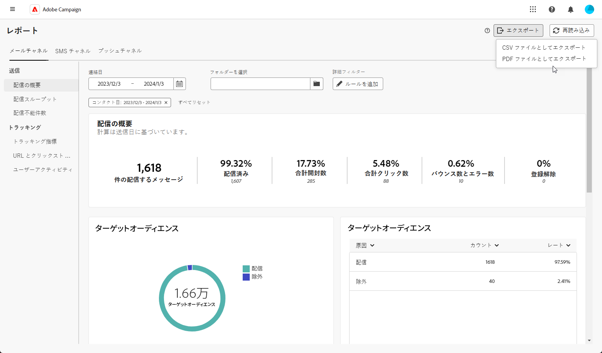

# レポートをエクスポート {#export-reports}

>[!CONTEXTUALHELP]
>id="acw_reporting_email_exportation"
>title="レポートをエクスポート"
>abstract="「**エクスポート**」ボタンをクリックして、これらの指標を PDF または CSV 形式に書き出します。この形式では、指標を共有または印刷できます。"

レポートを PDF または CSV 形式にエクスポートできるので、共有、操作、印刷ができるようになります。

1. レポートから「**[!UICONTROL エクスポート]**」をクリックし、「**[!UICONTROL PDF ファイルとしてエクスポート]**」または「**[!UICONTROL CSV ファイルとしてエクスポート]**」を選択します。

   {zoomable="yes"}

1. ファイルを保存するフォルダーを見つけて、必要に応じて名前を変更し、「**[!UICONTROL 保存]**」をクリックします。

レポートを PDF ファイルや CSV ファイルで表示または共有できるようになりました。