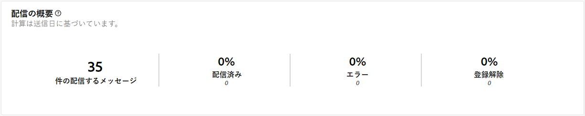
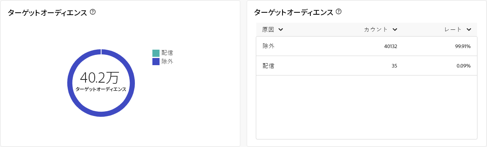
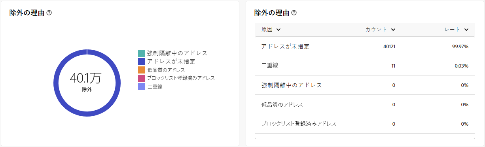

# ダイレクトメールチャネルのグローバルレポート {#global-report-direct}

ダイレクトメールのグローバルレポートでは、チャネルレベルでのトラフィック指標とエンゲージメント指標の包括的な概要をユーザーに提供します。

**[!UICONTROL レポート]**&#x200B;セクション内の「**[!UICONTROL レポート]**」メニューに移動します。レポートの日付、フォルダーまたはルールに応じて、データをフィルタリングできます。[詳細情報](global-reports.md)

## 配信の概要 {#delivery-summary-direct}

### 配信の概要 {#delivery-overview-direct}

>[!CONTEXTUALHELP]
>id="acw_global_reporting_delivery_overview_direct_mail"
>title="配信の概要"
>abstract="**配信の概要**&#x200B;には、各ダイレクトメール配信における訪問者のインタラクションに関する詳細なインサイトを提供する主要業績評価指標（KPI）が表示されます。指標の概要を以下に示します。"

**[!UICONTROL 配信の概要]**&#x200B;には、各ダイレクトメール配信における訪問者のインタラクションに関する詳細なインサイトを提供する主要業績評価指標（KPI）が表示されます。指標の概要を以下に示します。

{zoomable="yes"}{align="center"}

+++配信の概要指標の詳細情報

* **[!UICONTROL 配信メッセージ数]**：配信の準備中に処理されたメッセージの合計数。

* **[!UICONTROL 配信済み数]**：送信されたメッセージの合計数に対して、正常に送信できたメッセージの数。

* **[!UICONTROL エラー数]**：配信と自動返信処理の間に、送信されたメッセージの合計数に関して累積したエラーの合計数。

* **[!UICONTROL 登録解除数]**：登録解除をクリックした受信者の数。
+++

### 対象オーディエンス {#delivery-summary-direct-initial-target}

>[!CONTEXTUALHELP]
>id="acw_global_reporting_target_audience_direct_mail_graph"
>title="対象オーディエンス"
>abstract="受信者のデータとメッセージ情報は、配信準備の分析を反映して、**対象オーディエンス**&#x200B;グラフに表示されます。"

>[!CONTEXTUALHELP]
>id="acw_global_reporting_target_audience_direct_mail_table"
>title="対象オーディエンス"
>abstract="**対象オーディエンス**&#x200B;テーブルには、配信準備プロセスの結果に基づいて、受信者と対応するメッセージの詳細な分類が表示されます。"

**[!UICONTROL ターゲットオーディエンス]**&#x200B;のテーブルおよびグラフには、受信者に関連するデータが表示され、下に詳細な指標が示されます。

{zoomable="yes"}{align="center"}

+++ターゲットオーディエンス指標の詳細情報

* **[!UICONTROL ターゲットオーディエンス]**：ターゲット受信者の合計数。

* **[!UICONTROL 配信メッセージ数]**：配信準備の後に配信されるメッセージの合計数。

* **[!UICONTROL 除外]**：ルール（アドレスが不明、強制隔離された、ブロックリストに登録されているなど）を適用する際、分析中に無視されたアドレスの合計数。

+++

### 配信統計 {#delivery-summary-direct-exec-stats}

>[!CONTEXTUALHELP]
>id="acw_global_reporting_delivery_statistics_summary_direct_mail_graph"
>title="配信統計"
>abstract="**配信統計**&#x200B;グラフには、成功した配信や発生したエラーなど、ダイレクトメール配信の有効性に関するインサイトが表示されます。"

>[!CONTEXTUALHELP]
>id="acw_global_reporting_delivery_statistics_summary_direct_mail_table"
>title="配信統計"
>abstract="**配信統計**&#x200B;テーブルには、ダイレクトメール配信の成功と発生したエラーの詳細が表示されます。"

**[!UICONTROL 配信統計]**&#x200B;グラフおよびテーブルには、すべてのダイレクトメール配信の成功の分類と、以下に概要を示す詳細な指標が表示されます。

+++配信統計指標の詳細情報

* **[!UICONTROL 配信メッセージ数]**：配信準備の後に配信されるメッセージの合計数。

* **[!UICONTROL 成功]**：配信されるメッセージ数に関して、正常に処理されたメッセージ数。

* **[!UICONTROL エラー数／バウンス数]**：配信と自動リバウンド処理の間に、配信されるメッセージ数に関して累積したエラーの合計数。

* **[!UICONTROL 新しい強制隔離]**：配信されるメッセージ数に関して、配信の失敗後（不明なユーザー、無効なドメイン）に強制隔離されたアドレスの合計数。

+++

### 除外の理由 {#causes-exclusion}

>[!CONTEXTUALHELP]
>id="acw_global_reporting_exclusions_direct_mail_table"
>title="除外"
>abstract="**除外の理由**&#x200B;テーブルには、配信準備プロセス中に却下されたメッセージの詳細な分類がルールごとに表示されます。"

>[!CONTEXTUALHELP]
>id="acw_global_reporting_causes_exclusion_direct_mail_graph"
>title="除外の理由"
>abstract="**除外の理由**&#x200B;グラフには、配信の準備中に却下されたメッセージの配分がルールごとに分類されて表示されます。"

{zoomable="yes"}{align="center"}

除外グラフおよびテーブルには、ターゲットプロファイルから除外されたユーザープロファイルがメッセージを受信できなかった理由が表示されます。

+++詳しくは、除外の理由指標を参照してください。

* **[!UICONTROL 強制隔離中のアドレス]**：アドレスが強制隔離に置かれた場合に生成されるエラータイプ。

* **[!UICONTROL アドレスが未指定]**：配信の送信時に生成され、アドレスが存在しないことを示すエラータイプ。

* **[!UICONTROL 低品質のアドレス]**：郵送先住所の品質評価が低すぎる場合に生成されるエラータイプ。

* **[!UICONTROL ブロックリスト登録済みアドレス]**：配信実行時に受信者がブロックリストに登録されていた場合に生成されるエラータイプ。

* **[!UICONTROL 重複]**：受信者のキー値が一意でなかったので、受信者が除外された場合に生成されるエラータイプ。

* **[!UICONTROL コントロール母集団]**：受信者のアドレスはコントロール母集団に含まれています。

* **[!UICONTROL サイズが制限されたターゲット]**：受信者に対する最大配信サイズに達しました。

+++
