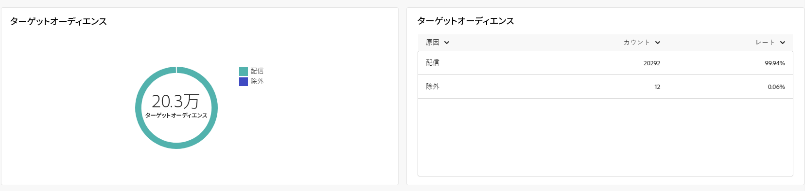

# ダイレクトメールチャネルのグローバルレポート {#global-report-direct}

グローバルレポートでは、チャネルレベルでのトラフィック指標とエンゲージメント指標の包括的な概要をユーザーに提供します。

**[!UICONTROL レポート]**&#x200B;セクション内の「**[!UICONTROL レポート]**」メニューに移動します。レポートの日付、フォルダーまたはルールに応じて、データをフィルタリングできます。[詳細情報](global-reports.md)

## 配信の概要 {#delivery-summary-direct}

### 配信の概要 {#delivery-overview-direct}

**[!UICONTROL 配信の概要]**&#x200B;には、各メール配信における訪問者のインタラクションに関する詳細なインサイトを提供する主要業績評価指標（KPI）が表示されます。指標の概要を以下に示します。

{align="center"}

+++配信の概要指標の詳細情報

* **[!UICONTROL 配信メッセージ数]**：配信の準備中に処理されたメッセージの合計数。

* **[!UICONTROL 配信済み数]**：送信されたメッセージの合計数に対して、正常に送信できたメッセージの数。

* **[!UICONTROL エラー数]**：配信と自動返信処理の間に、送信されたメッセージの合計数に関して累積したエラーの合計数。

* **[!UICONTROL 登録解除数]**：登録解除をクリックした受信者の数。
+++

### 対象オーディエンス {#delivery-summary-direct-initial-target}

**[!UICONTROL ターゲットオーディエンス]**&#x200B;テーブルおよびグラフには、受信者に関連するデータが表示され、以下に詳細な指標が示されます。

{align="center"}

+++ターゲットオーディエンス指標の詳細情報

* **[!UICONTROL ターゲットオーディエンス数]**：ターゲット受信者の合計数。

* **[!UICONTROL 配信メッセージ数]**：配信準備の後に配信されるメッセージの合計数。

* **[!UICONTROL 除外数]**：ルール（アドレスが不明、強制隔離された、ブロックリストに登録されているなど）を適用する際、分析中に無視されたアドレスの合計数。

+++

### 配信統計 {#delivery-summary-direct-exec-stats}

**[!UICONTROL 配信統計]**&#x200B;テーブルには、すべてのダイレクトメール配信の成功の分類と、以下に概要を示す詳細な指標が表示されます。

{align="center"}

+++配信統計指標の詳細情報

* **[!UICONTROL 配信メッセージ数]**：配信準備の後に配信されるメッセージの合計数。

* **[!UICONTROL 成功]**：配信されるメッセージ数に関して正常に処理されたメッセージ数。

* **[!UICONTROL エラー数／バウンス数]**：配信と自動リバウンド処理の間に、配信されるメッセージ数に関して累積したエラーの合計数。

* **[!UICONTROL 新しい強制隔離]**：配信の失敗後（不明なユーザー、無効なドメイン）に、配信されるメッセージ数に関して強制隔離されたアドレスの合計数。

+++

### 除外の理由 {#causes-exclusion}

{align="center"}

除外グラフおよびテーブルには、ターゲットプロファイルから除外されたユーザープロファイルがメッセージを受信できなかった理由が表示されます。

## 配信スループット {#delivery-throughput}

このレポートには、指定した期間内の配信スループットに関する包括的な詳細情報が表示されます。メッセージ配信速度の測定に使用される主な指標は、1 時間あたりに送信されるメッセージの数です。

## 配信不能件数 {#non-deliverables-direct}

### タイプ別のエラー分類 {#delivery-summary-direct-breakdown-per-type}

**[!UICONTROL タイプ別のエラー分類]**&#x200B;テーブルおよびグラフには、様々なドメインで発生する潜在的なエラーに関連するデータが表示され、以下に特定の指標が示されます。

このレポートに表示されるエラーにより、強制隔離プロセスが実行されることになります。強制隔離の管理について詳しくは、[Campaign v8（クライアントコンソール）ドキュメント](https://experienceleague.adobe.com/docs/campaign/campaign-v8/campaigns/send/failures/delivery-failures.html?lang=ja){target="_blank"}を参照してください。

+++タイプ別のエラー分類指標の詳細情報

* **[!UICONTROL 不明なユーザー]**：アドレスが無効であることを示すエラータイプで、配信中に生成される。

* **[!UICONTROL 無効なドメイン]**：アドレスが正しくないか存在しないことを示すエラータイプで、配信の送信中に生成される。

* **[!UICONTROL メールボックス容量超過]**：受信者の受信ボックスにあるメッセージの数が多すぎることを示すエラータイプで、5 回の配信の試行後に生成される。

* **[!UICONTROL 無効なアカウント]**：アドレスが存在しないことを示すエラータイプ。配信の送信中に生成される。

* **[!UICONTROL 拒否]**：アドレスが IAP（インターネットアクセスプロバイダー）によって却下される場合に生成されるエラータイプ。例えば、セキュリティルールのアプリケーション（スパム対策ソフトウェア）によって却下された場合に生成される。

* **[!UICONTROL 未到達]**：SMTP リレーでのインシデント、ドメインへの一時的な未到達など、メッセージ配分文字列で発生するエラータイプ。

* **[!UICONTROL 未接続]**：受信者の携帯電話の電源が入っていない、または送信時にネットワーク接続が切断されていることを示すエラータイプ。

+++

### ドメイン別のエラー分類 {#delivery-summary-email-breakdown-per-domain}

**[!UICONTROL ドメイン別のエラー分類]**&#x200B;テーブルおよびグラフには、各ドメイン内の潜在的なエラーに関連するデータが表示されます。指標は、上記の&#x200B;**[!UICONTROL タイプ別のエラー分類]**&#x200B;テーブルとグラフと共通です。

