# メールチャネルのグローバルレポート {#global-report-direct}

グローバルレポートでは、チャネルレベルでのトラフィック指標とエンゲージメント指標の包括的な概要をユーザーに提供します。

**[!UICONTROL レポート]**&#x200B;セクション内の「**[!UICONTROL レポート]**」メニューに移動します。レポートの日付、フォルダーまたはルールに応じて、データをフィルタリングできます。[詳細情報](global-reports.md)

## 配信の概要 {#delivery-summary-email}

### 配信の概要 {#delivery-overview-email}

>[!CONTEXTUALHELP]
>id="acw_global_reporting_deliveries_overview_email"
>title="配信の概要"
>abstract="**配信の概要**&#x200B;には、送信するメール配信やキャンペーンに対してオーディエンスが操作する方法に関する詳細なインサイトを提供する主要業績評価指標（KPI）が表示されます。"

**[!UICONTROL 配信の概要]**&#x200B;には、各メール配信における訪問者のインタラクションに関する詳細なインサイトを提供する主要業績評価指標（KPI）が表示されます。指標の概要を以下に示します。

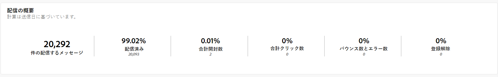{zoomable=&quot;yes&quot;}{align="center"}

+++配信の概要指標の詳細情報

* **[!UICONTROL 配信メッセージ数]**：配信の準備中に処理されたメッセージの合計数。

* **[!UICONTROL 配信済み数]**：送信されたメッセージの合計数に対して、正常に送信できたメッセージの数。

* **[!UICONTROL 合計開封数]**：メッセージを 1 回以上開封したターゲット受信者の合計数。

* **[!UICONTROL 合計クリック数]**：配信で少なくとも 1 回クリックした受信者の合計数。

* **[!UICONTROL バウンス数とエラー数]**：送信されたメッセージの合計数に関して、配信および自動返信処理の間に累積したエラーの合計数。

* **[!UICONTROL 登録解除数]**：登録解除をクリックした受信者の数。
+++

### 対象オーディエンス {#delivery-summary-email-initial-target}

>[!CONTEXTUALHELP]
>id="acw_global_reporting_target_audience_email"
>title="初期ターゲットオーディエンス統計"
>abstract="**ターゲットオーディエンス**&#x200B;テーブルおよびグラフには、受信者のエンゲージメントに関するインサイトが表示され、キャンペーンと配信の効果を評価するのに役立ちます。"

**[!UICONTROL ターゲットオーディエンス]**&#x200B;のテーブルおよびグラフには、受信者に関連するデータが表示され、下に詳細な指標が示されます。

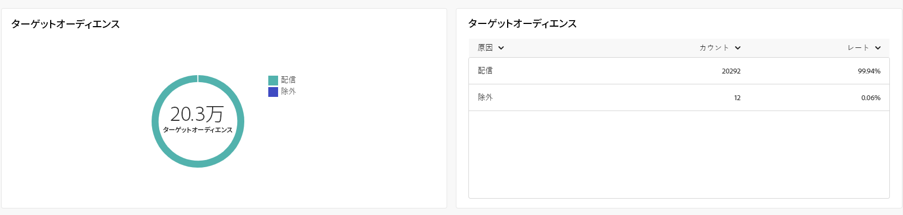{zoomable=&quot;yes&quot;}{align="center"}

+++ターゲットオーディエンス指標の詳細情報

* **[!UICONTROL ターゲットオーディエンス]**：ターゲット受信者の合計数。

* **[!UICONTROL 配信メッセージ数]**：配信準備の後に配信されるメッセージの合計数。

* **[!UICONTROL 除外]**：ルール（アドレスが不明、強制隔離された、ブロックリストに登録されているなど）を適用する際、分析中に無視されたアドレスの合計数。

+++

### 配信統計 {#delivery-summary-email-delivery-stats}

>[!CONTEXTUALHELP]
>id="acw_global_reporting_email_delivery_stats"
>title="配信統計"
>abstract="**配信統計**&#x200B;グラフおよびテーブルには、成功した配信、エラー、新しい強制隔離などの主要な指標の概要が表示され、配信パフォーマンスを評価するための簡潔な概要が示されます。"

**[!UICONTROL 配信統計]**&#x200B;テーブルには、すべてのメール配信の成功の分類が表示され、下に概要を示す詳細な指標が示されます。

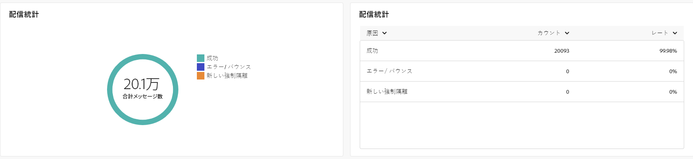{zoomable=&quot;yes&quot;}{align="center"}

+++配信統計指標の詳細情報

* **[!UICONTROL 配信メッセージ数]**：配信準備の後に配信されるメッセージの合計数。

* **[!UICONTROL 成功]**：配信されるメッセージ数に関して、正常に処理されたメッセージ数。

* **[!UICONTROL エラー数／バウンス数]**：配信と自動リバウンド処理の間に、配信されるメッセージ数に関して累積したエラーの合計数。

* **[!UICONTROL 新しい強制隔離]**：配信されるメッセージ数に関して、配信の失敗後（不明なユーザー、無効なドメイン）に強制隔離されたアドレスの合計数。

+++

### 除外の理由 {#causes-exclusion}

>[!CONTEXTUALHELP]
>id="acw_global_reporting_exclusion_email"
>title="除外の理由"
>abstract="**除外の理由**&#x200B;グラフおよびテーブルには、配信準備中にメッセージが拒否される具体的な理由が表示され、ルール別の詳細な分類が示されます。"

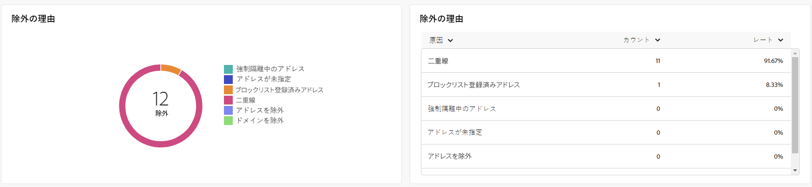{zoomable=&quot;yes&quot;}{align="center"}

除外グラフおよびテーブルには、ターゲットプロファイルから除外されたユーザープロファイルがメッセージを受信できなかった理由が表示されます。

メールのエラータイプは、[Adobe Campaign v8 （クライアントコンソール）ドキュメント](https://experienceleague.adobe.com/docs/campaign/campaign-v8/send/failures/delivery-failures.html?lang=ja#email-error-types){target="_blank"}に記載されています。

## 配信スループット {#delivery-throughput}

>[!CONTEXTUALHELP]
>id="acw_global_reporting_throughput_email"
>title="配信スループット"
>abstract="この&#x200B;**配信スループット**&#x200B;には、配信スループットに関する包括的なインサイトが表示され、指定した期間内の成功率とエラー率がハイライト表示されます。"

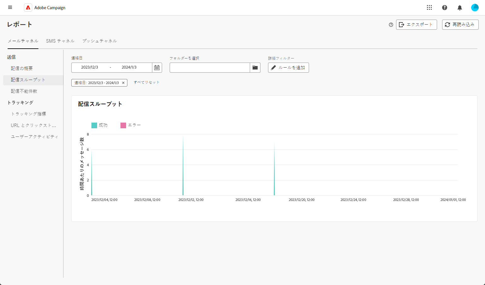{zoomable=&quot;yes&quot;}{align="center"}

配信スループットレポートには、配信プロセスの効率に関する詳細なインサイトが表示され、指定した期間内の成功率とエラー率の詳細な概要が示されます。

+++配信スループット指標の詳細情報

* **[!UICONTROL 成功]**：配信されるメッセージ数に関して正常に処理されたメッセージ数。

* **[!UICONTROL エラー]**：配信と自動リバウンド処理の間に、配信されるメッセージ数に関して累積したエラーの合計数。

+++

## 配信不能件数 {#non-deliverables-email}

### タイプ別のエラー分類 {#delivery-summary-email-breakdown-per-type}

>[!CONTEXTUALHELP]
>id="acw_global_reporting_error_type_email"
>title="タイプ別のエラー分類"
>abstract="**タイプ別のエラー分類**&#x200B;を詳細に示したテーブルおよびグラフには、不明なユーザー、メールボックス容量超過、無効なドメインなど、プロセス中に発生した様々なエラータイプに関する情報が含まれます。"

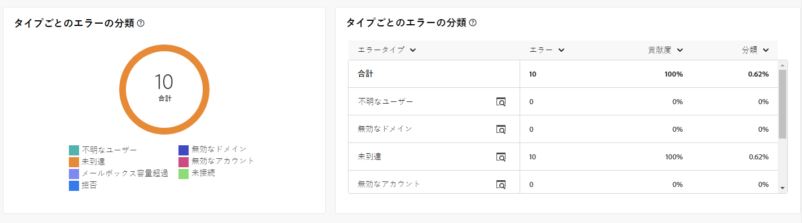{zoomable=&quot;yes&quot;}{align="center"}

**[!UICONTROL タイプ別のエラー分類]**&#x200B;テーブルおよびグラフには、様々なドメインで発生する潜在的なエラーに関連するデータが表示され、下に特定の指標が示されます。

このレポートに表示されるエラーにより、強制隔離プロセスが実行されることになります。強制隔離の管理について詳しくは、[Campaign v8（クライアントコンソール）ドキュメント](https://experienceleague.adobe.com/docs/campaign/campaign-v8/campaigns/send/failures/delivery-failures.html?lang=ja){target="_blank"}を参照してください。

+++タイプ別のエラー分類指標の詳細情報

* **[!UICONTROL 不明なユーザー]**：メールアドレスが無効であることを示すエラータイプで、配信中に生成される。

* **[!UICONTROL 無効なドメイン]**：メールアドレスが正しくないか存在しないことを示すエラータイプ。配信の送信中に生成される。

* **[!UICONTROL メールボックス容量超過]**：受信者の受信ボックスにあるメッセージの数が多すぎることを示すエラータイプで、5 回の配信の試行後に生成される。

* **[!UICONTROL 無効なアカウント]**：アドレスが存在しないことを示すエラータイプ。配信の送信中に生成される。

* **[!UICONTROL 拒否]**：アドレスが IAP（インターネットアクセスプロバイダー）によって却下される場合に生成されるエラータイプ。例えば、セキュリティルールのアプリケーション（スパム対策ソフトウェア）によって却下された場合に生成される。

* **[!UICONTROL 未到達]**：SMTP リレーでのインシデント、ドメインへの一時的な未到達など、メッセージ配分文字列で発生するエラータイプ。

* **[!UICONTROL 未接続]**：受信者の携帯電話の電源が入っていない、または送信時にネットワーク接続が切断されていることを示すエラータイプ。

+++

### ドメイン別のエラー分類 {#delivery-summary-email-breakdown-per-domain}

>[!CONTEXTUALHELP]
>id="acw_global_reporting_error_domain_email"
>title="ドメイン別のエラー分類"
>abstract="**ドメイン別のエラー分類**&#x200B;を示すテーブルおよびグラフには、発生した各エラータイプに対応するデータが特定のドメインごとに分類されて表示されます。"

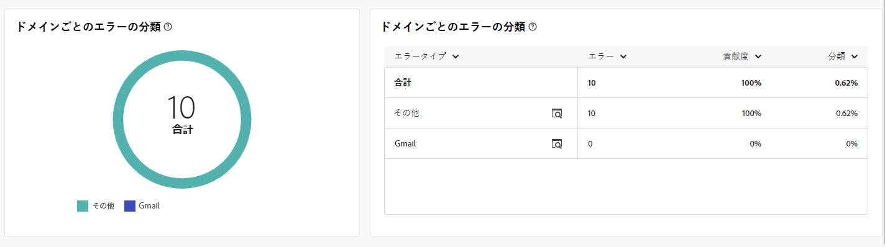{zoomable=&quot;yes&quot;}{align="center"}

**[!UICONTROL ドメイン別のエラー分類]**&#x200B;テーブルおよびグラフには、各ドメイン内の潜在的なエラーに関連するデータが表示されます。指標は、上記の&#x200B;**[!UICONTROL タイプ別のエラー分類]**&#x200B;テーブルとグラフと共通です。

## トラッキング指標 {#tracking-indicators-email}

### 配信統計 {#delivery-summary-email-statistics}

>[!CONTEXTUALHELP]
>id="acw_global_delivery_statistics_summary_email"
>title="配信統計"
>abstract="**配信統計**&#x200B;の主要業績評価指標（KPI）には、配信とキャンペーンのパフォーマンスの包括的な概要と、成功した配信、発生したエラー、ユーザーエンゲージメントに関するインサイトが示されます。"

**[!UICONTROL 配信統計]**&#x200B;指標には、すべてのメール配信に関連するデータについての詳細情報を提供する主要業績評価指標（KPI）が示されます。これらの指標について詳しくは、以下を参照してください。

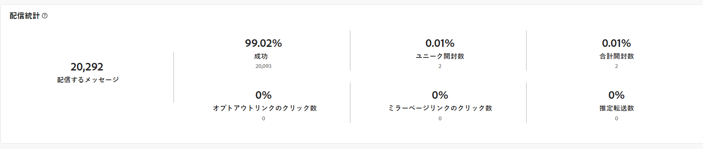{zoomable=&quot;yes&quot;}{align="center"}

+++配信統計指標の詳細情報

* **[!UICONTROL 配信メッセージ数]**：配信の準備中に処理されたメッセージの合計数。

* **[!UICONTROL 成功]**：配信されるメッセージ数に対して、正常に処理されたメッセージ数。

* **[!UICONTROL ユニーク開封数]**：メッセージを 1 回以上開封したターゲット受信者の合計数。

* **[!UICONTROL 合計開封数]**：メッセージを 1 回以上開封した、このドメインのユニークターゲット受信者の数。

* **[!UICONTROL オプトアウトリンクのクリック数]**：購読解除リンクのクリック数。

* **[!UICONTROL ミラーリンクのクリック数]**：ミラーページへのリンクのクリック数。

* **[!UICONTROL 推定転送数]**：ターゲット受信者によって転送されるメール数の推定値。
+++

### 開封率およびクリックスルー率 {#delivery-summary-open-rate}

>[!CONTEXTUALHELP]
>id="acw_global_reporting_open_clickthrough_email"
>title="開封率とクリックスルー率"
>abstract="**開封率とクリックスルー率**&#x200B;のテーブルには、配信に対する受信者のエンゲージメントが表示され、簡潔でインサイトに満ちた概要に対する開封率とクリックスルー率に関するデータが示されます。"

**[!UICONTROL 開封率およびクリックスルー率]**&#x200B;テーブルには、受信者に関連するデータが表示されます。指標については、以下で詳しく説明します。

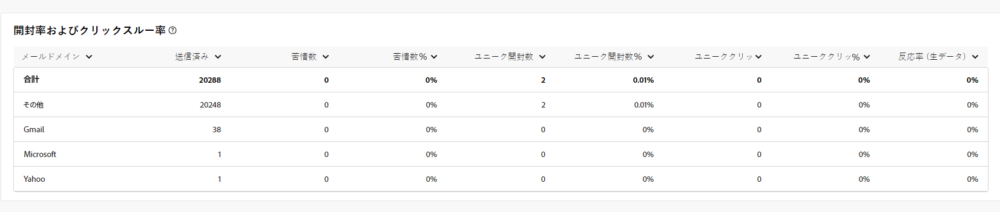{zoomable=&quot;yes&quot;}{align="center"}

+++開封率とクリックスルー率指標の詳細情報

* **[!UICONTROL 送信済み]**：送信されたメッセージの合計数。

* **[!UICONTROL 苦情件数]**：このドメインのメッセージのうち、受信者によって望ましくないとレポートされたメッセージ数と割合。

* **[!UICONTROL ユニーク開封数]**：メッセージを 1 回以上開封した、このドメインのユニークターゲット受信者の数と割合。

* **[!UICONTROL ユニーククリック数]**：同じ配信で 1 回以上クリックしたユニークターゲット受信者の数と割合。

* **[!UICONTROL 反応率（生データ）]**：配信を少なくとも 1 回開封した受信者数に対する、配信で少なくとも 1 回クリックした受信者数の割合。
+++

## URL とクリックストリーム {#url-email}

### URL とクリックストリーム KPI {#url-email-kpis}

>[!CONTEXTUALHELP]
>id="acw_global_reporting_urls_clickstreams_email"
>title="URL とクリックストリーム"
>abstract="**URL とクリックストリーム**&#x200B;レポートには、配信中に最もクリックされた URL に関する詳細なインサイトを提供する重要な主要業績評価指標（KPI）が表示されます。"

**[!UICONTROL URL とクリックストリーム]**&#x200B;レポートには、配信中に最も多くのクリック数を受信した URL に関する詳細なインサイトを提供する主要業績評価指標（KPI）が表示されます。指標については、以下で詳しく説明します。

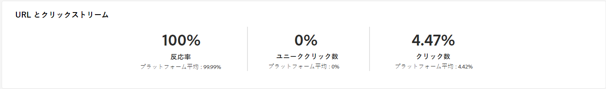{zoomable=&quot;yes&quot;}{align="center"}

+++URL とクリックストリーム指標の詳細情報

* **[!UICONTROL 反応度]**：配信を開封した推定ターゲット受信者数に対する、配信でクリックしたターゲット受信者数の割合。

* **[!UICONTROL ユニーククリック数]**：配信で 1 回以上クリックしたユニーク受信者の合計数。

* **[!UICONTROL 合計クリック数]**：配信におけるリンクの合計クリック数。

* **[!UICONTROL プラットフォームの平均]**：この平均率は、それぞれの率（反応度、ユニーククリック数および累積クリック数）の下に表示され、過去 6 ヶ月間に送信された配信に対して計算されます。同じタイポロジを持つ、同じチャネルでの配信のみが考慮されます。配達確認は除外されます。
+++

### 最も訪問されたリンク上位 10 件 {#top10-global-report-email}

>[!CONTEXTUALHELP]
>id="acw_global_reporting_top10_email"
>title="最も訪問されたリンク上位 10 件"
>abstract="**最も訪問されたリンク上位 10 件**&#x200B;グラフおよびテーブルには、各リンクと受信者のインタラクションに関する包括的なデータが表示されます。"

**[!UICONTROL 最も訪問されたリンク上位 10 件]**&#x200B;グラフおよびテーブルには、リンクごとの受信者の行動に関する入手可能なデータが表示されます。指標については、以下で詳しく説明します。

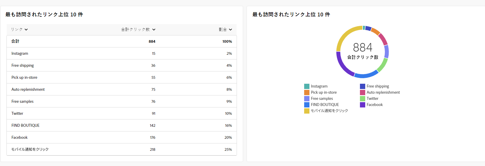{zoomable=&quot;yes&quot;}{align="center"}

+++最も訪問されたリンク上位 10 件指標の詳細情報

* **[!UICONTROL 合計クリック数]**：配信におけるリンクの合計クリック数。

* **[!UICONTROL 割合]**：配信で操作したユーザーの割合。

+++

### 時間の経過に伴うクリック数の分類 {#global-report-email-breakdown-clicks}

>[!CONTEXTUALHELP]
>id="acw_global_reporting_urls_click_breakdown_email"
>title="時間の経過に伴うクリック数の分類"
>abstract="**時間の経過に伴うクリック数の分類**&#x200B;グラフには、指定した期間中に受信者がリンクにエンゲージした方法についての包括的なビューが表示されます。"

**[!UICONTROL 時間の経過に伴うクリック数の分類]**&#x200B;グラフには、リンクごとの受信者の行動に関する入手可能なデータが表示されます。

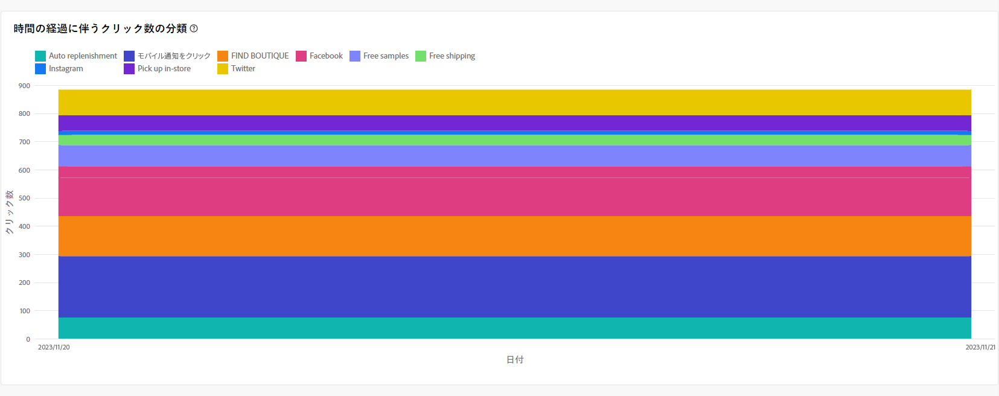{zoomable=&quot;yes&quot;}{align="center"}

## ユーザーアクティビティ {#user-activities-email}

>[!CONTEXTUALHELP]
>id="acw_global_reporting_user_activities_email"
>title="ユーザーアクティビティ"
>abstract="**ユーザーアクティビティ**&#x200B;のグラフィカル表現には、受信者のインタラクションの詳細な分類が表示され、グラフ形式で開封数とクリック数に関する情報が示されます。"

**[!UICONTROL ユーザーアクティビティ]**&#x200B;レポートには、開封数とクリック数の分類がチャート形式で表示されます。このレポートの指標については、以下で詳しく説明します。

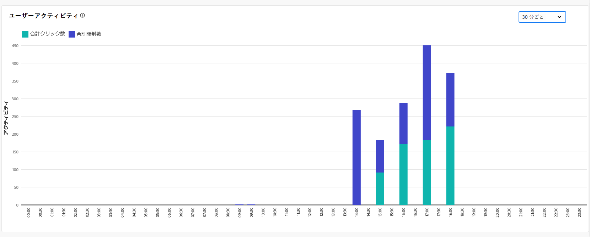{zoomable=&quot;yes&quot;}{align="center"}

+++ユーザーアクティビティ指標の詳細情報

* **[!UICONTROL 合計クリック数]**：配信におけるリンクの合計クリック数。

* **[!UICONTROL 合計開封数]**：メッセージを 1 回以上開封した、このドメインのユニークターゲット受信者の合計数。

+++
