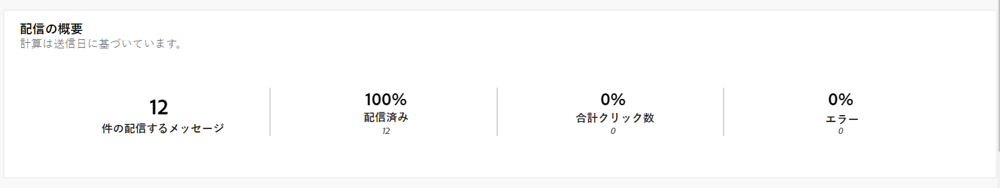
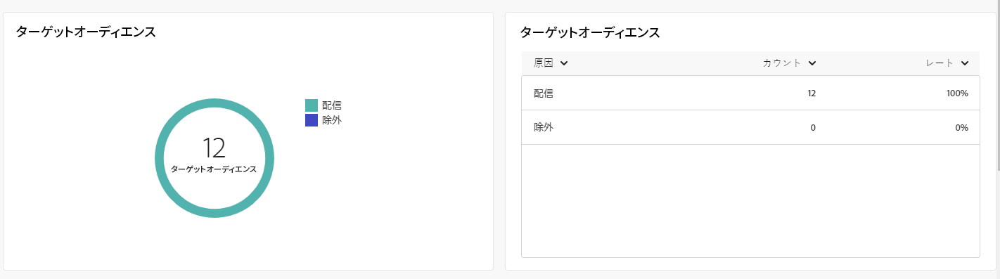
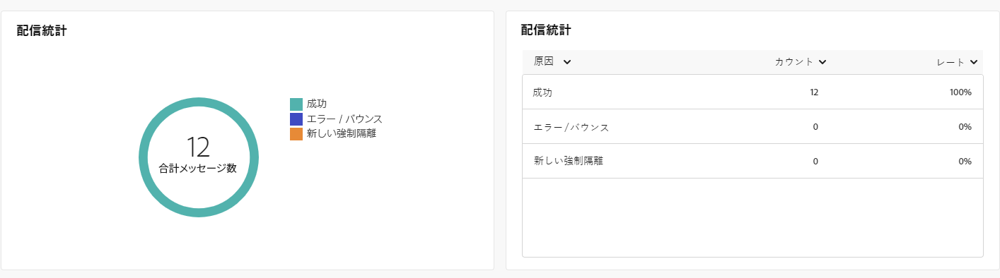
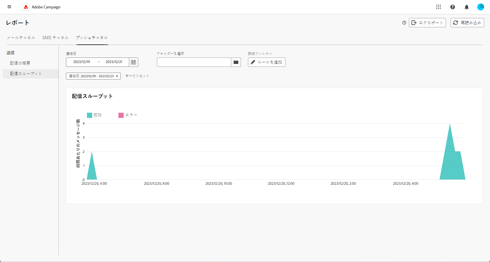

# プッシュチャネルのグローバルレポート {#campaign-reports-push}

グローバルレポートでは、チャネルレベルでのトラフィック指標とエンゲージメント指標の包括的な概要をユーザーに提供します。

**[!UICONTROL レポート]**&#x200B;セクション内の「**[!UICONTROL レポート]**」メニューに移動します。レポートの日付、フォルダーまたはルールに応じて、データをフィルタリングできます。[詳細情報](global-reports.md)

## 配信の概要 {#delivery-summary-push}

### 配信の概要 {#delivery-overview-push}

>[!CONTEXTUALHELP]
>id="acw_push_global_report_overview"
>title="プッシュ配信の概要"
>abstract="プッシュ&#x200B;**配信の概要 KPI** では、プッシュ配信を徹底的に調査し、詳細なインサイトと特定のデータを提供します。配信のパフォーマンス、効果、結果に関する包括的な詳細を提供します。"

**[!UICONTROL 配信の概要]**&#x200B;レポートは、すべてのプッシュ通知配信に対する訪問者のエンゲージメントの詳細を示す主要業績評価指標（KPI）を提供します。指標については、以下で詳しく説明します。

+++配信の概要指標の詳細情報

* **[!UICONTROL 配信メッセージ数]**：配信の準備中に処理されたメッセージの合計数。

* **[!UICONTROL 配信済み数]**：送信されたメッセージの合計数に対して、正常に送信できたメッセージの数。

* **[!UICONTROL 合計クリック数]**：配信で少なくとも 1 回クリックしたユニーク受信者の合計数。

* **[!UICONTROL エラー数]**：配信と自動返信処理の間に、送信されたメッセージの合計数に関して累積したエラーの合計数。

+++

### 対象オーディエンス {#delivery-summary-push-initial-target}

>[!CONTEXTUALHELP]
>id="acw_global_reporting_push_targeted_audience"
>title="プッシュのターゲット母集団"
>abstract="**ターゲット母集団**&#x200B;グラフおよびテーブルには、プッシュメッセージングオーディエンスに関連するデータが表示され、配信メッセージ数と除外件数に関する情報が示されます。"

**[!UICONTROL ターゲットオーディエンス]**&#x200B;テーブルおよびグラフには、送信済みの各プッシュ通知配信の受信者に関連するデータが表示されます。指標については、以下で詳しく説明します。

+++ターゲットオーディエンス指標の詳細情報

* **[!UICONTROL ターゲットオーディエンス]**：ターゲット受信者の合計数。

* **[!UICONTROL 配信メッセージ数]**：配信準備の後に配信されるメッセージの合計数。

* **[!UICONTROL 除外]**：ルール（アドレスが不明、強制隔離された、ブロックリストに登録されているなど）を適用する際、分析中に無視されたアドレスの合計数。

+++

### 配信統計 {#delivery-summary-push-exec-stats}

>[!CONTEXTUALHELP]
>id="acw_global_reporting_push_delivery_stats"
>title="プッシュ配信統計"
>abstract="**全体的な統計**&#x200B;レポートには、成功率、エラー、強制隔離など、送信されたプッシュ通知に関する情報が表示されます。"

**[!UICONTROL 配信統計]**&#x200B;グラフには、すべてのプッシュ配信の成功の詳細が表示されます。指標については、以下で詳しく説明します。

+++配信統計指標の詳細情報

* **[!UICONTROL メッセージの合計数]**：配信準備の後に配信されるメッセージの合計数。

* **[!UICONTROL 成功]**：配信されるメッセージ数に関して正常に処理されたメッセージ数。

* **[!UICONTROL エラー数／バウンス数]**：配信と自動リバウンド処理の間に、配信されるメッセージ数に関して累積したエラーの合計数。

* **[!UICONTROL 新しい強制隔離]**：配信の失敗（無効な登録、メッセージ却下、ペイロードエラーなど）の後で強制隔離されたアドレスの合計数（割合は、配信されるメッセージの数に対する比率です）。

  プッシュ通知のエラータイプについては、[Adobe Campaign v8 （クライアントコンソール）ドキュメント](https://experienceleague.adobe.com/docs/campaign/campaign-v8/send/failures/delivery-failures.html?lang=ja#push-error-types){target="_blank"}を参照してください。

+++

### 除外の理由 {#causes-exclusion}

>[!CONTEXTUALHELP]
>id="acw_global_reporting_push_exclusion"
>title="プッシュの除外の理由"
>abstract="**除外の理由**&#x200B;グラフおよびテーブルには、ユーザープロファイルがプッシュ通知を受信できない様々な理由が表示されます。"

**[!UICONTROL 除外の理由]**&#x200B;グラフおよびテーブルには、ターゲットプロファイルから除外されたユーザープロファイルがメッセージを受信できなかった理由が表示されます。

プッシュ通知のエラータイプについては、[Adobe Campaign v8（クライアントコンソール）ドキュメント](https://experienceleague.adobe.com/docs/campaign/campaign-v8/send/failures/delivery-failures.html?lang=ja#push-error-types){target="_blank"}を参照してください。

## 配信スループット {#delivery-throughput-sms}

>[!CONTEXTUALHELP]
>id="acw_global_reporting_throughput_push"
>title="配信スループットレポート"
>abstract="**配信スループット**&#x200B;レポートには、指定した期間内のプラットフォーム全体のプッシュ通知配信スループットに関する詳細情報が表示されます。"

**[!UICONTROL 配信スループット]**&#x200B;レポートには、プッシュ通知配信システムの効果に関する包括的なインサイトが表示され、指定された期間における成功率とエラー率の詳細な概要が示されます。
