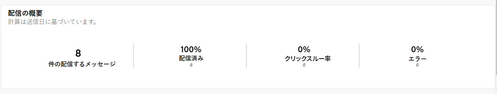
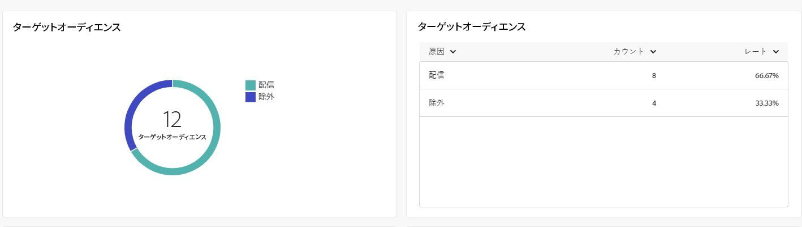
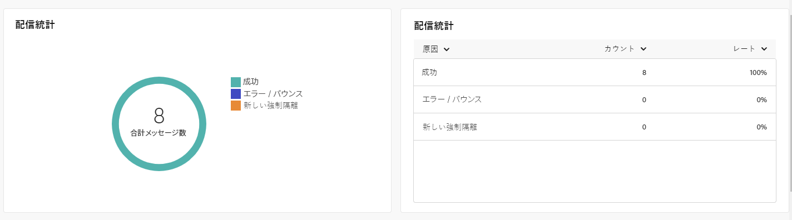
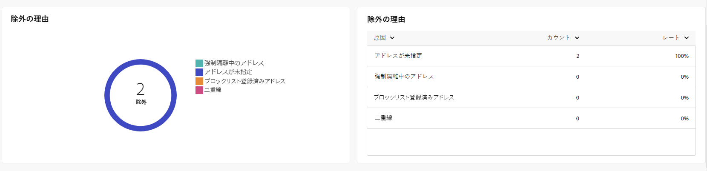
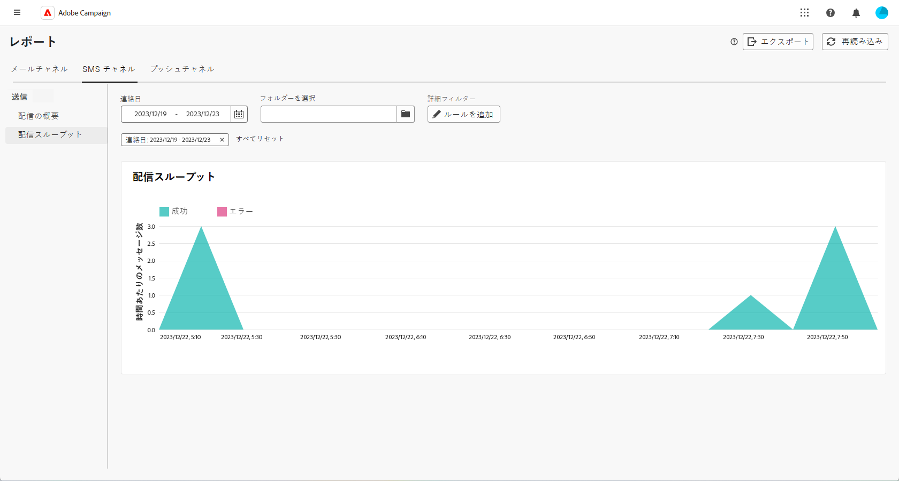

# SMS チャネルのグローバルレポート {#campaign-reports-sms}

グローバルレポートでは、チャネルレベルでのトラフィック指標とエンゲージメント指標の包括的な概要をユーザーに提供します。

**[!UICONTROL レポート]**&#x200B;セクション内の「**[!UICONTROL レポート]**」メニューに移動します。レポートの日付、フォルダーまたはルールに応じて、データをフィルタリングできます。[詳細情報](global-reports.md)

## 配信の概要 {#delivery-summary-sms}

### 配信の概要 {#delivery-overview-sms}

>[!CONTEXTUALHELP]
>id="acw_sms_global_report_overview"
>title="SMS 配信の概要"
>abstract="**SMS 配信の概要** KPI には、SMS 配信の完全な概要が表示され、詳細な分析情報と特定のデータが示されます。配信のパフォーマンス、効果、結果に関する包括的な情報が表示されます。"

**[!UICONTROL 配信の概要]**&#x200B;レポートには、包括的な主要業績評価指標（KPI）が表示され、各 SMS 配信における訪問者のインタラクションパターンについての深い洞察が得られます。指標の概要を以下に示します。

{zoomable="yes"}

+++配信の概要指標について説明します。

* **[!UICONTROL 配信メッセージ数]**：配信の準備中に処理されたメッセージの合計数。

* **[!UICONTROL 配信済み率]**：送信されたメッセージの合計数に関する、正常に送信されたメッセージの割合。

* **[!UICONTROL クリックスルー率]**：配信で少なくとも 1 回クリックしたユニーク受信者の割合。

* **[!UICONTROL エラー率]**：配信と自動返信処理中に送信されたメッセージの合計数に対する累積したエラーの割合。

+++

### ターゲットオーディエンス {#delivery-summary-sms-initial-target}

>[!CONTEXTUALHELP]
>id="acw_global_reporting_sms_targeted_audience"
>title="SMS のターゲット母集団"
>abstract="**ターゲット母集団**&#x200B;のグラフとテーブルには、配信するメッセージや除外するメッセージに関する情報など、SMS オーディエンスに関連するデータが表示されます。"

**[!UICONTROL ターゲットオーディエンス]**&#x200B;のテーブルとグラフには、送信した各 SMS 配信の受信者に関連するデータが表示されます。指標について詳しくは、以下で説明します。

{zoomable="yes"}

+++ターゲットオーディエンス指標の詳細情報。

* **[!UICONTROL ターゲットオーディエンス]**：ターゲット受信者の合計数。

* **[!UICONTROL 配信メッセージ数]**：配信準備の後に配信されるメッセージの合計数。

* **[!UICONTROL 除外]**：アドレスが不明、強制隔離された、ブロックリストに登録されているなどのルールを適用する際、分析中に無視されたアドレスの合計数。

+++

### 配信統計 {#delivery-summary-sms-exec-stats}

>[!CONTEXTUALHELP]
>id="acw_global_reporting_sms_delivery_stats"
>title="SMS 配信統計"
>abstract="**配信統計**&#x200B;レポートには、送信した SMS に関する包括的なインサイトが表示され、成功率、エラーの発生数、強制隔離されたオーディエンスなどの様々な指標の分類が示されます。この詳細なプレゼンテーションにより、SMS 配信プロセスの全体的なパフォーマンスと結果を徹底的に調査できます。"

**[!UICONTROL 配信統計]**&#x200B;テーブルには、すべての SMS 配信の成功の詳細が表示されます。指標について詳しくは、以下で説明します。

{zoomable="yes"}

+++配信統計指標の詳細を説明します。

* **[!UICONTROL メッセージの合計数]**：配信準備の後に配信されるメッセージの合計数。

* **[!UICONTROL 成功]**：配信されるメッセージ数に対して、正常に処理されたメッセージ数。

* **[!UICONTROL エラー数／バウンス数]**：配信と自動リバウンド処理中に配信されたメッセージ数に対する累積したエラーの合計数。

* **[!UICONTROL 新しい強制隔離数]**：配信の失敗後（例：不明なユーザー、無効なドメイン）、配信されるメッセージ数に対して強制隔離されたアドレスの合計数。

  SMS エラータイプについて詳しくは、[Adobe Campaign v8 （クライアントコンソール）ドキュメント](https://experienceleague.adobe.com/docs/campaign/campaign-v8/send/failures/delivery-failures.html?lang=ja#sms-quarantines){target="_blank"}を参照してください。

+++

### 除外の理由 {#causes-exclusion}

>[!CONTEXTUALHELP]
>id="acw_global_reporting_sms_exclusions"
>title="SMS の除外の理由"
>abstract="**除外の理由**&#x200B;のグラフとテーブルには、ユーザープロファイルが SMS メッセージを受信できなかった様々な理由が表示されます。"

**[!UICONTROL 除外の理由]**&#x200B;のグラフとテーブルには、ターゲットプロファイルから除外されたユーザープロファイルが SMS 配信を受信できなかった理由が表示されます。

エラータイプについて詳しくは、[Adobe Campaign v8 （クライアントコンソール）ドキュメント](https://experienceleague.adobe.com/docs/campaign/campaign-v8/send/failures/delivery-failures.html?lang=ja#email-error-types){target="_blank"}を参照してください。

{zoomable="yes"}

## 配信スループット {#delivery-throughput-sms}

>[!CONTEXTUALHELP]
>id="acw_global_reporting_throughput_sms"
>title="SMS の配信スループット"
>abstract="**配信スループット**&#x200B;レポートには、SMS メッセージ配信システムの効率に関する広範なインサイトが表示され、指定した期間内の成功率とエラー率の詳細な概要が示されます。"

{zoomable="yes"}

**[!UICONTROL 配信スループット]**&#x200B;レポートには、SMS メッセージ配信システムの効果に関する包括的なインサイトが表示され、指定した期間における成功率とエラー率の詳細な概要が示されます。