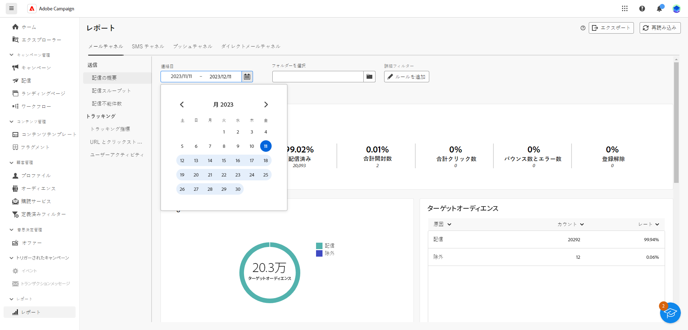

# グローバルレポートの基本を学ぶ {#global-report-gs}

>[!CONTEXTUALHELP]
>id="acw_campaign_reporting_global_report"
>title="グローバルレポート"
>abstract="グローバルレポートは、キャンペーンのパフォーマンスを分析する強力で効率的な方法を提供します。これらのレポートは、キャンペーン内の各チャネルの主なトラフィックとエンゲージメント指標の統合ビューを提供します。"

「**グローバルレポート**」は効果的なツールとして機能し、Campaign インスタンス内の各チャネルのトラフィックとエンゲージメント指標の統合された全体的な概要を提供します。これらのレポートは様々なウィジェットで構成され、それぞれがキャンペーンや配信パフォーマンスに関する明確な観点を提供します。

主要業績評価指標（KPI）は、最新のインサイトが得られるよう、1 時間ごとに更新されます。デフォルトでは、過去 30 日間を対象にデータがフィルタリングされ、キャンペーンと配信パフォーマンスに関する最新かつ関連性の高い観点を提供します。

各チャネルのレポートと関連指標の完全なリストについては、下記のページを参照してください。

* [メールグローバルレポート](global-report-email.md)
* [SMS グローバルレポート](global-report-sms.md)
* [プッシュグローバルレポート](global-report-push.md)
* [ダイレクトメールグローバルレポート](global-report-direct.md)

## レポートダッシュボードの管理 {#manage-reports}

グローバルレポートにアクセスして管理するには、次の手順に従います。

1. 「**[!UICONTROL レポート]**」セクション内の&#x200B;**[!UICONTROL レポート]**&#x200B;メニューに移動します。

1. 左側のメニューで、リストからレポートを選択し、タブ間を移動して各チャネルからのデータを表示します。

   {zoomable="yes"}

1. ダッシュボードから、**開始時間**&#x200B;と&#x200B;**[!UICONTROL 終了時間]**&#x200B;を選択して、特定のデータをターゲットにします。

   {zoomable="yes"}

1. 「**[!UICONTROL フォルダーを選択]**」フィールドで、特定のフォルダーから配信またはキャンペーンをターゲットにするかどうかを選択します。

   {zoomable="yes"}

1. 「**[!UICONTROL ルールを追加]**」をクリックしてクエリの作成を開始し、レポートデータをより適切にフィルタリングします。[詳しくは、クエリモデラーの使用方法を参照してください](../query/query-modeler-overview.md)。

1. **[!UICONTROL URL とクリックストリーム]**&#x200B;から、**[!UICONTROL 上位訪問リンク]**&#x200B;または&#x200B;**[!UICONTROL 期間]**&#x200B;を選択します。

   「**[!UICONTROL 表示条件]**」オプションを使用すると、URL、ラベルまたはカテゴリでフィルタリングできます。