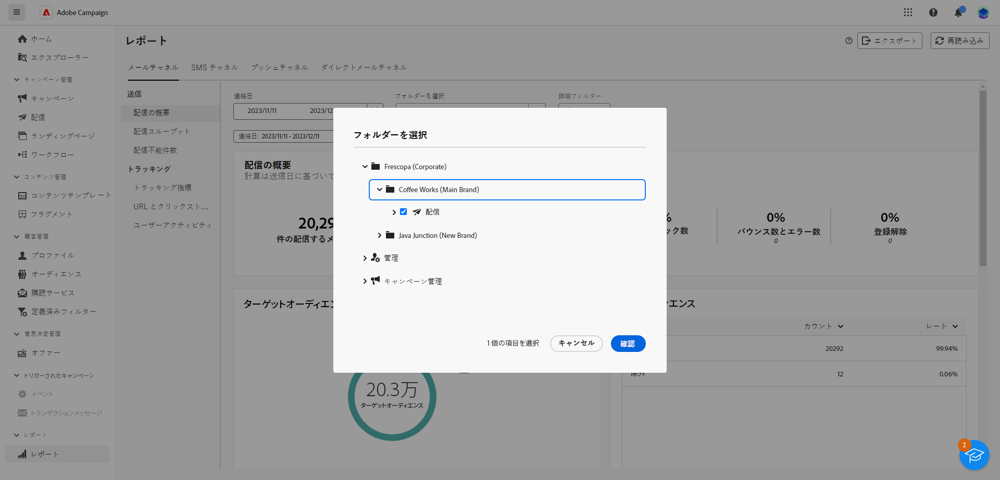
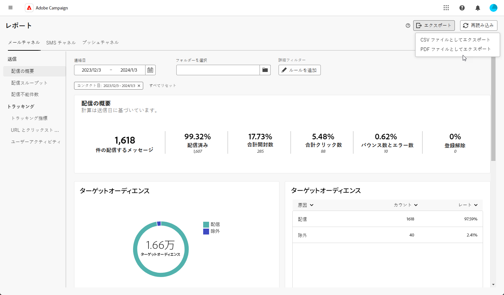

# グローバルレポートの概要 {#global-report-gs}

グローバルレポートは、すべてのチャネルにわたるトラフィックとエンゲージメントの包括的な概要を提供し、キャンペーンと配信のパフォーマンスに関する独自のインサイトを提供する様々なウィジェットを提供します。

## レポートダッシュボードを管理 {#manage-reports}

グローバルレポートにアクセスして管理するには、次の手順に従います。

1. 次に移動： **[!UICONTROL レポート]** メニュー内 **[!UICONTROL レポート]** 」セクションに入力します。

1. ダッシュボードから、 **開始** および **[!UICONTROL 終了時間]** 特定のデータをターゲットに設定します。

   

1. 次から： **[!UICONTROL フォルダを選択]** 「 」フィールドで、特定のフォルダーから配信またはキャンペーンをターゲットにするかを選択します。

   

1. クリック **[!UICONTROL ルールを追加]** をクリックして、レポートデータをより適切にフィルタリングするクエリの作成を開始します。

1. 次から： **[!UICONTROL URL とクリックストリーム]**&#x200B;を使用する場合は、 **[!UICONTROL 上位の訪問済みリンク]** または **[!UICONTROL 期間]**.

   The **[!UICONTROL 表示基準]** オプションを使用すると、URL、ラベルまたはカテゴリに基づいてフィルタリングできます。

## レポートをエクスポート {#export-reports}

様々なレポートをPDFまたは CSV 形式で簡単に書き出し、それらを共有、操作または印刷できます。

1. レポートで、 **[!UICONTROL 書き出し]** を選択し、 **[!UICONTROL 書き出しPDFファイル]** または **[!UICONTROL CSV ファイルとして書き出し]**.

   

1. ファイルを保存するフォルダを探し、必要に応じて名前を変更して、「 **[!UICONTROL 保存]**.

これで、レポートをPDFまたは CSV ファイルで表示または共有できるようになりました。

