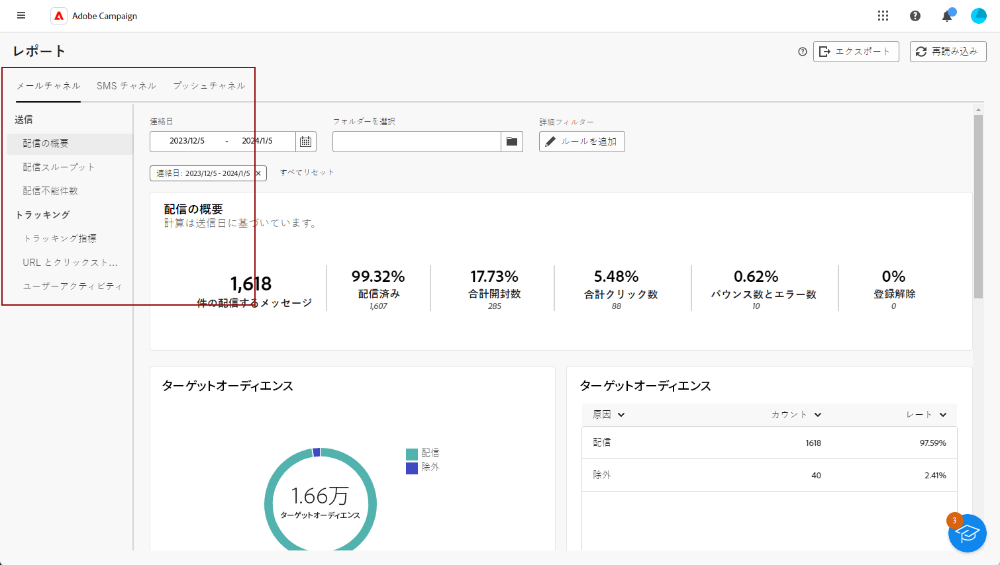

# グローバルレポートの基本を学ぶ {#global-report-gs}

「**グローバルレポート**」は効果的なツールとして機能し、Campaign インスタンス内の各チャネルのトラフィックとエンゲージメント指標の統合された全体的な概要を提供します。これらのレポートは様々なウィジェットで構成され、それぞれがキャンペーンや配信パフォーマンスに関する明確な観点を提供します。

主要業績評価指標 (KPI) は 1 時間ごとに更新され、最新のインサイトを確保します。 デフォルトでは、データは過去 30 日間を対象にフィルタリングされ、キャンペーンおよび配信パフォーマンスに関する現在の関連性の高い視点が提供されます。

各チャネルのレポートと関連指標の完全なリストについては、下記のページを参照してください。

* [メールグローバルレポート](global-report-email.md)
* [SMS グローバルレポート](global-report-sms.md)
* [プッシュグローバルレポート](global-report-push.md)

## レポートダッシュボードの管理 {#manage-reports}

グローバルレポートにアクセスして管理するには、次の手順に従います。

1. 「**[!UICONTROL レポート]**」セクション内の&#x200B;**[!UICONTROL レポート]**&#x200B;メニューに移動します。

1. 左側のメニューで、リストからレポートを選択し、タブ間を移動して各チャネルからのデータを表示します。

   {zoomable=&quot;yes&quot;}

1. ダッシュボードから、**開始時間**&#x200B;と&#x200B;**[!UICONTROL 終了時間]**&#x200B;を選択して、特定のデータをターゲットにします。

   {zoomable=&quot;yes&quot;}

1. 「**[!UICONTROL フォルダーを選択]**」フィールドで、特定のフォルダーから配信またはキャンペーンをターゲットにするかどうかを選択します。

   {zoomable=&quot;yes&quot;}

1. 「**[!UICONTROL ルールを追加]**」をクリックしてクエリの作成を開始し、レポートデータをより適切にフィルタリングします。[詳しくは、クエリモデラーの使用方法を参照してください](../query/query-modeler-overview.md)

1. また、**[!UICONTROL URL とクリックストリーム]**&#x200B;から、**[!UICONTROL 上位訪問リンク]**&#x200B;または&#x200B;**[!UICONTROL 期間]**&#x200B;を選択することもできます。

   「**[!UICONTROL 表示条件]**」オプションを使用すると、URL、ラベル、またはカテゴリでフィルタリングできます。
