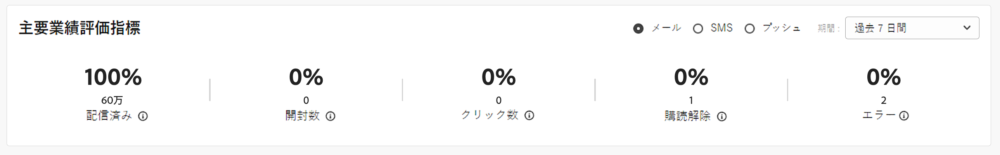

# 主要業績評価指標 {#kpis}

>[!CONTEXTUALHELP]
>id="acw_homepage_kpi"
>title="主要業績評価指標"
>abstract="**主要業績評価指標**&#x200B;のセクションでは、一般的な KPI を通じてプラットフォームの有効性を確認できます。"

<!-- à enlever? -->

>[!CONTEXTUALHELP]
>id="acw_keyindicators_spam"
>title="スパム"
>abstract="スパム KPI"

ホームページを参照して、プラットフォームの主要業績評価指標を確認します。これらの指標は、配信されたメッセージ、開封されたメッセージ、クリックされたメッセージ、購読解除メッセージの数と割合、エラー率を示します。

指標は、デフォルトで過去 7 日間に送信された配信について計算されます。 期間は、カードの右上のセクションにあるドロップダウンリストから変更できます。 テストプロファイルに送信されたメッセージは除外されます。

表示するチャネルを選択できます。デフォルトでは、これらの指標はメールチャネルの指標を反映します。

{zoomable="yes"}

## 配信済みメッセージ {#ui-delivered-kpi}

>[!CONTEXTUALHELP]
>id="acw_keyindicators_delivered"
>title="配信済み"
>abstract="この指標は、選択したチャネルについて、成功して処理されたすべてのメッセージの合計と、送信されたメッセージの合計数に対する、成功して配信されたメッセージの割合を表示します。"

配信されたメッセージの数は、配信品質の割合を反映します。次の理由では、100% にすることはできません。一部のアドレスや電話番号が間違っている可能性がある、メールプロバイダーのスパムブロッカーがメッセージを拒否する、配信品質の問題が発生する可能性がある、などです。

**配信済み** インジケーターは、各チャネルの次の KPI を示します。

* 送信されたメッセージの合計数に対する、成功で配信されたメッセージ数の割合。

* 正常に処理されたすべてのメッセージの合計。

Adobe Campaign では、メッセージを「配信済み」としてマークするルールは次のとおりです。

「シードアドレス」フィールドが「いいえ」で、ステータスが「サービスプロバイダーで受信済み」（SMS の場合）、「送信済み」（メールの場合）、または「モバイルで受信」（プッシュ通知の場合）に等しいメッセージの数。

## 合計開封数 {#ui-open-kpi}

>[!CONTEXTUALHELP]
>id="acw_keyindicators_opens"
>title="開封数"
>abstract="この指標は、選択したチャネルについて、開封されたすべてのメッセージの合計と、成功して配信されたメッセージの合計数に対する、開封されたメッセージの割合を表示します。"

合計開封数は、個々の受信者が開封した数に関係なく、メッセージが開封された合計回数を追跡することによって計算されます。 この指標は、メールでのみ使用できます。

**開封数** インジケーターは、各チャネルの次の KPI を示します。

* 成功して配信されたメッセージの合計数に対する、開封されたメッセージ数の割合。

* チャネルごとに開封されたすべてのメッセージの合計。

Adobe Campaign は、受信者がメール内の画像をダウンロードした際のメッセージの開封数を検出します。HTMLおよびマルチパート/オルタナティブメールには、0 ピクセルの画像が含まれており、開封されたメッセージを検出できます。 テキスト形式のメッセージには画像が含まれていないので、メッセージが開かれたかどうかを検出することはできません。 メッセージの開封に基づいて計算された値は、画像表示に関連するエラーマージンが原因で、常に予測されます。

## クリックスルー率 {#ui-click-kpi}

>[!CONTEXTUALHELP]
>id="acw_keyindicators_clicks"
>title="クリック数"
>abstract="この指標は、選択したチャネルに関して、メッセージでクリックされたすべての URL の合計と、成功して配信されたメッセージの合計数に対するクリックの割合を表示します。"

受信者を特定のページにリダイレクトするには、メッセージコンテンツに URL を追加します。 クリックスルー率は、メッセージ内のリンクをクリックした受信者の数と割合を測定します。

**クリック数** インジケーターは、各チャネルの次の KPI を表示します。

* 正常に配信されたメッセージの合計数に対する、クリック数の割合。

* 配信で 1 回以上クリックしたユニーク受信者数。 購読解除リンクとメールミラーページへのリンクは除外されます。

これらの指標は、統合トラッキングテーブル（`nms:trackingStats`）に基づいています。 この集計テーブルは、受信者トラッキングログテーブル（`nms:trackingLogRcp`）ではなく、レポートを表示する際のパフォーマンス上の理由で使用されます。 リアルタイムでは計算されません。 テーブルは、トラッキングログを取得して数分後に生成されます。

## 購読率 {#ui-sub-kpi}

>[!CONTEXTUALHELP]
>id="acw_keyindicators_subscriptions"
>title="購読"
>abstract="この指標は、選択したチャネルについて、サービスへのすべての購読の合計と、正常に配信されたメッセージの合計数に対する、購読の割合を示します。"

受信者は、メールおよび SMS 通信をオプトインできます。

**購読** インジケーターは、各チャネルの次の KPI を表示します。

* 成功して配信されたメッセージの合計数に対する、購読の数の割合。

>[!NOTE]
>
> 購読 KPI と購読解除 KPI は、サービスタイプに基づいて異なります。例えば、メールの購読と購読解除は、手動のアクションか web フォームかに関わらず、メール関連のすべてのサービスを含みます。この方法を配信レベルの登録解除指標と区別することが重要です。配信レベルの登録解除指標は、実際に登録解除されたユーザーではなく、登録解除のリンククリック数を追跡します。

## 購読解除率 {#ui-unsub-kpi}

>[!CONTEXTUALHELP]
>id="acw_keyindicators_unsubscriptions"
>title="購読解除"
>abstract="この指標は、選択したチャネルについて、サービスからのすべての購読解除の合計と、正常に配信されたメッセージの合計数に対する、購読解除の割合を示します。"

受信者は、メールコンテンツ内の専用の購読解除リンクを介して、または SMS に対して「停止」を返信して、メールおよび SMS からオプトアウトできる必要があります。

**購読解除** インジケーターは、各チャネルの次の KPI を表示します。

* 正常に配信されたメッセージの合計数に対する、購読解除数の割合。

* 購読解除リンク（URL カテゴリが「オプトアウト」に等しい）のすべてのクリックの合計。

>[!NOTE]
>
> 購読 KPI と購読解除 KPI は、サービスタイプに基づいて異なります。例えば、メールの購読と購読解除は、手動のアクションか web フォームかに関わらず、メール関連のすべてのサービスを含みます。この方法を配信レベルの登録解除指標と区別することが重要です。配信レベルの登録解除指標は、実際に登録解除されたユーザーではなく、登録解除のリンククリック数を追跡します。

## エラー率 {#ui-error-kpi}

>[!CONTEXTUALHELP]
>id="acw_keyindicators_errors"
>title="エラー"
>abstract="配信と自動バウンス処理の間に累積したエラーの合計数。関連付けられている割合は、配信されるメッセージ数の比率です。"

Adobe Campaign プラットフォームから送信された一部のメッセージは、宛先に到達しない可能性があります。この問題は、ユーザーのアドレスや電話に入力ミスがある場合、受信者がメールアドレスを変更した場合、またはメールボックスがいっぱいになった場合に発生する可能性があります。 メッセージをプロファイルに送信できない場合、リモートサーバーは自動的にエラーメッセージを Adobe Campaign に送信します。このエラーは、メールアドレス、電話番号、またはデバイスを強制隔離する必要があるかどうかを判断するために適合されます。

データベースを定期的にチェックおよび更新し、すべてのプロファイルがアクティブで実際に動作していることを確認します。 配信エラーは、メッセージが配信されなかった理由に応じて、一時的な場合も永続的な場合もあります（ソフトバウンスまたはハードバウンス）。

**エラー** インジケーターは、各チャネルの次の KPI を示します。

* 配信されるメッセージの合計数に対する、エラー数の割合。

* 配信と自動リバウンド処理の間に累積したエラーの合計数。

## 送信済みメッセージ {#ui-sent-kpi}

<!--DRAFT - This section requires a validation-->

>[!CONTEXTUALHELP]
>id="acw_keyindicators_sent"
>title="送信済み"
>abstract="このメトリックは、配信準備フェーズで準備されたメッセージの合計数に対する、ダイレクト・メール・チャネルの送信されたすべてのメッセージの合計およびプロバイダに送信されたメッセージの割合を示します。"

準備フェーズでは、ダイレクトメール抽出ファイルが生成されますが、受信者（配信ログ）に関する情報は更新されません。 Campaign ユーザーが配信の送信を確認すると、配信のステータスは「配信待ち」から「送信済み」に移動します。 次に、配信は「完了」に設定されます。

準備されたメッセージの合計に対して、送信されたメッセージを 100% にすることはできません。一部のアドレスが欠落しているか、不完全である可能性があるからです。

**送信済み** インジケーターは、ダイレクトメールチャネルの次の KPI を示します。

* 準備されたメッセージの合計数に対する、送信されたメッセージ数の割合。

* すべての送信済みメッセージの合計。