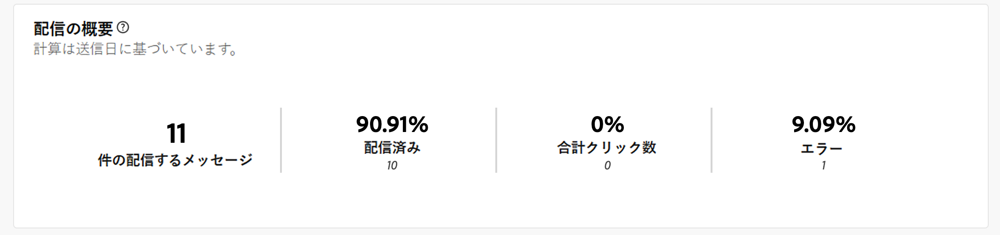
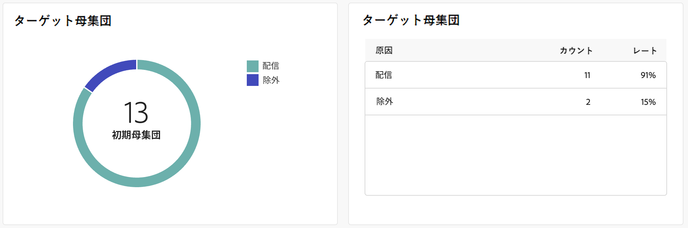
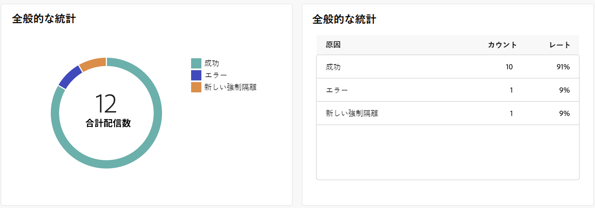
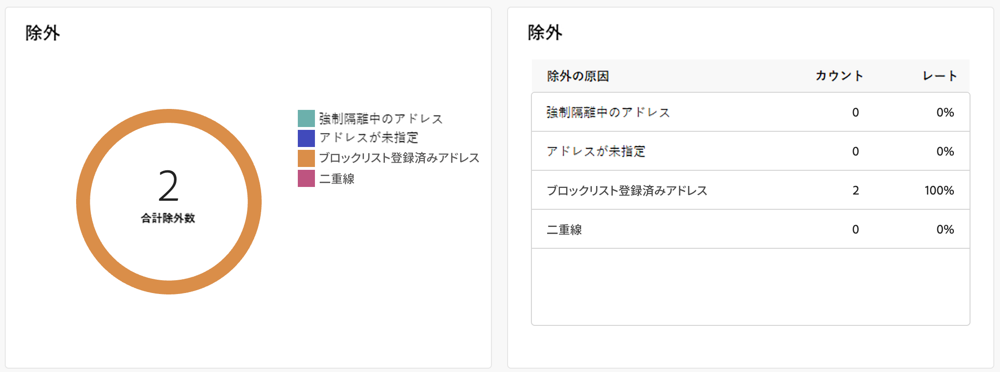
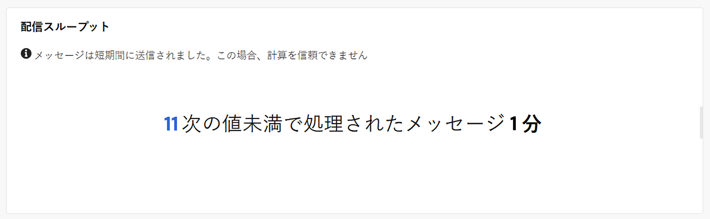

# プッシュ配信レポート {#push-report}

>[!CONTEXTUALHELP]
>id="acw_push_report_overview"
>title="プッシュレポートの概要"
>abstract="プッシュ配信のレポート指標を確認します。"

この **プッシュ配信レポート** では、プッシュチャネルの完全な概要を提供し、広範なインサイトと特定のデータを提供します。 各配信のパフォーマンス、効果、結果に関する包括的な情報を提供します。

## プッシュの概要 {#push-summary}

* **[!UICONTROL 配信の概要]** は、訪問者がプッシュメッセージにどのように関与しているかに関する詳細情報を提供する主要業績評価指標 (KPI) を提供します。

  

  +++プッシュ配信レポート指標の詳細を説明します。

   * **[!UICONTROL 送信総数]**:配信の分析中に処理されたメッセージの合計数。

   * **[!UICONTROL 配信済み]**:送信されたメッセージの合計数に関する、正常に送信されたメッセージの数。

   * **[!UICONTROL クリック数]**:プッシュメッセージでインタラクションをおこなった受信者の合計数。

   * **[!UICONTROL エラー]**:配信中に発生し、プロファイルに送信できなかったエラーの合計数。

+++

* **ターゲット母集団** オーディエンスに関連したグラフおよびテーブル表示データ。

  

  +++プッシュ配信レポート指標の詳細を説明します。

   * **[!UICONTROL 配信する]**:配信の分析中に処理されたメッセージの合計数。

   * **[!UICONTROL 除外]**:分析から除外されたプロファイルの数。

+++

* **全体的な統計** は、次のような送信済みプッシュ通知のデータを表示します。

  

  +++プッシュ配信レポート指標の詳細を説明します。

   * **[!UICONTROL 成功]**：正常に処理されたメッセージ数。

   * **[!UICONTROL エラー]**:配信中に発生し、特定のプロファイルにメッセージを送信できなかったエラーの合計数。

   * **[!UICONTROL 新しい強制隔離]**:除外され、強制隔離に追加されたプロファイルの数。

+++

* **[!UICONTROL 除外]** グラフとテーブルには、ターゲットプロファイルから除外されたユーザープロファイルがメッセージを受信できなかった様々な理由が表示されます。

  

## 配信スループット {#delivery-throughput}

このレポートは、指定した期間内のプラットフォーム全体の配信スループットに関する詳細情報を表示します。 メッセージ配信の速度の測定に使用される主な指標は、1 時間に送信されたメッセージの数です。

