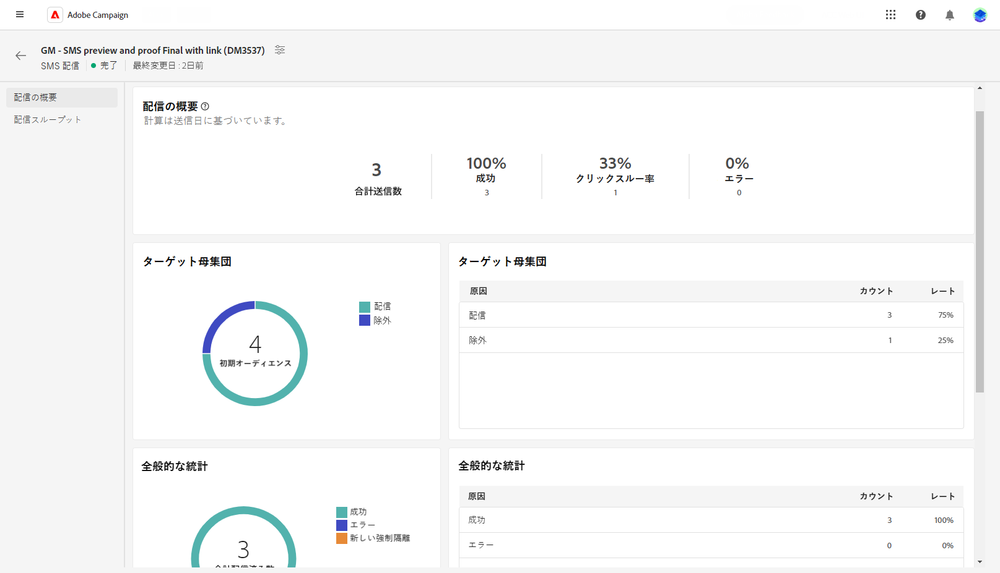

# SMS 配信レポート {#report}

>[!CONTEXTUALHELP]
>id="acw_sms_report_overview"
>title="SMS レポートの概要"
>abstract="SMS 配信のレポート指標を確認します。"

## 配信の概要 {#delivery-summary}

* **[!UICONTROL 配信の概要]** は、訪問者が SMS メッセージにどのように関わっているかに関する詳細情報を提供する主要業績評価指標 (KPI) を提供します。 これらの KPI には次のものが含まれます。

   * **[!UICONTROL 送信総数]**:配信の分析中に処理されたメッセージの合計数。

   * **[!UICONTROL 成功]**:送信されたメッセージの合計数に関する、正常に送信されたメッセージの数。

   * **[!UICONTROL クリックスルー率]**:SMS 配信に含まれるリンクを操作したユーザーの割合。

   * **[!UICONTROL エラー]**:配信中に発生し、プロファイルに送信できなかったエラーの合計数。

* **ターゲット母集団** オーディエンスに関連したグラフおよびテーブル表示データ。

   * **[!UICONTROL 配信する]**:配信の分析中に処理されたメッセージの合計数。

   * **[!UICONTROL 除外]**:分析から除外されたプロファイルの数。

* **全体的な統計** は、以下を含む送信済み SMS メッセージのデータを表示します。

   * **[!UICONTROL 成功]**：正常に処理されたメッセージ数。

   * **[!UICONTROL エラー]**:配信中に発生し、特定のプロファイルにメッセージを送信できなかったエラーの合計数。

   * **[!UICONTROL 新しい強制隔離]**:除外され、強制隔離に追加されたプロファイルの数。

* **[!UICONTROL 除外]** グラフとテーブルには、ターゲットプロファイルから除外されたユーザープロファイルがメッセージを受信できなかった様々な理由が表示されます。
