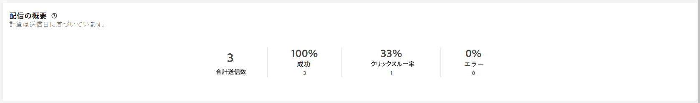

# SMS 配信レポート {#report}

>[!CONTEXTUALHELP]
>id="acw_sms_report_overview"
>title="SMS レポートの概要"
>abstract="SMS 配信のレポート指標を確認します。"

**SMS 配信レポート**&#x200B;は、SMS チャネルの包括的な概要を提供し、広範なインサイトと特定のデータを提供します。各配信のパフォーマンス、効果、結果に関する包括的な情報を提供します。

## 配信の概要 {#delivery-summary}

* **[!UICONTROL 配信の概要]**&#x200B;は、訪問者が SMS メッセージにどのように関与したかについて詳細情報を与える主要業績評価指標（KPI）を提供します。

  

  +++SMS 配信レポート指標の詳細を説明します。

   * **[!UICONTROL 合計送信数]**：配信の分析中に処理されたメッセージの合計数。

   * **[!UICONTROL 成功]**：送信されたメッセージの合計数に対して、正常に送信されたメッセージの数。

   * **[!UICONTROL クリックスルー率]**：SMS 配信に含まれるリンクを操作したユーザーの割合。

   * **[!UICONTROL エラー]**：配信中に発生し、プロファイルに送信できなかったエラーの合計数。
+++

* **ターゲット母集団**&#x200B;グラフおよびテーブルには、オーディエンスに関連したデータが表示されます。

  

  +++SMS 配信レポート指標の詳細を説明します。

   * **[!UICONTROL 配信]**：配信の分析中に処理されたメッセージの合計数。

   * **[!UICONTROL 除外]**：分析から除外されたプロファイルの数。
+++

* **全般的な統計**&#x200B;は、以下を含む送信済み SMS メッセージのデータを表示します。

  

  +++SMS 配信レポート指標の詳細を説明します。

   * **[!UICONTROL 成功]**：正常に処理されたメッセージ数。

   * **[!UICONTROL エラー]**：配信中に発生し、特定のプロファイルにメッセージを送信できなかったエラーの合計数。

   * **[!UICONTROL 新しい強制隔離]**：除外され、強制隔離に追加されたプロファイルの数。
+++

* **[!UICONTROL 除外]**&#x200B;グラフとテーブルには、ターゲットプロファイルから除外されたユーザープロファイルがメッセージを受信できなかった様々な理由が表示されます。

  

## 配信スループット {#delivery-throughput}

このレポートには、指定した期間内のプラットフォーム全体の配信スループットに関する詳細情報が表示されます。メッセージ配信速度の測定に使用される主な指標は、1 時間あたりに送信されるメッセージの数です。

