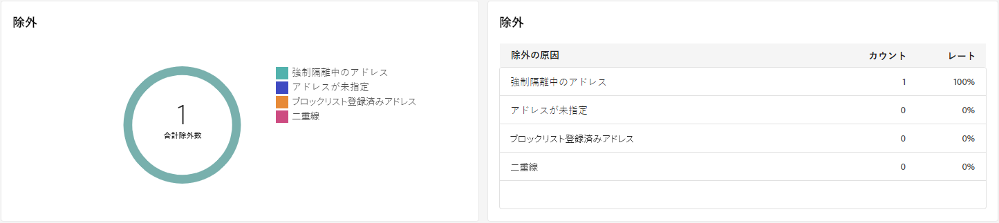

# SMS 配信レポート {#sms-report}

>[!CONTEXTUALHELP]
>id="acw_delivery_reporting_sending_sms"
>title="送信のレポート"
>abstract="レポート内の「**送信**」タブでは、訪問者の配信とのやり取りや、訪問者が遭遇した可能性のある潜在的なエラーに関する詳細なインサイトを提供します。"

**SMS 配信の概要** は、SMS 配信の詳細な概要を提供し、広範なインサイトと特定のデータを提供します。 配信のパフォーマンス、有効性、結果に関する包括的な情報が含まれます。

## 配信の概要 {#delivery-summary}

### 配信の概要 {#sms-delivery-overview}

>[!CONTEXTUALHELP]
>id="acw_sms_report_overview"
>title="SMS 配信の概要"
>abstract="**SMS 配信の概要**&#x200B;は、SMS 配信の包括的な概要を提供し、広範なインサイトと特定のデータを提供します。配信のパフォーマンス、効果、結果に関する包括的な情報を提供します。"

**[!UICONTROL 配信の概要]** レポートは、成功率とエラー率に関する詳細情報と、訪問者が SMS メッセージにどのように関与したかを提供する主要業績評価指標（KPI）を提供します。

{zoomable="yes"}

+++SMS 配信レポート指標の詳細情報。

* **[!UICONTROL 合計送信数]**：配信の準備中に処理されたメッセージの割合と合計数。

* **[!UICONTROL 成功]**：送信されたメッセージの合計数に対して、正常に送信されたメッセージの割合と数。

* **[!UICONTROL クリックスルー率]**：SMS 配信に含まれるリンクを操作したユーザーの割合と数。

* **[!UICONTROL エラー]**：配信中に発生し、プロファイルに送信できなかったエラーの割合と合計数。

+++

### ターゲット母集団 {#sms-delivery-targeted-population}

>[!CONTEXTUALHELP]
>id="acw_delivery_reporting_sms_targeted_population"
>title="SMS のターゲット母集団"
>abstract="**ターゲット母集団**&#x200B;グラフおよびテーブルには、SMS オーディエンスに関連するデータ（配信メッセージ数と除外件数）が表示されます。"

この **ターゲット母集団** グラフおよびテーブルには、オーディエンスに関連するデータが表示されます。 指標については、以下で詳しく説明します。

{zoomable="yes"}

+++SMS 配信レポート指標の詳細情報。

* **[!UICONTROL 配信]**：配信の準備中に処理されたメッセージの合計数と割合。

* **[!UICONTROL 除外]**：分析から除外されたプロファイルの数と割合。
+++

### 全体的な統計 {#sms-delivery-overall}

>[!CONTEXTUALHELP]
>id="acw_delivery_reporting_sms_overall_stats"
>title="SMS の全体的な統計"
>abstract="**全体的な統計**&#x200B;レポートには、送信された SMS のデータ（成功、エラーおよび強制隔離）が表示されます。"

**全体的な統計**&#x200B;レポートには、送信された SMS メッセージのデータが表示されます。指標については、以下で詳しく説明します。

{zoomable="yes"}

+++SMS 配信レポート指標の詳細情報。

* **[!UICONTROL 成功]**：正常に処理されたメッセージの数と割合。

* **[!UICONTROL エラー]**：配信中に発生し、特定のプロファイルにメッセージを送信できなかったエラーの合計数と割合。

* **[!UICONTROL 新しい強制隔離]**：除外され、強制隔離に追加されたプロファイルの数と割合。
+++

### 除外 {#sms-delivery-exclusions}

>[!CONTEXTUALHELP]
>id="acw_delivery_reporting_sms_exclusions"
>title="SMS の除外"
>abstract="**除外**&#x200B;グラフおよびテーブルには、ターゲットプロファイルから除外されたユーザープロファイルがメッセージを受信できなかった様々な理由が表示されます。"

**[!UICONTROL 除外]**&#x200B;グラフおよびテーブルには、ターゲットプロファイルから除外されたユーザープロファイルがメッセージを受信できなかった理由が表示されます。除外ルールについて詳しくは、[Campaign v8（コンソール）ドキュメント](https://experienceleague.adobe.com/docs/campaign/campaign-v8/send/failures/delivery-failures.html?lang=ja#sms-quarantines){_blank}を参照してください。

{zoomable="yes"}

## 配信スループット {#delivery-throughput}

>[!CONTEXTUALHELP]
>id="acw_delivery_reporting_throughput_sms"
>title="SMS の配信スループット"
>abstract="**配信スループット**&#x200B;レポートには、指定した期間内の配信スループットに関する詳細情報が表示されます。メッセージ配信速度の測定に使用される主な指標は、1 時間あたりに送信されるメッセージの数です。"

このレポートには、指定した期間内の配信スループットに関する詳細情報が表示されます。 メッセージ配信速度の測定に使用される主な指標は、1 時間あたりに送信されるメッセージの数です。

{zoomable="yes"}