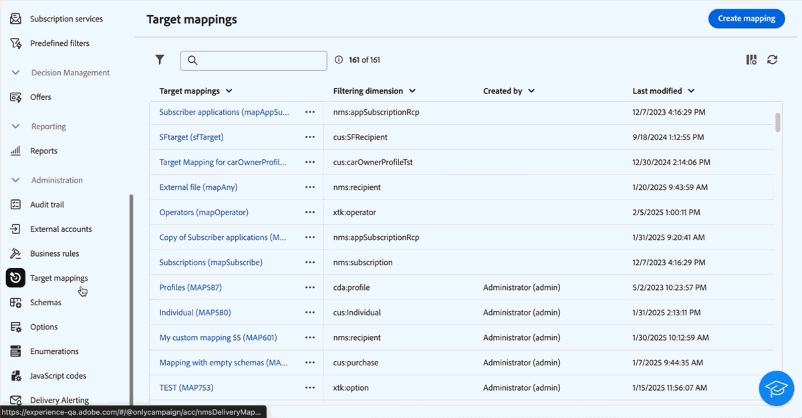

# リリースノート {#latest-release}

>[!CONTEXTUALHELP]
>id="acw_homepage_learning_card2"
>title="リリースノート"
>abstract="Adobe Campaign web ユーザーインターフェイスのリリースは、機能のデプロイメントに対してより拡張性の高い、段階的なアプローチを可能にする継続的な配信モデルに基づいて動作します。これにより、Campaign リリースノートは月に数回更新され、最新の機能、改善点、修正が含まれます。定期的に確認することをお勧めします。"

Adobe Campaign web ユーザーインターフェイスリリースは、継続的な配信モデルに基づいて動作します。このモデルにより、機能のデプロイメントに対するスケーラブルかつ段階的なアプローチが可能になります。 したがって、これらのリリースノートは月に数回更新されます。 定期的に確認してください。

以前のリリースで利用可能な変更および改善点は、[ このページ ](release-notes-24.md) に記載されています。

## 2025年2月リリース {#25-2-release}

**リリース日**：2025年2月18日（PT）

次の機能と改善点は、2月のリリース以降使用できます。

### 機能 {#25-2-features}

<table>
<thead>
<tr>
<th><strong>ビジネスルール（タイポロジルール）の作成</strong> </th>
</tr>
</thead>
<tbody>
<tr>
<td>

Adobe Campaign web ユーザーインターフェイスでタイポロジとタイポロジルールを作成できるようになりました。タイポロジでは、配信の送信を制御、フィルタリングおよび優先順位付けします。 タイポロジは、配信に常に必須のコンポーネント（購読解除リンクや件名行など）またはオーディエンスからグループを除外するフィルタリングルール（非購読者、競合他社、非ロイヤルティ顧客など）が含まれていることを検証します。

詳しくは、<a href="../administration/typologies.md">詳細なドキュメント</a>を参照してください。

</td>
</tr>
</tbody>
</table>

<table>
<thead>
<tr>
<th><strong>ターゲットマッピング</strong> </th>
</tr>
</thead>
<tbody>
<tr>
<td>

Campaign web ユーザーインターフェイスでターゲットマッピングを作成できるようになりました。ターゲットマッピングは、様々な配信チャネル（メール、SMS、プッシュ通知）からスキーマのデータフィールドへのリンク方法を定義します。ターゲットマッピングは、プロファイル、契約の受益者、オペレーター、サブスクライバー、見込み客などの、ターゲットオーディエンスを定義します。

詳しくは、<a href="../administration/target-mappings.md">詳細なドキュメント</a>を参照してください。

</td>
</tr>
</tbody>
</table>

<table>
<thead>
<tr>
<th><strong>スキーマの詳細</strong> </th>
</tr>
</thead>
<tbody>
<tr>
<td>

リストで名前を選択して、スキーマの詳細にアクセスできるようになりました。カスタムフィールドの編集に、スキーマの詳細にある「<b> カスタムフィールドを編集 </b> ボタンからアクセスできるようになりました。

詳しくは、<a href="../administration/schemas.md">詳細なドキュメント</a>を参照してください。

</td>
</tr>
</tbody>
</table>

## 2025年1月リリース {#25-1-release}

**リリース日**：2025年2月5日（PT）

次の機能と改善点は、1月のリリース以降使用できます。

### 機能 {#25-1-features}

<table>
<thead>
<tr>
<th><strong>ビジュアルフラグメントの作成と使用</strong> </th>
</tr>
</thead>
<tbody>
<tr>
<td>

ビジュアルフラグメントは、複数のメール配信やコンテンツテンプレートで再利用できる、事前定義されたビジュアルブロックです。 この機能を、サーバービルド 8.6.4 以降を実行しているすべてのお客様が使用できるようになりました。

詳しくは、<a href="../content/use-visual-fragments.md">詳細なドキュメント</a>を参照してください。

</td>
</tr>
</tbody>
</table>

<table>
<thead>
<tr>
<th><strong>サードパーティシステムを使用した配信の送信</strong> </th>
</tr>
</thead>
<tbody>
<tr>
<td>

Campaign web インターフェイスで外部配信と外部配信テンプレートを定義できるようになりました。このモードでは、外部プロバイダーと共有できる出力ファイルにメッセージをコンパイルできます。デフォルトでは、ダイレクトメールチャネルには外部配信モードが使用されます。

詳しくは、<a href="../msg/send-external-deliveries.md">詳細なドキュメント</a>を参照してください。

</td>
</tr>
</tbody>
</table>

<table>
<thead>
<tr>
<th><strong>列挙の管理</strong> </th>
</tr>
</thead>
<tbody>
<tr>
<td>

Adobe Campaign web ユーザーインターフェイスから列挙を直接作成できるようになりました。列挙とは、フィールドへの入力候補としてシステムによって表示される値のリストです。列挙を使用して、これらのフィールドの値を標準化したり、データ入力を支援したり、クエリ内で使用したりできます。

詳しくは、<a href="../administration/enumerations.md">詳細なドキュメント</a>を参照してください。

</td>
</tr>
</tbody>
</table>

<table>
<thead>
<tr>
<th><strong>カスタムオプションの作成</strong> </th>
</tr>
</thead>
<tbody>
<tr>
<td>

Adobe Campaign web ユーザーインターフェイス内のテクニカルオプションにアクセスし、ニーズに合わせて独自のカスタムオプションを作成できるようになりました。これは、JavaScript コードワークフローアクティビティを使用して中間データを保存する際に特に便利です。

詳しくは、<a href="../administration/options.md">詳細なドキュメント</a>を参照してください。

</td>
</tr>
</tbody>
</table>

<table>
<thead>
<tr>
<th><strong>JavaScript コードの定義と呼び出し</strong> </th>
</tr>
</thead>
<tbody>
<tr>
<td>

Adobe Campaign web ユーザーインターフェイスで JavaScript コードを作成できるようになりました。これにより、ライブラリと同様に、ワークフロー全体で使用できる再利用可能な関数を作成できます。

詳しくは、<a href="../administration/javascript-codes.md">詳細なドキュメント</a>を参照してください。

</td>
</tr>
</tbody>
</table>

<table>
<thead>
<tr>
<th><strong>AI アシスタントによるランディングページの生成</strong> </th>
</tr>
</thead>
<tbody>
<tr>
<td>

ランディングページ配信で AI アシスタントが使用できるようになり、テキストや画像の生成、または完全なページレイアウトの生成が可能になりました。

AI アシスタントについて詳しくは、<a href="../email/generative-lp.md">詳細ドキュメント</a>を参照してください。

</td>
</tr>
</tbody>
</table>

### 改善点 {#25-1-improvements}

* インターフェイスでのカスタムフィールドの表示のカスタマイズ：
   * インターフェイスに表示する追加のカスタムフィールドを選択します。
   * 他のフィールドの入力に基づいてリスト値を制限するなど、リンクタイプのカスタムフィールドを表示するためのルールを設定します。
   * インターフェイスのフィールドをより柔軟に並べ替える：フィールドは、1 つの列に及んだり、より良い整理のためにサブセクションにグループ化したりできます。
   * 特定のフィールドを読み取り専用に設定します。

* 最近のフィルターとお気に入りフィルター：頻繁に使用する属性をお気に入りに追加して、すばやくアクセスできます。 お気に入りに加えて、最後に選択した属性を表示および使用します。

* 外部アカウント：新しい外部アカウントを作成する際に、新しい&#x200B;**[!UICONTROL ルーティング]**&#x200B;タイプを選択できます。これにより、外部配信で使用する特定の外部アカウントを設定できます。[詳細情報](../administration/external-account.md#routing)。