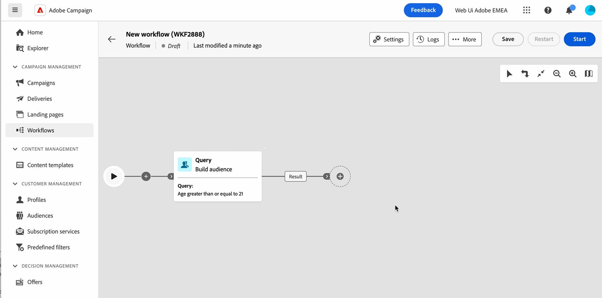

# リリースノート {#latest-release}

>[!CONTEXTUALHELP]
>id="acw_homepage_learning_card2"
>title="新機能"
>abstract="Adobe Campaign web ユーザーインターフェイスのリリースは、機能のデプロイメントに対するより拡張性の高い、段階的なアプローチを可能にする継続的な配信モデルに基づいて動作します。リリースノートは月に数回更新されます。ダイレクトメールチャネル、新しい「データソースを変更」ワークフローアクティビティ、その他の機能強化を含む **3月リリースが公開されました**。"

<!--Last update: **March 19, 2024**-->

Adobe Campaign web ユーザーインターフェイスのリリースは、機能のデプロイメントに対するより拡張性の高い、段階的なアプローチを可能にする継続的な配信モデルに基づいて動作します。したがって、これらのリリースノートは月に数回更新されます。定期的に確認してください。

>[!AVAILABILITY]
>
>このバージョンは、[Campaign（コンソール）v8.6 リリース](https://experienceleague.adobe.com/docs/campaign/campaign-v8/releases/release-notes.html?lang=ja)以降のすべてのユーザーが利用できます。Adobe Campaign クライアントコンソールのリリースとアップグレードについて詳しくは、[Campaign v8（コンソール）ドキュメント](https://experienceleague.adobe.com/docs/campaign/campaign-v8/releases/upgrades.html?lang=ja){target="_blank"}を参照してください。

## 3月リリースノート {#24-3-release}

**リリース日**：2024年3月19～20日（PT）

### ダイレクトメールチャネル {#24-3-dm}

**ダイレクトメール**&#x200B;チャネルがワークフロー内およびスタンドアロン配信として使用できるようになりました。ダイレクトメールは、抽出ファイルを作成、カスタマイズ、生成し、ダイレクトメールプロバイダーと共有して顧客にメールを送信できるオフラインチャネルです。[詳細情報](../direct-mail/gs-direct-mail.md)

### 新しい「データソースを変更」ワークフローアクティビティ {#24-3-change-data-source}

「**データソースを変更**」ワークフローアクティビティを使用すると、ワークフローの作業用テーブルで使用するデータソースを変更できます。このアクティビティによって、様々なデータベース間でデータを管理できるようになり、パフォーマンスが向上するため、柔軟性が高まります。[詳細情報](../workflows/activities/change-data-source.md)

### ワークフローアクティビティの機能強化の分割 {#24-3-split}

「**分割**」ワークフローアクティビティの「**同じテーブル内のすべてのサブセットを生成**」オプションを使用して、すべてのサブセットを 1 つの出力トランジションにグループ化できるようになりました。[詳細情報](../workflows/activities/split.md)

### クエリモデラー {#24-3-query-modeler}

* クエリモデラーがメールデザイナーで使用できるようになりました。条件付きコンテンツを作成する際に、条件を作成できます。[詳細情報](../personalization/conditions.md)
* カスタム条件を作成する際に、日付タイプの属性に定義済みの値を使用できるようになりました。[詳細情報](../query/build-query.md)
* ダイアグラム内の新しいトランジションにオペレーターを追加できなくなりました。コンポーネントをフィルタリングしてグループ化する前にのみ、既存のトランジションに追加できます。[詳細情報](../query/build-query.md)
