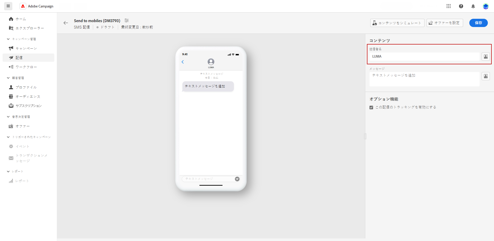
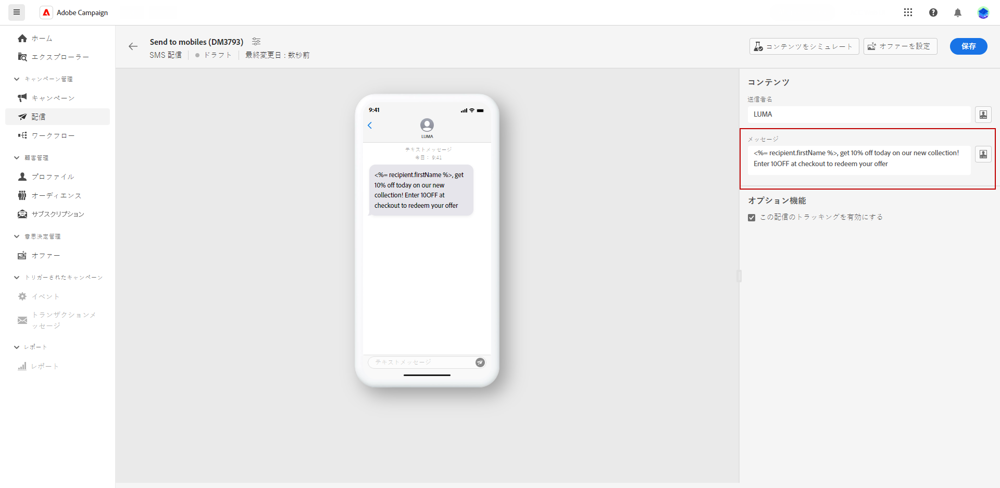

# SMS 配信をデザイン {#design-sms}

>[!CONTEXTUALHELP]
>id="acw_deliveries_sms_content"
>title="SMS コンテンツ"
>abstract="SMS 配信のコンテンツを作成し、パーソナライゼーションフィールド、コンテンツブロック、動的コンテンツを使用してパーソナライズします。"

SMS 配信のコンテンツをデザインするには、次の手順に従います。

1. 配信ページで、「**[!UICONTROL コンテンツを編集]**」ボタンを使用して SMS コンテンツをデザインします。

1. **[!UICONTROL コンテンツを編集]**&#x200B;ページで、**[!UICONTROL 送信者フィールド]**&#x200B;にアクセスし、優先名を入力することで送信者名をカスタマイズできます。

   さらに、「**[!UICONTROL パーソナライゼーションダイアログを開く]**」をクリックすると、パーソナライゼーションフィールド、コンテンツブロック、動的コンテンツをメッセージに含めることができます。

   

1. 「**[!UICONTROL メッセージ]**」フィールドにテキストメッセージを入力するか、「**[!UICONTROL パーソナライゼーションダイアログを開く]**」オプションをクリックしてコンテンツを定義し、動的コンテンツを追加します。[詳細情報](../personalization/gs-personalization.md)

   

1. デフォルトでは、配信のトラッキングが有効になっています。このオプションは、「**[!UICONTROL オプション機能]**」セクションから無効にすることができます。

1. **[!UICONTROL コンテンツをシミュレート]**&#x200B;メニューにアクセスすると、パーソナライズされたコンテンツをプレビューできます。[詳細情報](send-sms.md#preview-sms)

1. 「**[!UICONTROL 保存]**」をクリックして、プレビューでメッセージを確認します。

これで、SMS メッセージを確認してオーディエンスに送信できるようになりました。
