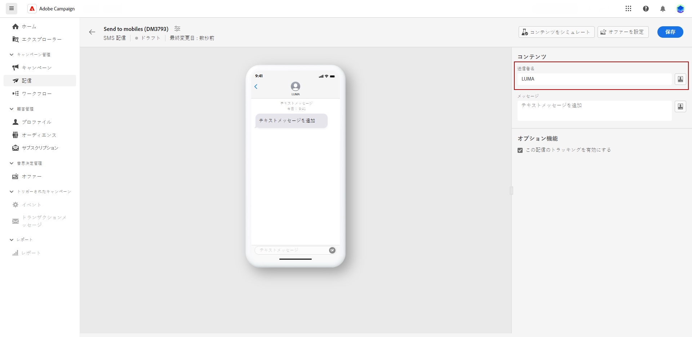
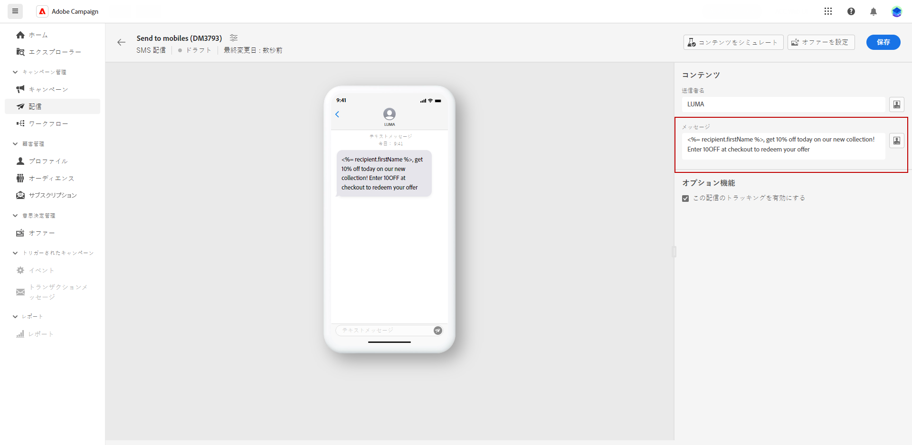

<?xml version="1.0" encoding="UTF-8"?>
<xliff xmlns="urn:oasis:names:tc:xliff:document:1.2" xmlns:okp="okapi-framework:xliff-extensions" xmlns:its="http://www.w3.org/2005/11/its" xmlns:itsxlf="http://www.w3.org/ns/its-xliff/" version="1.2" its:version="2.0">
<file original="help/v8/sms/content-sms.md.mdsc" source-language="en-US" target-language="en-XX" datatype="x-text/markdown">
<body>
<trans-unit id="tu1" restype="x-YAML_METADATA_HEADER_VALUE" xml:space="preserve">
<source xml:lang="en-US">Design a SMS delivery</source>
<target xml:lang="en-XX">SMS 配信のデザイン</target>
</trans-unit>
<trans-unit id="tu2" restype="x-YAML_METADATA_HEADER_VALUE" xml:space="preserve">
<source xml:lang="en-US">Learn how to design your SMS delivery</source>
<target xml:lang="en-XX">SMS 配信のデザイン方法を学ぶ</target>
</trans-unit>
<trans-unit id="tu3" xml:space="preserve">
<source xml:lang="en-US">Design an SMS delivery</source>
<target xml:lang="en-XX">SMS 配信をデザイン</target>
</trans-unit>
<trans-unit id="tu4" xml:space="preserve">
<source xml:lang="en-US">SMS Content</source>
<target xml:lang="en-XX">SMS コンテンツ</target>
</trans-unit>
<trans-unit id="tu5" xml:space="preserve">
<source xml:lang="en-US">Create the content of your SMS deliveries, and personalize it with personalization fields, expression fragments, and dynamic content. To start composing your message, click the <ph id="1" ctype="x-STRONG_EMPHASIS">**</ph>Edit content<ph id="2" ctype="x-STRONG_EMPHASIS">**</ph> button.</source>
<target xml:lang="en-XX">SMS 配信のコンテンツを作成し、パーソナライゼーションフィールド、式フラグメント、動的コンテンツを使用してパーソナライズします。 メッセージの作成を開始するには、「<ph id="1" ctype="x-STRONG_EMPHASIS">**</ph>コンテンツを編集<ph id="2" ctype="x-STRONG_EMPHASIS">**</ph>」ボタンをクリックします。</target>
</trans-unit>
<trans-unit id="tu6" xml:space="preserve">
<source xml:lang="en-US">SMS message content</source>
<target xml:lang="en-XX">SMS メッセージコンテンツ</target>
</trans-unit>
<trans-unit id="tu7" xml:space="preserve">
<source xml:lang="en-US">Define the content of your SMS. To compose your message, click the <ph id="1" ctype="x-STRONG_EMPHASIS">**</ph>Message<ph id="2" ctype="x-STRONG_EMPHASIS">**</ph> field and enter the message content. Use the Expression editor to add personalized data and dynamic content. You can also customize the sender name. By default, tracking is enabled for all SMS deliveries, allowing you to measure when recipients click on links.</source>
<target xml:lang="en-XX">SMS のコンテンツの定義 メッセージを作成するには、「<ph id="1" ctype="x-STRONG_EMPHASIS">**</ph>メッセージ<ph id="2" ctype="x-STRONG_EMPHASIS">**</ph>」フィールドをクリックしてメッセージコンテンツを入力します。 式エディターを使用すると、パーソナライズされたデータと動的コンテンツを追加できます。 また、送信者名をカスタマイズすることもできます。 デフォルトでは、すべての SMS 配信に対してトラッキングが有効になっているので、受信者がリンクをクリックした際に測定できます。</target>
</trans-unit>
<trans-unit id="tu8" xml:space="preserve">
<source xml:lang="en-US">To design the content of an SMS delivery, follow these steps:</source>
<target xml:lang="en-XX">SMS 配信のコンテンツをデザインするには、次の手順に従います。</target>
</trans-unit>
<trans-unit id="tu9" xml:space="preserve">
<source xml:lang="en-US">From your delivery page, click the <ph id="1" ctype="x-STRONG_EMPHASIS">**[!UICONTROL </ph>Edit content<ph id="3" ctype="x-LINK_REF">]**</ph> button to design your SMS content.</source>
<target xml:lang="en-XX">配信ページで、「<ph id="1" ctype="x-STRONG_EMPHASIS">**[!UICONTROL </ph>コンテンツを編集<ph id="3" ctype="x-LINK_REF">]**</ph>」ボタンを使用して SMS コンテンツをデザインします。</target>
</trans-unit>
<trans-unit id="tu10" xml:space="preserve">
<source xml:lang="en-US">On the <ph id="1" ctype="x-STRONG_EMPHASIS">**[!UICONTROL </ph>Edit content<ph id="3" ctype="x-LINK_REF">]**</ph> page, customize the sender name by accessing the <ph id="5" ctype="x-STRONG_EMPHASIS">**[!UICONTROL </ph>Sender field<ph id="7" ctype="x-LINK_REF">]**</ph> and entering the preferred name.</source>
<target xml:lang="en-XX"><ph id="1" ctype="x-STRONG_EMPHASIS">**[!UICONTROL </ph>コンテンツを編集<ph id="3" ctype="x-LINK_REF">]**</ph>ページで、<ph id="5" ctype="x-STRONG_EMPHASIS">**[!UICONTROL </ph>送信者フィールド<ph id="7" ctype="x-LINK_REF">]**</ph>にアクセスし、優先名を入力することで送信者名をカスタマイズできます。</target>
</trans-unit>
<trans-unit id="tu11" xml:space="preserve">
<source xml:lang="en-US">Additionally, click <ph id="1" ctype="x-STRONG_EMPHASIS">**[!UICONTROL </ph>Open personalization dialog<ph id="3" ctype="x-LINK_REF">]**</ph> to include personalization fields, expression fragments, and dynamic content in your message.</source>
<target xml:lang="en-XX">さらに、「<ph id="1" ctype="x-STRONG_EMPHASIS">**[!UICONTROL </ph>パーソナライゼーションダイアログを開く<ph id="3" ctype="x-LINK_REF">]**</ph>」をクリックすると、パーソナライゼーションフィールド、式フラグメント、動的コンテンツをメッセージに含めることができます。</target>
</trans-unit>
<trans-unit id="tu12" xml:space="preserve">
<source xml:lang="en-US"><ph id="1" ctype="x-IMAGE">{zoomable="yes"}</ph></source>
<target xml:lang="en-XX"><ph id="1" ctype="x-IMAGE">{zoomable="yes"}</ph></target>
</trans-unit>
<trans-unit id="tu13" xml:space="preserve">
<source xml:lang="en-US">Type your text message in the <ph id="1" ctype="x-STRONG_EMPHASIS">**[!UICONTROL </ph>Message<ph id="3" ctype="x-LINK_REF">]**</ph> field, or click the <ph id="5" ctype="x-STRONG_EMPHASIS">**[!UICONTROL </ph>Open personalization dialog<ph id="7" ctype="x-LINK_REF">]**</ph> option to define content and add dynamic content. <ph id="9" ctype="x-LINK">[</ph>Learn more<ph id="10" ctype="x-LINK">](../personalization/gs-personalization.md)</ph></source>
<target xml:lang="en-XX">「<ph id="1" ctype="x-STRONG_EMPHASIS">**[!UICONTROL </ph>メッセージ<ph id="3" ctype="x-LINK_REF">]**</ph>」フィールドにテキストメッセージを入力するか、「<ph id="5" ctype="x-STRONG_EMPHASIS">**[!UICONTROL </ph>パーソナライゼーションダイアログを開く<ph id="7" ctype="x-LINK_REF">]**</ph>」オプションをクリックしてコンテンツを定義し、動的コンテンツを追加します。 <ph id="9" ctype="x-LINK">[</ph>詳細情報<ph id="10" ctype="x-LINK">](../personalization/gs-personalization.md)</ph></target>
</trans-unit>
<trans-unit id="tu14" xml:space="preserve">
<source xml:lang="en-US"><ph id="1" ctype="x-IMAGE">{zoomable="yes"}</ph></source>
<target xml:lang="en-XX"><ph id="1" ctype="x-IMAGE">{zoomable="yes"}</ph></target>
</trans-unit>
<trans-unit id="tu15" xml:space="preserve">
<source xml:lang="en-US">By default, tracking is enabled for deliveries. Disable this option from the delivery's <ph id="1" ctype="x-STRONG_EMPHASIS">**[!UICONTROL </ph>Settings<ph id="3" ctype="x-LINK_REF">]**</ph> > <ph id="5" ctype="x-STRONG_EMPHASIS">**[!UICONTROL </ph>Tracking<ph id="7" ctype="x-LINK_REF">]**</ph> tab if needed. <ph id="9" ctype="x-LINK">[</ph>Learn more<ph id="10" ctype="x-LINK">](../advanced-settings/delivery-settings.md#tracking-tab)</ph></source>
<target xml:lang="en-XX">デフォルトでは、配信のトラッキングが有効になっています。 必要に応じて、配信の<ph id="1" ctype="x-STRONG_EMPHASIS">**[!UICONTROL </ph>設定<ph id="3" ctype="x-LINK_REF">]**</ph>／<ph id="5" ctype="x-STRONG_EMPHASIS">**[!UICONTROL </ph>トラッキング<ph id="7" ctype="x-LINK_REF">]**</ph>タブからこのオプションを無効にします。<ph id="9" ctype="x-LINK">[</ph>詳細情報<ph id="10" ctype="x-LINK">](../advanced-settings/delivery-settings.md#tracking-tab)</ph></target>
</trans-unit>
<trans-unit id="tu16" xml:space="preserve">
<source xml:lang="en-US">Click <ph id="1" ctype="x-STRONG_EMPHASIS">**[!UICONTROL </ph>Settings<ph id="3" ctype="x-LINK_REF">]**</ph> to access advanced options related to your delivery template. <ph id="5" ctype="x-LINK">[</ph>Learn more<ph id="6" ctype="x-LINK">](../advanced-settings/delivery-settings.md)</ph></source>
<target xml:lang="en-XX">「<ph id="1" ctype="x-STRONG_EMPHASIS">**[!UICONTROL </ph>設定<ph id="3" ctype="x-LINK_REF">]**</ph>」をクリックして、配信テンプレートに関連する詳細オプションにアクセスします。 <ph id="5" ctype="x-LINK">[</ph>詳細情報<ph id="6" ctype="x-LINK">](../advanced-settings/delivery-settings.md)</ph></target>
</trans-unit>
<trans-unit id="tu17" xml:space="preserve">
<source xml:lang="en-US">Access the <ph id="1" ctype="x-STRONG_EMPHASIS">**[!UICONTROL </ph>Simulate content<ph id="3" ctype="x-LINK_REF">]**</ph> menu to preview your personalized content. <ph id="5" ctype="x-LINK">[</ph>Learn more<ph id="6" ctype="x-LINK">](send-sms.md#preview-sms)</ph></source>
<target xml:lang="en-XX"><ph id="1" ctype="x-STRONG_EMPHASIS">**[!UICONTROL </ph>コンテンツをシミュレート<ph id="3" ctype="x-LINK_REF">]**</ph>メニューにアクセスすると、パーソナライズされたコンテンツをプレビューできます。 <ph id="5" ctype="x-LINK">[</ph>詳細情報<ph id="6" ctype="x-LINK">](send-sms.md#preview-sms)</ph></target>
</trans-unit>
<trans-unit id="tu18" xml:space="preserve">
<source xml:lang="en-US">Click <ph id="1" ctype="x-STRONG_EMPHASIS">**[!UICONTROL </ph>Save<ph id="3" ctype="x-LINK_REF">]**</ph> and check your message in the preview.</source>
<target xml:lang="en-XX">「<ph id="1" ctype="x-STRONG_EMPHASIS">**[!UICONTROL </ph>保存<ph id="3" ctype="x-LINK_REF">]**</ph>」をクリックして、プレビューでメッセージを確認します。</target>
</trans-unit>
<trans-unit id="tu19" xml:space="preserve">
<source xml:lang="en-US">Review and send your SMS message to your audience.</source>
<target xml:lang="en-XX">SMS メッセージを確認してオーディエンスに送信します。</target>
</trans-unit>
</body>
</file>
</xliff>