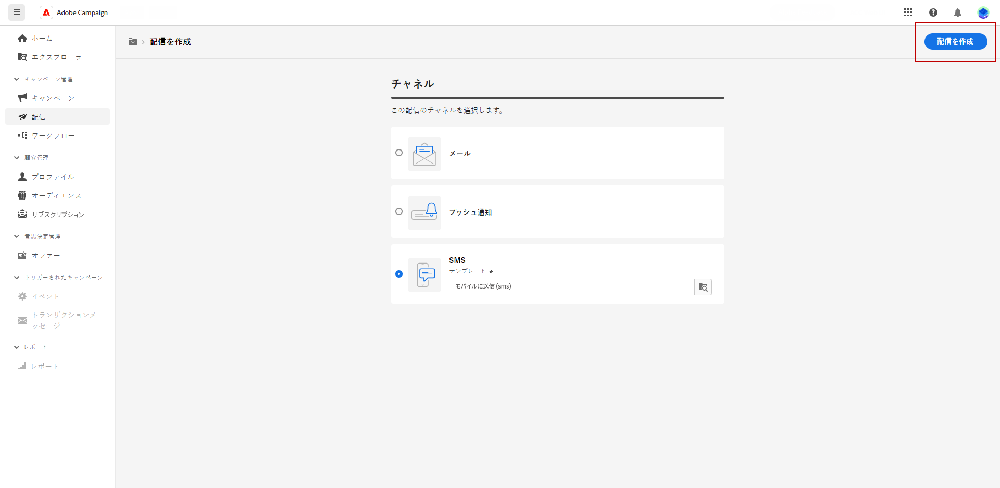

# SMS 配信を作成 {#create-sms}

>[!CONTEXTUALHELP]
>id="acw_deliveries_sms_properties"
>title="SMS 配信プロパティ"
>abstract="プロパティには、配信の名前付けと分類に役立つ一般的な配信パラメーターが含まれています。 配信で拡張スキーマを使用する場合は、特定のカスタムオプションフィールドを使用できます。"

>[!CONTEXTUALHELP]
>id="acw_deliveries_sms_audience"
>title="SMS オーディエンスの定義"
>abstract="新しいオーディエンスを作成するか、「**オーディエンスを選択** ボタンをクリックして既存のオーディエンスを選択します。 必要に応じて、コントロール母集団を追加して、配信の影響を測定します。"
>additional-url="https://experienceleague.adobe.com/docs/campaign-web/v8/audiences/target-audiences/control-group.html?lang=ja" text="コントロール母集団の設定"

>[!CONTEXTUALHELP]
>id="acw_deliveries_sms_template_selection"
>title="SMS テンプレートの選択"
>abstract="事前定義済みのテンプレートを選択して SMS 配信を開始します。配信テンプレートを使用すると、キャンペーンや配信全体でカスタムコンテンツおよび設定を再利用できます。"
>additional-url="https://experienceleague.adobe.com/docs/campaign-web/v8/msg/delivery-template.html?lang=ja" text="配信テンプレートの使用"

スタンドアロンの SMS 配信を作成することも、キャンペーンワークフローのコンテキストで SMS を作成することもできます。 次の手順では、スタンドアロン（1 回限りの） SMS 配信の手順を説明します。 キャンペーンワークフローのコンテキストで作業している場合、作成手順について [ この節 ](../workflows/activities/channels.md#create-a-delivery-in-a-campaign-workflow) を参照してください。

スタンドアロン SMS 配信を新規作成するには、次の手順に従います。

1. 左側のパネルの **[!UICONTROL 配信]** メニューを参照し、「**[!UICONTROL 配信を作成]**」ボタンをクリックします。

1. 「**[!UICONTROL チャネル]**」セクションで、チャネルとして SMS を選択し、テンプレートを選択します。[テンプレートの詳細情報](../msg/delivery-template.md)

1. 「**[!UICONTROL 配信を作成]**」ボタンをクリックして、確定します。

   {zoomable="yes"}

1. 配信の&#x200B;**[!UICONTROL ラベル]**&#x200B;を入力し、**[!UICONTROL その他のオプション]**&#x200B;ドロップダウンにアクセスします。配信で拡張スキーマを使用する場合、特定の **カスタムオプション** フィールドを使用できます。

   +++要件に基づいて次の設定を行います。
   * **[!UICONTROL 内部名]**：配信に一意の ID を割り当てます。
   * **[!UICONTROL フォルダー]**：配信を特定のフォルダーに保存します。
   * **[!UICONTROL 配信コード]**：独自の命名規則を使用して配信を整理します。
   * **[!UICONTROL 説明]**：配信の説明を指定します。
   * **[!UICONTROL 特性]**  : 分類目的で配信の特性を指定します。

   +++

1. 「**[!UICONTROL オーディエンスを選択]**」ボタンをクリックして、既存のオーディエンスをターゲットにするか、独自のユーザーを作成します。[詳しくは、オーディエンスを参照してください](../audience/about-recipients.md)。

   {zoomable="yes"}

   既存のオーディエンスを選択する方法については、[ このページ ](../audience/add-audience.md) を参照してください。

   新しいオーディエンスを作成する方法については、[ このページ ](../audience/one-time-audience.md) を参照してください。

1. 「**[!UICONTROL コントロール母集団を有効にする]**」オプションをオンにして、配信の影響を測定するコントロール母集団を設定します。メッセージは、そのコントロール母集団には送信されないので、メッセージを受信した母集団の行動と、受信しなかった連絡先の行動を比較できます。 [詳細情報](../audience/control-group.md)

1. 「**[!UICONTROL コンテンツの編集]**」をクリックして、SMS メッセージのコンテンツのデザインを開始します。[詳細情報](content-sms.md)

   {zoomable="yes"}

   この画面から、[コンテンツをシミュレート](../preview-test/preview-test.md)したり、[オファーを設定](../msg/offers.md)したりすることもできます。

1. 特定の日時に配信をスケジュールするには、「**[!UICONTROL スケジュールを有効にする]**」オプションをオンにします。配信を開始すると、メッセージは、その受信者に定義した、正確な日時に自動的に送信されます。 配信スケジュールについて詳しくは、[この節](../msg/gs-deliveries.md#gs-schedule)を参照してください。

   >[!NOTE]
   >
   >ワークフローのコンテキストで配信が送信されたら、**スケジューラー** アクティビティを使用します。 詳しくは、[このページ](../workflows/activities/scheduler.md)を参照してください。

1. 「**[!UICONTROL 設定]**」をクリックして、配信テンプレートに関連する詳細オプションにアクセスします。[詳細情報](../advanced-settings/delivery-settings.md)

   {zoomable="yes"}