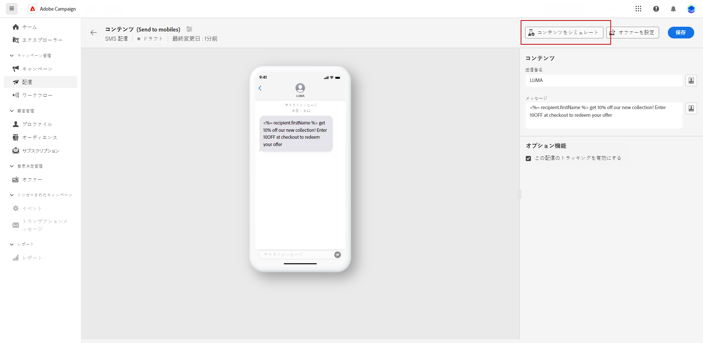
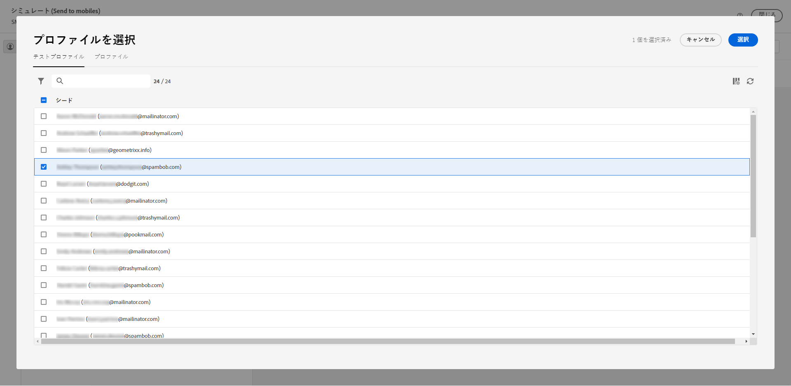
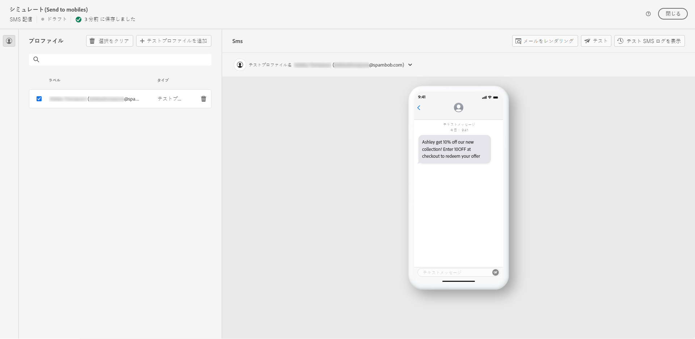
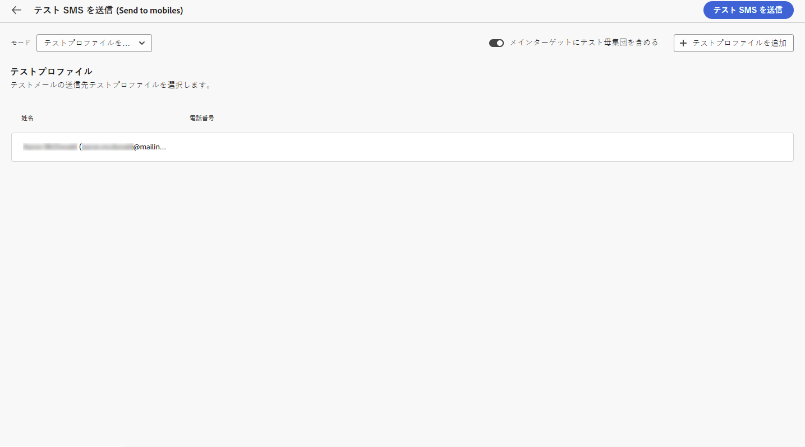
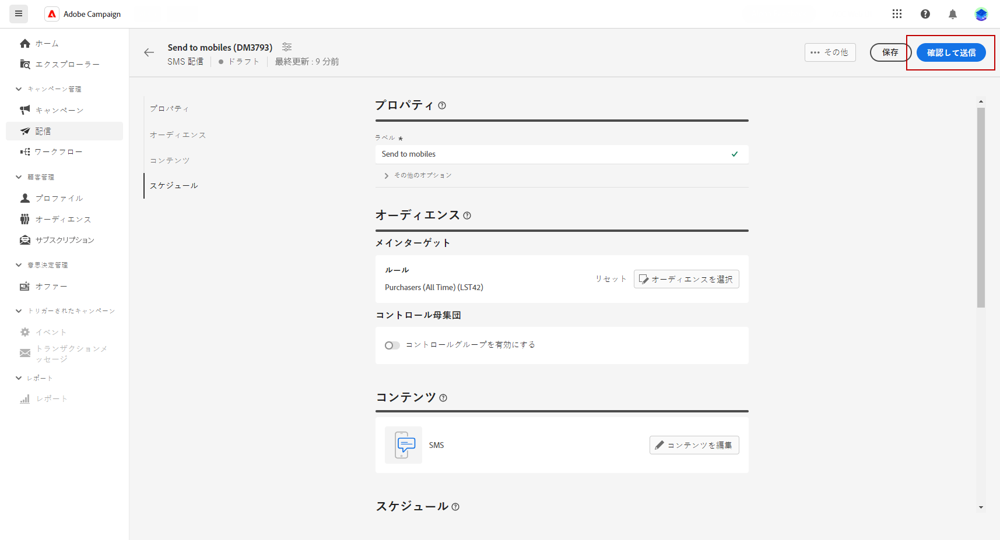
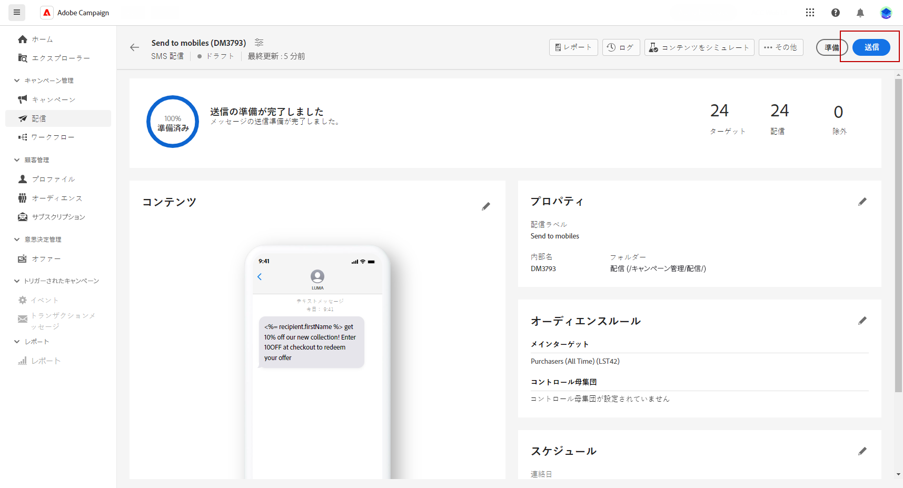

# SMS 配信のプレビューと送信 {#send-sms-delivery}

## SMS 配信のプレビュー{#preview-sms}

メッセージコンテンツを定義したら、テストプロファイルを使用してプレビューとテストを行うことができます。パーソナライズされたコンテンツが含まれている場合は、テストプロファイルデータを使用して、このコンテンツがメッセージにどのように表示されるかを調べることができます。 これにより、メッセージが意図したとおりに表示され、パーソナライズされた情報が正しく表示されるようになります。

SMS 配信をプレビューする主な手順は次のとおりです。 配信のプレビュー方法の詳細については、 [この節](../preview-test/preview-content.md).

1. 配信コンテンツページから、 **[!UICONTROL コンテンツをシミュレート]** パーソナライズされたコンテンツをプレビューする

   

1. 「**[!UICONTROL テストプロファイルを追加]**」をクリックして、1 つ以上のテストプロファイルを選択します。

   <!--
    Once your test profiles are selected, click **[!UICONTROL Select]**.
    
    -->

1. 右側のウィンドウには SMS 配信のプレビューが表示され、パーソナライズされた要素が、選択したプロファイルのデータで動的に置き換えられます。

   

これで、SMS メッセージを確認してオーディエンスに送信できるようになりました。

## SMS 配信のテスト {#test-sms}

**Adobe Campaign** を使用すると、メインオーディエンスに送信する前にメッセージをテストできます。これは、メールキャンペーンを検証し、潜在的な問題を特定する際に重要な手順です。

テスト SMS の送信は、配信の品質と有効性を保証するための重要な手順です。テスト受信者は、リンク、オプトアウトリンク、画像などの様々な要素を確認し、レンダリング、コンテンツ、パーソナライゼーション設定、SMS 設定のエラーを特定できます。このプロセスは、メインオーディエンスに到達する前に SMS を徹底的に評価して最適化するのに役立ちます。

 でテスト用 SMS を送信する方法を説明します。 [この節](../preview-test/proofs.md).

## SMS 配信の送信 {#send-sms}

1. SMS コンテンツをパーソナライズした後、**[!UICONTROL 配信]**&#x200B;ページで「**[!UICONTROL 確認して送信]**」をクリックします。

   

1. クリック **[!UICONTROL 準備]** およびは、提供された進行状況と統計を監視します。

   エラーが発生した場合は、ログメニューでエラーに関する詳細情報を参照してください。

1. 「**[!UICONTROL 送信]**」をクリックしてメッセージを送信し、最終的な送信プロセスに進みます。

   

1. 「**[!UICONTROL 送信]**」ボタンをクリックして、送信アクションを確定します。

配信が送信されると、配信ページの KPI（主要業績評価指標）データと、 **[!UICONTROL ログ]** メニュー

これで、組み込みレポートを使用して、メッセージの影響の測定を開始できます。[詳細情報](../reporting/sms-report.md)

