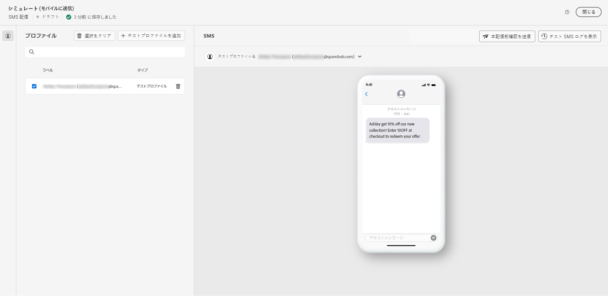

# SMS 配信のプレビューと送信 {#send-sms}

## SMS 配信をプレビュー{#preview-sms}

メッセージの内容を定義したら、テストプロファイルを利用してプレビューおよびテストできます。 パーソナライズされたコンテンツが含まれている場合は、テストプロファイルデータを利用して、このコンテンツがメッセージにどのように表示されるかを調べることができます。 これにより、メッセージが意図したとおりに表示され、パーソナライズされた情報が正しく表示されることを確認できます。

1. 配信コンテンツページから、 **[!UICONTROL コンテンツをシミュレート]** パーソナライズされたコンテンツをプレビューする

   

1. 「**[!UICONTROL テストプロファイルを追加]**」をクリックして、1 つ以上のテストプロファイルを選択します。

1. テストプロファイルを選択したら、「**[!UICONTROL 選択]**」をクリックします。

   

1. 右側のパネルにはメールのプレビューが表示され、パーソナライズされた要素が選択したプロファイルのデータに動的に置き換えられます。

   

これで、SMS メッセージを確認してオーディエンスに送信できるようになりました。

## SMS 配信の送信 {#preview-send-sms}

1. SMS コンテンツをパーソナライズした後、 **[!UICONTROL 確認して送信]** から **[!UICONTROL 配信]** ページ。

   

1. クリック**[!UICONTROL 準備]**、提供された進行状況と統計を監視します。

   エラーが発生した場合は、ログメニューを参照して、エラーの詳細を確認してください。

1. 「 」をクリックしてメッセージを送信します。 **[!UICONTROL 送信]** をクリックして、最終的な送信プロセスを続行します。

   

1. 「 **[!UICONTROL 送信]** 」ボタンをクリックします。

配信が送信されたら、配信ページの KPI（主要業績評価指標）データと、ログメニューのデータをトラッキングできます。

これで、組み込みレポートを使用して、メッセージの影響の測定を開始できます。 [詳細情報](../reporting/sms-report.md)

