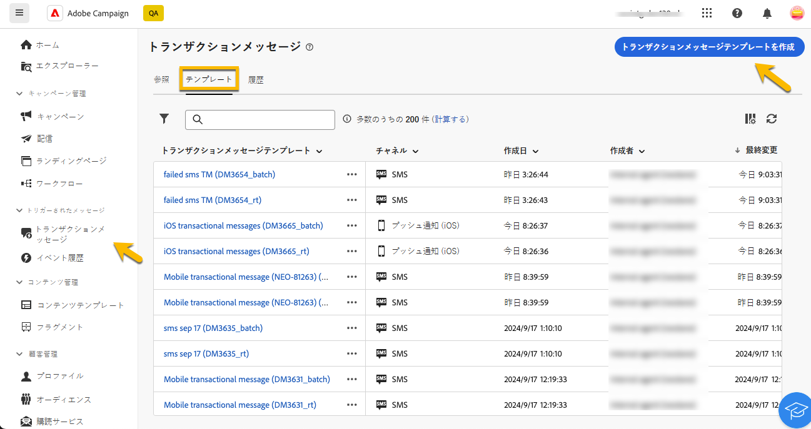
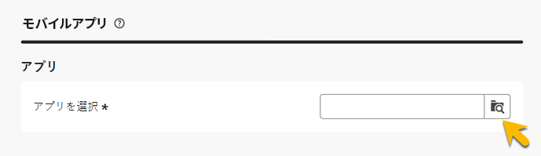
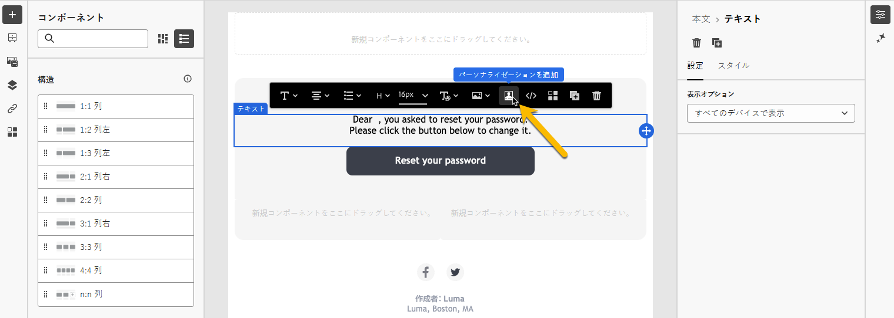
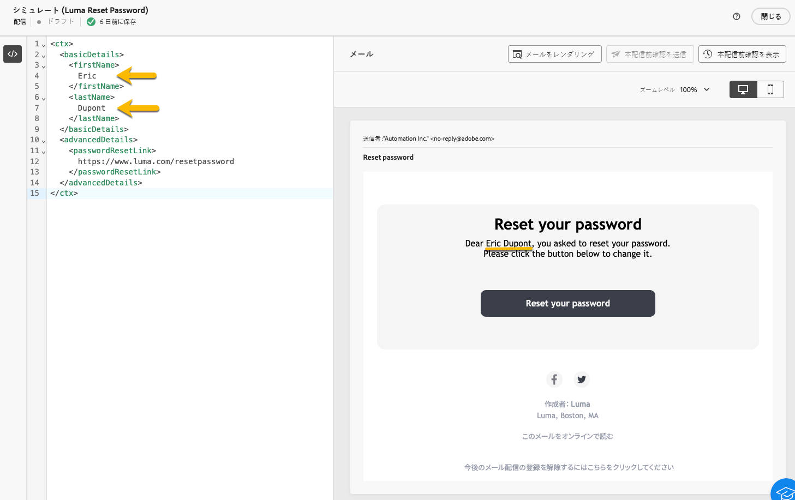
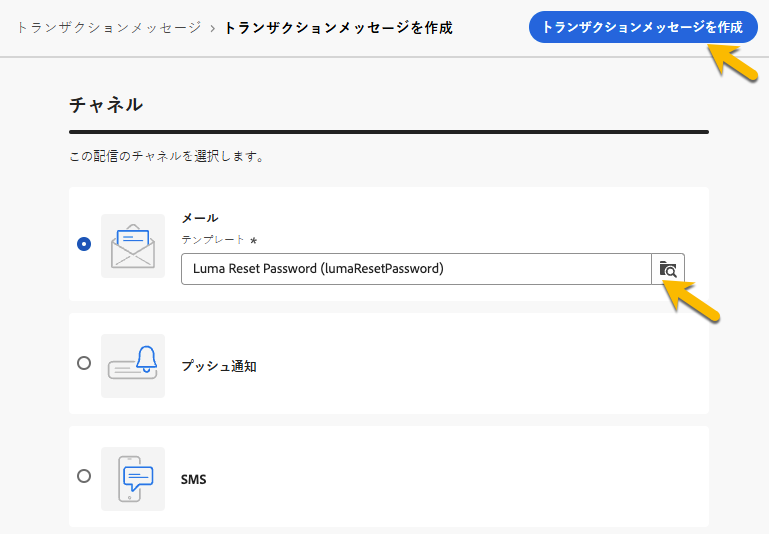

# トランザクションメッセージの作成

トランザクションメッセージでは、イベントは、パーソナライズされたメッセージの送信をトリガーにします。
これを有効にするには、イベントタイプごとにメッセージテンプレートを作成する必要があります。 これらのテンプレートには、トランザクションメッセージをパーソナライズするために必要な情報がすべて含まれています。

## トランザクションメッセージテンプレートの作成 {#transactional-template}

Campaign web ユーザーインターフェイスでは、トランザクションメッセージ設定の最初の手順は、テンプレートの作成またはメッセージの直接作成です。 この点は [ クライアントコンソールでのトランザクションメッセージの設定 ](https://experienceleague.adobe.com/ja/docs/campaign/campaign-v8/send/real-time/transactional) とは異なります。

トランザクションメッセージテンプレートを使用すると、プロファイルが最終的なオーディエンスに到達する前に受信した配信コンテンツをプレビューできます。 例えば、管理者はテンプレートを設定して、マーケティングユーザーが使用できるようにします。

トランザクションメッセージテンプレートを作成するには、次の手順に従います。

* **[!UICONTROL トリガーメッセージ]** セクションで、**[!UICONTROL トランザクションメッセージ]** に移動します。 「**[!UICONTROL テンプレート]**」タブには、トランザクションメッセージ用のすべての配信テンプレートが表示されます。 「**[!UICONTROL トランザクションメッセージテンプレートを作成]**」ボタンをクリックして、テンプレートの作成を開始します。

  {zoomable="yes"}

* 表示された新しいページで、テンプレートのチャネルを選択します。 この例では、「**[!UICONTROL メール]** チャネルを選択します。 また、別のメッセージテンプレートから作業して、テンプレートリストで選択することもできます。

  {zoomable="yes"}

  **[!UICONTROL トランザクションメッセージを作成]** ボタンを再度クリックして、選択したチャネルでのテンプレートの作成を検証します。

* これで、トランザクションメッセージテンプレートの設定にアクセスできるようになりました。

  {zoomable="yes"}

### トランザクションメッセージのプロパティ {#transactional-properties}

>[!CONTEXTUALHELP]
>id="acw_transacmessages_properties"
>title="トランザクションメッセージのプロパティ"
>abstract="トランザクションメッセージのプロパティを設定するには、このフォームに入力します"

>[!CONTEXTUALHELP]
>id="acw_transacmessages_email_properties"
>title="トランザクションメッセージのメールプロパティ"
>abstract="トランザクションメッセージのメールプロパティを設定するには、このフォームに入力します"

>[!CONTEXTUALHELP]
>id="acw_transacmessages_sms_properties"
>title="トランザクションメッセージの SMS プロパティ"
>abstract="トランザクションメッセージの SMS プロパティを設定するには、このフォームに入力します"

>[!CONTEXTUALHELP]
>id="acw_transacmessages_push_properties"
>title="トランザクションメッセージのプッシュプロパティ"
>abstract="トランザクションメッセージのプッシュプロパティを設定するには、このフォームに入力します"

トランザクションメッセージの **[!UICONTROL プロパティ]** セクションは、次の設定に役立ちます。

* **[!UICONTROL ラベル]** は、トランザクションメッセージリストに表示される名前です。 研究と将来の使用について明確にします。
* **[!UICONTROL 内部名]** は、作成された他のメッセージとメッセージを区別する一意の名前です。
* **[!UICONTROL フォルダー]** は、トランザクションメッセージテンプレートが作成される場所です。
* **[!UICONTROL 実行フォルダー]** には、実行後にメッセージが保存されます。
* **[!UICONTROL 配信コード]**：必要に応じて、レポート用のメッセージを認識するのに役立つコード。
* **[!UICONTROL 説明]**
* **[!UICONTROL Nature]** は、列挙 *deliveryNature* に示されている配信の特性です。 [ 列挙の詳細 ](https://experienceleague.adobe.com/en/docs/campaign/campaign-v8/config/configuration/ui-settings#enumerations)

{zoomable="yes"}

### モバイルアプリ {#mobile-app}

>[!CONTEXTUALHELP]
>id="acw_transacmessages_mobileapp"
>title="トランザクションメッセージのモバイルアプリ"
>abstract="このセクションでは、メッセージをプッシュするアプリケーションを選択できます。"

このセクションでは、メッセージをプッシュするアプリケーションを選択できます。

「検索」アイコンをクリックすると、Adobe Campaign インスタンスに一覧表示されているモバイルアプリケーションにアクセスできます。

{zoomable="yes"}

### コンテキストサンプル {#context-sample}

>[!CONTEXTUALHELP]
>id="acw_transacmessages_context"
>title="トランザクションメッセージのコンテキスト"
>abstract="コンテキストサンプルを使用すると、プロファイルのパーソナライゼーションで受信したトランザクションメッセージをプレビューするテストイベントを作成できます。"

>[!CONTEXTUALHELP]
>id="acw_transacmessages_addcontext"
>title="トランザクションメッセージのコンテキスト"
>abstract="コンテキストサンプルを使用すると、プロファイルのパーソナライゼーションで受信したトランザクションメッセージをプレビューするテストイベントを作成できます。 "

コンテキストサンプルを使用すると、プロファイルのパーソナライゼーションで受信したトランザクションメッセージをプレビューするテストイベントを作成できます。

この手順はオプションです。コンテキストサンプルを含めなくてもテンプレートを使用できますが、パーソナライズされたコンテンツをプレビューできないという欠点があります。

パスワードを設定する例では、イベントはユーザーの名、姓およびパスワードをリセットするためのパーソナライズされたリンクを送信します。 コンテキストは、次のように設定できます。

コンテキストの内容は、必要なパーソナライゼーションによって異なります。

{zoomable="yes"}

### トランザクションメッセージテンプレートのコンテンツ {#transactional-content}

>[!CONTEXTUALHELP]
>id="acw_transacmessages_content"
>title="トランザクションメッセージのコンテンツ"
>abstract="トランザクションメッセージのコンテンツの作成方法を学ぶ"

>[!CONTEXTUALHELP]
>id="acw_transacmessages_personalization"
>title="トランザクションメッセージのパーソナライゼーション"
>abstract="トランザクションメッセージのコンテンツのパーソナライズ方法を学ぶ"

トランザクションメッセージのコンテンツの操作は、配信のコンテンツ作成に似ています。 **[!UICONTROL 電子メールデザイナーを開く]** または **[!UICONTROL メール本文を編集]** をクリックし、テンプレートのコンテンツを選択するか、HTMLコードを読み込みます。

{zoomable="yes"}

コンテンツにパーソナライゼーションを追加するには、パーソナライゼーションを追加するセクションをクリックし、「**[!UICONTROL Personalizationを追加]**」アイコンを選択します。

{zoomable="yes"}

**[!UICONTROL パーソナライゼーションを編集]** ウィンドウにアクセスできるようになります。
トリガーイベントから変数を追加するには、「**[!UICONTROL イベントコンテキスト]** アイコンをクリックします。 テンプレートに対して定義したコンテキスト内を移動し（[ コンテキストの詳細については ](#context-sample)）、「**[!UICONTROL +]**」ボタンをクリックして必要な変数を挿入します。

以下の画像で、名のパーソナライゼーションを追加する方法を確認できます。

{zoomable="yes"}

この例では、名、姓を追加して、「パスワードをリセット **[!UICONTROL ボタンリンクをパーソナライズし]** す。

{zoomable="yes"}

### テンプレートのプレビュー

テンプレート作成のこの段階では、テンプレートコンテンツをプレビューして、パーソナライゼーションを確認します。

これを行うには、[ コンテキストサンプル ](#context-sample) を入力し、「**[!UICONTROL コンテンツをシミュレート]**」ボタンをクリックします。

{zoomable="yes"}

## トランザクションメッセージの作成 {#transactional-message}

トランザクションメッセージは、直接またはトランザクションメッセージテンプレートを使用して作成できます。 [ トランザクションメッセージテンプレートの作成方法を説明します ](#transactional-template)。

トランザクションメッセージを作成するには、次の手順に従います。

* **[!UICONTROL トリガーメッセージ]** セクションで、**[!UICONTROL トランザクションメッセージ]** に移動します。 「**[!UICONTROL 参照]** タブには、作成されたすべてのトランザクションメッセージが表示されます。 「**[!UICONTROL トランザクションメッセージを作成]**」ボタンをクリックして、メッセージの作成を開始します。

  {zoomable="yes"}

* 表示された新しいページで、メッセージのチャネルを選択し、使用するテンプレートを選択します。 この例では、「ここで作成したテンプレート [ を選択し ](#transactional-template) す。

  {zoomable="yes"}

  **[!UICONTROL トランザクションメッセージを作成]** ボタンを再度クリックして、選択したチャネルでのメッセージの作成を検証します。

* これで、トランザクションメッセージの設定にアクセスできるようになりました。 メッセージはテンプレートの設定を継承します。 このページは、イベントタイプの設定も含むことを除けば、トランザクションメッセージテンプレート設定ページとほとんど同じです。

  {zoomable="yes"}

  メッセージの設定を、としてテンプレート用に入力します。
   * [トランザクションメッセージのプロパティ](#transactional-properties)
   * [コンテキストサンプル](#context-sample)
   * [ メッセージコンテンツ ](#transactional-content)
[ イベントタイプを設定 ](#event-type) します（下図を参照）。

* [ トランザクションメッセージの検証 ](validate-transactional.md) が完了したら、「**[!UICONTROL 確認して公開]**」ボタンをクリックして、メッセージを作成して公開します。
これで、トリガーがトランザクションメッセージの送信をプッシュできるようになりました。

### イベントタイプについて {#event-type}

>[!CONTEXTUALHELP]
>id="acw_transacmessages_event"
>title="トランザクションメッセージのイベント"
>abstract="イベントタイプの設定により、メッセージがトリガーイベントにリンクされます。"

イベントタイプの設定により、メッセージがトリガーイベントにリンクされます。

Campaign web ユーザーインターフェイスでは、既に作成されているイベントタイプを選択して設定したり、この設定ページでイベントタイプを直接作成したりできます。

{zoomable="yes"}

>[!CAUTION]
>
>別のトランザクションメッセージで現在使用されているイベントタイプを選択すると、2 つのメッセージがトリガーされます。 ベストプラクティスとしては **1 つのイベントタイプを 1 つのトランザクションメッセージのみにリンクすることを強くお勧めします**。

## トランザクションメッセージへのオファーの追加 {#transactional-offers}

トランザクションメッセージにオファーを含めることもできます。これにより、メッセージがイベントトリガーされた場合でも、エンドユーザーに関連する提案を提示できます。

この機能は、トランザクションメッセージのコンテンツ編集フェーズでアクセスできます。 「**[!UICONTROL オファーを設定]**」ボタンをクリックするだけで設定できます。

設定プロセスは、標準配信のオファーを設定する場合と同じです。 [ メッセージにオファーを追加する方法を学ぶ ](../msg/offers.md)。

{zoomable="yes"}
