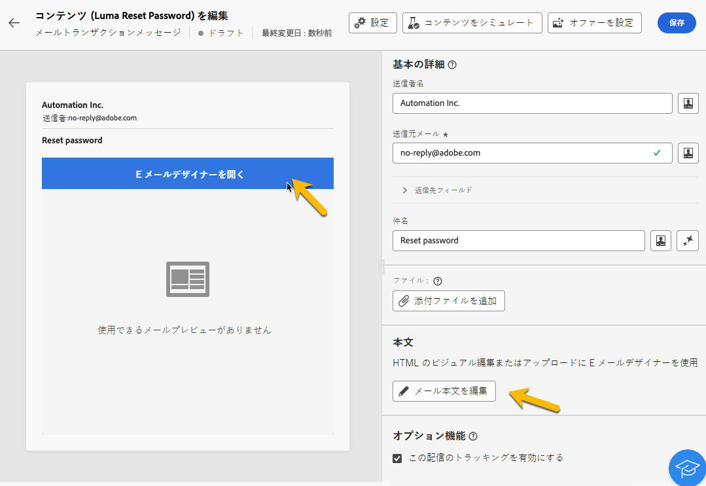

# トランザクションメッセージの作成

トランザクションメッセージでは、イベントによってパーソナライズされたメッセージの送信がトリガーされます。これを有効にするには、イベントタイプごとにメッセージテンプレートを作成します。これらのテンプレートには、トランザクションメッセージをパーソナライズするのに必要なすべての情報が含まれています。

## トランザクションメッセージテンプレートの作成 {#transactional-template}

Campaign web ユーザーインターフェイスでは、トランザクションメッセージ設定の最初の手順は、テンプレートの作成またはメッセージの直接作成です。これは、[クライアントコンソールでのトランザクションメッセージの設定](https://experienceleague.adobe.com/ja/docs/campaign/campaign-v8/send/real-time/transactional)とは異なります。

トランザクションメッセージテンプレートを使用すると、プロファイルが受信した配信コンテンツを、最終的なオーディエンスに到達する前にプレビューできます。例えば、管理者はテンプレートを設定し、マーケティングユーザーが使用の準備を整えるようにすることができます。

トランザクションメッセージテンプレートを作成するには、次の手順に従います。

* 「**[!UICONTROL トリガーされたメッセージ]**」セクションで、**[!UICONTROL トランザクションメッセージ]**&#x200B;に移動します。「**[!UICONTROL テンプレート]**」タブでは、トランザクションメッセージの配信テンプレートをすべて確認できます。「**[!UICONTROL トランザクションメッセージテンプレートを作成]**」ボタンをクリックして、テンプレートの作成を開始します。

  {zoomable="yes"}

* 表示された新しいページで、テンプレートのチャネルを選択します。この例では、「**[!UICONTROL メール]**」チャネルを選択します。また、別のメッセージテンプレートから作業して、テンプレートリストで選択することもできます。

  {zoomable="yes"}

  「**[!UICONTROL トランザクションメッセージを作成]**」ボタンをもう一度クリックして、選択したチャネルでのテンプレートの作成を検証します。

* トランザクションメッセージテンプレートの設定にアクセスします。

  {zoomable="yes"}

### トランザクションメッセージのプロパティ {#transactional-properties}

>[!CONTEXTUALHELP]
>id="acw_transacmessages_properties"
>title="トランザクションメッセージのプロパティ"
>abstract="トランザクションメッセージのプロパティを設定するには、このフォームに入力します。"

>[!CONTEXTUALHELP]
>id="acw_transacmessages_email_properties"
>title="トランザクションメッセージングのメールプロパティ"
>abstract="トランザクションメッセージのメールプロパティを設定するには、このフォームに入力します。"

>[!CONTEXTUALHELP]
>id="acw_transacmessages_sms_properties"
>title="トランザクションメッセージの SMS プロパティ"
>abstract="トランザクションメッセージの SMS プロパティを設定するには、このフォームに入力します。"

>[!CONTEXTUALHELP]
>id="acw_transacmessages_push_properties"
>title="トランザクションメッセージのプッシュプロパティ"
>abstract="トランザクションメッセージのプッシュプロパティを設定するには、このフォームに入力します。"

トランザクションメッセージの「**[!UICONTROL プロパティ]**」セクションは、次の設定に役立ちます。

* **[!UICONTROL ラベル]**：トランザクションメッセージのリストに表示される名前。調査と今後の使用のために明確にします。
* **[!UICONTROL 内部名]**：作成された他のメッセージとユーザーのメッセージを区別する一意の名前。
* **[!UICONTROL フォルダー]**：トランザクションメッセージテンプレートを作成した場所。
* **[!UICONTROL 実行フォルダー]**：実行後にメッセージが保存される場所。
* **[!UICONTROL 配信コード]**：必要に応じて、レポート用のメッセージを認識するのに役立つコード。
* **[!UICONTROL 説明]**。
* **[!UICONTROL 特性]**：定義済みリストの *deliveryNature* にリストされている配信の特性。[詳しくは、定義済みリストを参照してください](https://experienceleague.adobe.com/ja/docs/campaign/campaign-v8/config/configuration/ui-settings#enumerations)。

{zoomable="yes"}

### モバイルアプリ {#mobile-app}

>[!CONTEXTUALHELP]
>id="acw_transacmessages_mobileapp"
>title="トランザクションメッセージのモバイルアプリ"
>abstract="このセクションでは、メッセージをプッシュするアプリケーションを選択できます。"

このセクションでは、メッセージをプッシュするアプリケーションを選択します。

検索アイコンをクリックすると、Adobe Campaign インスタンスのモバイルアプリケーションのリストにアクセスできます。

{zoomable="yes"}

### コンテキストサンプル {#context-sample}

>[!CONTEXTUALHELP]
>id="acw_transacmessages_context"
>title="トランザクションメッセージのコンテキスト"
>abstract="コンテキストサンプルを使用すると、プロファイルのパーソナライゼーションで受信したトランザクションメッセージをプレビューするテストイベントを作成できます。"

>[!CONTEXTUALHELP]
>id="acw_transacmessages_addcontext"
>title="トランザクションメッセージのコンテキスト"
>abstract="コンテキストサンプルを使用すると、プロファイルのパーソナライゼーションで受信したトランザクションメッセージをプレビューするテストイベントを作成できます。"

コンテキストサンプルを使用すると、プロファイルのパーソナライゼーションで受信したトランザクションメッセージをプレビューするテストイベントを作成できます。

この手順はオプションです。コンテキストサンプルなしでテンプレートを使用できますが、パーソナライズされたコンテンツをプレビューできない欠点があります。

パスワードを設定する例では、イベントによってユーザーの名、姓およびパスワードをリセットするパーソナライズしたリンクが送信されます。コンテキストは、次に示すように設定できます。

コンテキストのコンテンツは、必要なパーソナライゼーションによって異なります。

{zoomable="yes"}

### トランザクションメッセージテンプレートのコンテンツ {#transactional-content}

>[!CONTEXTUALHELP]
>id="acw_transacmessages_content"
>title="トランザクションメッセージのコンテンツ"
>abstract="詳しくは、トランザクションメッセージのコンテンツの作成方法を参照してください。"

>[!CONTEXTUALHELP]
>id="acw_transacmessages_personalization"
>title="トランザクションメッセージのパーソナライゼーション"
>abstract="詳しくは、トランザクションメッセージのコンテンツのパーソナライズ方法を参照してください。"

>[!CONTEXTUALHELP]
>id="acw_personalization_editor_event_context"
>title="イベントコンテキスト"
>abstract="このメニューには、トランザクションメッセージのコンテンツをパーソナライズするために活用できる、トリガーイベントの変数が用意されています。"

トランザクションメッセージのコンテンツの操作は、配信のコンテンツ作成に似ています。「**[!UICONTROL E メールデザイナーを開く]**」または「**[!UICONTROL メール本文を編集]**」をクリックし、テンプレートのコンテンツを選択するか、HTML コードをインポートします。

{zoomable="yes"}

コンテンツにパーソナライゼーションを追加するには、追加するセクションをクリックし、「**[!UICONTROL パーソナライゼーションを追加]**」アイコンを選択します。

{zoomable="yes"}

**[!UICONTROL パーソナライゼーションを編集]**&#x200B;ウィンドウにアクセスします。トリガーイベントから変数を追加するには、「**[!UICONTROL イベントコンテキスト]**」アイコンをクリックします。テンプレートに対して定義したコンテキスト（[詳しくは、コンテキストを参照](#context-sample)）に移動し、「**[!UICONTROL +]**」ボタンをクリックして必要な変数を挿入します。

次の画像に、名にパーソナライゼーションを追加する方法を示します。

{zoomable="yes"}

この例では、名、姓の順に追加し、「**[!UICONTROL パスワードをリセット]**」ボタンリンクをパーソナライズします。

{zoomable="yes"}

### テンプレートのプレビュー

テンプレート作成のこのステージでは、テンプレートのコンテンツをプレビューし、パーソナライゼーションを確認します。

これを行うには、[コンテキストサンプル](#context-sample)を入力し、「**[!UICONTROL コンテンツをシミュレート]**」ボタンをクリックします。

{zoomable="yes"}

## トランザクションメッセージの作成 {#transactional-message}

トランザクションメッセージは、直接作成することや、トランザクションメッセージテンプレートを使用して作成することができます。[詳しくは、トランザクションメッセージテンプレートの作成方法を参照してください](#transactional-template)。

トランザクションメッセージを作成するには、次の手順に従います。

* 「**[!UICONTROL トリガーされたメッセージ]**」セクションで、**[!UICONTROL トランザクションメッセージ]**&#x200B;に移動します。「**[!UICONTROL 参照]**」タブでは、作成したすべてのトランザクションメッセージを確認できます。「**[!UICONTROL トランザクションメッセージを作成]**」ボタンをクリックして、メッセージの作成を開始します。

  {zoomable="yes"}

* 表示された新しいページで、メッセージのチャネルを選択し、操作するテンプレートを選択します。この例では、[以前に作成したテンプレート](#transactional-template)を選択します。

  {zoomable="yes"}

  「**[!UICONTROL トランザクションメッセージを作成]**」ボタンをもう一度クリックして、選択したチャネルでのメッセージの作成を検証します。

* トランザクションメッセージの設定にアクセスします。メッセージは、テンプレートの設定を継承します。このページは、イベントタイプの設定も含まれていることを除いて、トランザクションメッセージテンプレートの設定ページとほとんど同じです。

  {zoomable="yes"}

  テンプレートと同様に次のメッセージの設定を入力します。
   * [トランザクションメッセージのプロパティ](#transactional-properties)
   * [コンテキストサンプル](#context-sample)
   * [メッセージのコンテンツ](#transactional-content)
および次に示すように[イベントタイプを設定](#event-type)します。

* [トランザクションメッセージの検証](validate-transactional.md)後、「**[!UICONTROL レビューして公開]**」ボタンをクリックして、メッセージを作成および公開します。これで、トリガーによってトランザクションメッセージの送信をプッシュできます。

### イベントタイプについて {#event-type}

>[!CONTEXTUALHELP]
>id="acw_transacmessages_event"
>title="トランザクションメッセージのイベント"
>abstract="イベントタイプの設定により、メッセージがトリガーイベントにリンクされます。"

イベントタイプの設定により、メッセージがトリガーイベントにリンクされます。

Campaign web ユーザーインターフェイスでは、既に作成されているイベントタイプを選択するか、この設定ページでイベントタイプを直接作成します。

{zoomable="yes"}

>[!CAUTION]
>
>別のトランザクションメッセージで現在使用されているイベントタイプを選択すると、両方のメッセージがトリガーされます。ベストプラクティスとして、**1 つのイベントタイプを 1 つのトランザクションメッセージにのみリンクします。**

## トランザクションメッセージへのオファーの追加 {#transactional-offers}

トランザクションメッセージにオファーを含めることができるので、メッセージがイベントトリガーされた場合でも、エンドユーザーに関連する提案を提示できます。

この機能は、トランザクションメッセージのコンテンツ編集フェーズ中にアクセスできます。「**[!UICONTROL オファーを設定]**」ボタンをクリックして設定します。

設定プロセスは、標準配信のオファーを設定する場合と同じです。[詳しくは、メッセージへのオファーの追加方法を参照してください](../msg/offers.md)。

{zoomable="yes"}