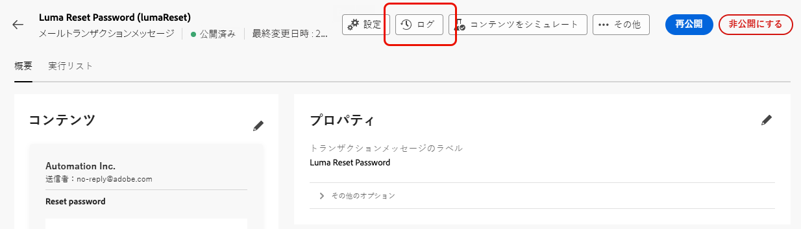
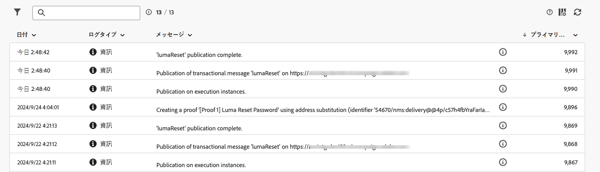
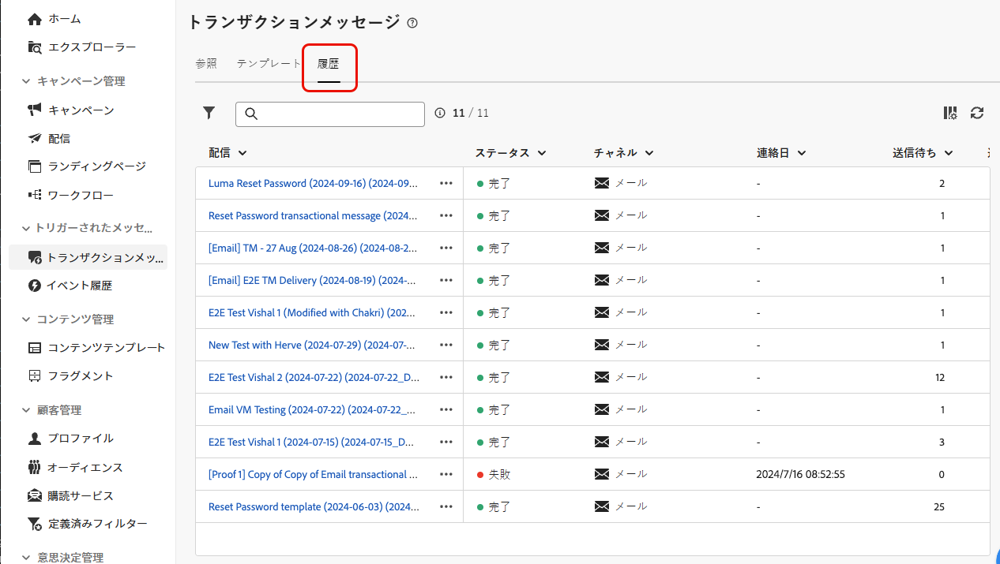
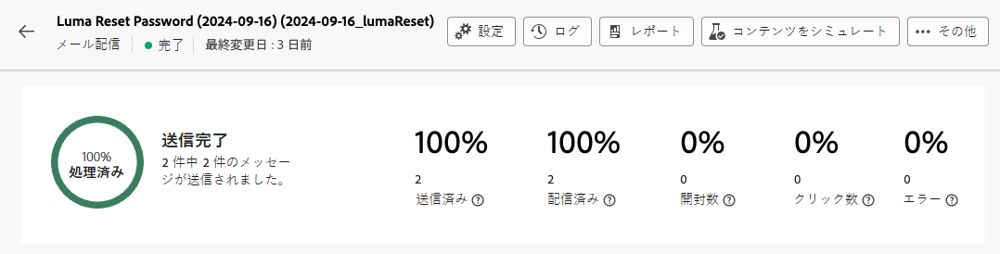
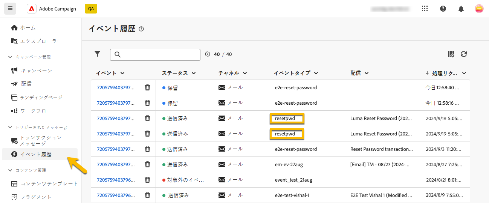
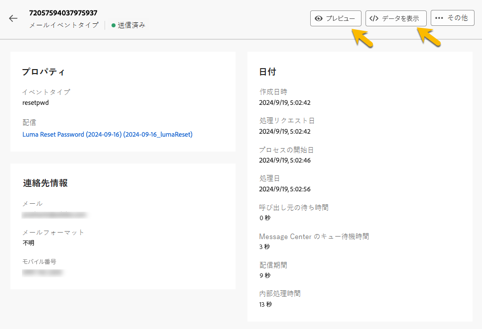

# トランザクションメッセージの監視

トランザクションメッセージの公開および送信後、これに関するレポートとログにアクセスできます。

## トランザクションメッセージのログ {#transactional-logs}

メッセージを公開した後、「**[!UICONTROL ログ]**」ボタンをクリックして、その実行を確認します。

{zoomable="yes"}

これにより、「**[!UICONTROL ログ]**」タブでメッセージの公開に関する詳細なログにアクセスできます。

{zoomable="yes"}

さらに、ログと共に送信された&#x200B;**[!UICONTROL 配達確認]**&#x200B;のリストを、対応するタブで表示します。

## トランザクションメッセージの履歴 {#transactional-history}

「**[!UICONTROL トリガーされたメッセージ]**」セクションでは、実行されたすべてのトランザクションメッセージに関する詳細を表示します。これにアクセスするには、**[!UICONTROL トランザクションメッセージ]**&#x200B;に移動します。「**[!UICONTROL 履歴]**」タブでは、実行されたトランザクションメッセージのリストとそのステータスおよび追加情報を確認します。

{zoomable="yes"}

メッセージを検索し、クリックして詳細を表示します。

{zoomable="yes"}

## イベント履歴 {#event-history}

>[!CONTEXTUALHELP]
>id="acw_transacmessages_eventhistory"
>title="トランザクションメッセージのイベント履歴"
>abstract="トランザクションメッセージをトリガーするイベントを表示できます。"

>[!CONTEXTUALHELP]
>id="acw_transacmessages_eventhistory_preview"
>title="トランザクションメッセージのイベント履歴のプレビュー"
>abstract="トランザクションメッセージをトリガーするイベントを表示できます。"

トランザクションメッセージをトリガーするイベントを表示できます。これらにアクセスするには、「**[!UICONTROL イベント履歴]**」セクションに移動します。

イベントは、イベントタイプ名と共に表示されます。

{zoomable="yes"}

**[!UICONTROL イベント]** ID をクリックすると、次のような詳細が表示されます。

* 連絡先情報
* 処理日に関する情報

「**[!UICONTROL プレビュー]**」ボタンを使用して送信されたメッセージをプレビューし、「**[!UICONTROL データを表示]**」ボタンを使用してメッセージをトリガーした受信データを表示します。

{zoomable="yes"}

「**[!UICONTROL 詳細]**」ボタンをクリックすると、イベント履歴を削除できます。