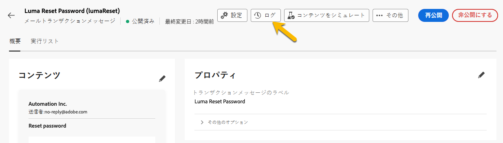

# トランザクションメッセージの監視

トランザクションメッセージを公開および送信した後、それに関するレポートとログを作成できます。

## トランザクションメッセージログ {#transactional-logs}

メッセージが公開されたら、「**[!UICONTROL ログ]**」ボタンをクリックして、実行を確認できます。

{zoomable="yes"}

これにより、「**[!UICONTROL ログ]**」タブで、メッセージの公開に関する詳細なログにアクセスできます。

{zoomable="yes"}

さらに、送信された **[!UICONTROL 配達確認]** のリストとそのログを、対応するタブで確認できます。

## トランザクションメッセージ履歴 {#transactional-history}

「**[!UICONTROL トリガーメッセージ]**」セクションでは、実行されたすべてのトランザクションメッセージに関する詳細を表示できます。 これにアクセスするには、**[!UICONTROL トランザクションメッセージ]** に移動します。 「**[!UICONTROL 履歴]**」タブには、実行されたトランザクションメッセージのリストと、そのステータスおよび追加情報が表示されます。

{zoomable="yes"}

そこで調査を行い、メッセージを見つけてクリックします。
詳細を確認できます。

{zoomable="yes"}

## イベント履歴 {#event-history}

>[!CONTEXTUALHELP]
>id="acw_transacmessages_eventhistory"
>title="トランザクションメッセージのイベント履歴"
>abstract="トランザクションメッセージをトリガーするイベントに関するビューを表示できます。"

>[!CONTEXTUALHELP]
>id="acw_transacmessages_eventhistory_preview"
>title="トランザクションメッセージのイベント履歴プレビュー"
>abstract="トランザクションメッセージをトリガーするイベントに関するビューを表示できます。"

また、トランザクションメッセージをトリガーするイベントに関するビューも作成できます。
それらを表示するには、**[!UICONTROL イベント履歴]** セクションに進みます。

これらは、イベントタイプ名で確認できます。

{zoomable="yes"}

**[!UICONTROL イベント]** ID をクリックすると、以下のように詳細が表示されます。

* 連絡先情報
* 処理日に関するすべて

「**[!UICONTROL プレビュー]**」ボタンで送信したメッセージをプレビューしたり、「データを表示 **[!UICONTROL ボタンでメッセージをトリガーして受信したデータを確認したりすること]** できます。

{zoomable="yes"}

**[!UICONTROL 詳細]** ボタンを使用すると、イベント履歴を削除できます。
