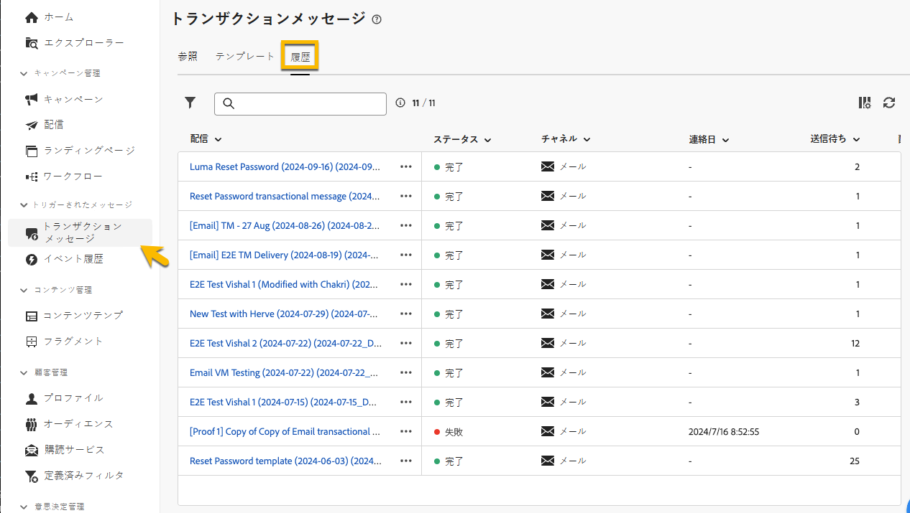

# トランザクションメッセージの監視

トランザクションメッセージを公開して送信した後、関連するレポートとログにアクセスできます。

## トランザクションメッセージのログ {#transactional-logs}

メッセージが公開されたら、「**[!UICONTROL ログ]**」ボタンをクリックして、その実行を確認します。

{zoomable="yes"}

これにより、「**[!UICONTROL ログ]**」タブで、メッセージの公開に関する詳細なログにアクセスできます。

{zoomable="yes"}

さらに、送信された **[!UICONTROL 配達確認]** のリストとそのログを、対応するタブで確認できます。

## トランザクションメッセージの履歴 {#transactional-history}

「**[!UICONTROL トリガーメッセージ]**」セクションでは、実行されたすべてのトランザクションメッセージに関する詳細を表示します。 これにアクセスするには、**[!UICONTROL トランザクションメッセージ]**&#x200B;に移動します。「**[!UICONTROL 履歴]**」タブで、実行されたトランザクションメッセージのリストと、そのステータスおよび追加情報を確認します。

{zoomable="yes"}

メッセージを検索し、クリックして詳細を表示します。

{zoomable="yes"}

## イベント履歴 {#event-history}

>[!CONTEXTUALHELP]
>id="acw_transacmessages_eventhistory"
>title="トランザクションメッセージのイベント履歴"
>abstract="トランザクションメッセージをトリガーにしたイベントを表示できます。"

>[!CONTEXTUALHELP]
>id="acw_transacmessages_eventhistory_preview"
>title="トランザクションメッセージのイベント履歴のプレビュー"
>abstract="トランザクションメッセージをトリガーにしたイベントを表示できます。"

トランザクションメッセージをトリガーにしたイベントを表示できます。 これらにアクセスするには、「**[!UICONTROL イベント履歴]**」セクションに移動します。

イベントは、イベントタイプ名と共に表示されます。

{zoomable="yes"}

**[!UICONTROL イベント]** ID をクリックすると、次のような詳細が表示されます。

* 連絡先情報
* 処理日に関する情報

「**[!UICONTROL プレビュー]**」ボタンを使用して送信したメッセージをプレビューし、「データを表示 **[!UICONTROL ボタンを使用して、メッセージをトリガーした受信データを表示]** ます。

{zoomable="yes"}

「**[!UICONTROL 詳細]**」ボタンをクリックすると、イベント履歴を削除できます。