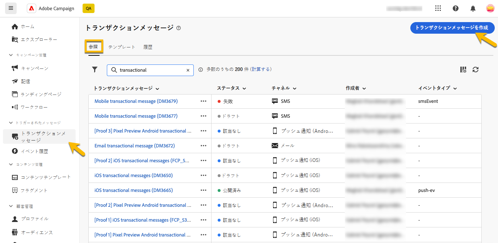

# プロファイルデータによるトランザクションメッセージのエンリッチメント{#profile-enrichment}

>[!CONTEXTUALHELP]
>id="acw_homepage_welcome_rn2"
>title="プロファイルエンリッチメント"
>abstract="Campaign データベースフィールドをコンテンツにリンクして、トランザクションメッセージをパーソナライズできるようになりました。 正確なリアルタイムパーソナライゼーションを実現するには、ターゲットマッピング、エンリッチメント列および紐付けキーを選択します。"
>additional-url="https://experienceleague.adobe.com/docs/campaign-web/v8/release-notes/release-notes.html?lang=ja" text="リリースノートを参照してください"

この機能では、Adobe Campaign データベースフィールドをメッセージのコンテンツにリンクすることによって、トランザクションメッセージをパーソナライズできます。 ターゲットマッピング、エンリッチメント列および紐付けキーを選択して、パフォーマンスのしきい値を維持しながら、正確でリアルタイムのパーソナライゼーションを行うことができます。

* イベントベースのトランザクションメッセージでは、イベント自体に含まれるデータが使用されます。
* プロファイルベースのトランザクションメッセージでは、Adobe Campaign データベースに含まれるデータが使用されます。

プロファイルエンリッチメントを設定するには、次の主な手順に従います。

1. トランザクションメッセージを作成します。[詳細情報](#create-enrichment)
1. イベントタイプを定義します。[詳細情報](#event-enrichment)
1. エンリッチメント設定を指定します。[詳細情報](#settings-enrichment)
1. コンテンツを定義します。[詳細情報](#content-enrichment)
1. 検証して送信します。 [詳細情報](#send-enrichment)

>[!NOTE]
>
>サーバーは 8.8.2 以上にアップグレードする必要があります。
>
>この機能は現在、メール、SMS およびプッシュ通知でのみ使用できます。

## トランザクションメッセージの作成{#create-enrichment}

まず、新しいトランザクションメッセージを作成する必要があります。

1. 「**[!UICONTROL トリガーされたメッセージ]**」セクションで、「**[!UICONTROL トランザクションメッセージ]**」に移動し、新しいトランザクションメッセージを作成します。

   {zoomable="yes"}

1. テンプレートを選択し、プロパティを定義します。 詳しくは、この[ページ](create-transactional.md#transactional-message)を参照してください。

## イベントタイプの定義{#event-enrichment}

次に、Adobe Campaign データベースに含まれるターゲットデータに対して、イベントをプロファイルベースとして定義する必要があります。

1. 「**イベントタイプ**」セクションで「**イベントタイプを選択**」を選択し、既存のイベントタイプを使用するか、独自のイベントタイプを作成するかを選択します。

   >[!NOTE]
   >
   >別のトランザクションメッセージテンプレートで既に使用されているイベントタイプは選択できません。

   {zoomable="yes"}

1. イベントタイプの情報を入力します。

   * 既存のイベントタイプの場合は、リストから選択します。
   * 新しいイベントタイプの場合は、ラベルと名前を追加します。

1. 次に、**イベントタイプ**&#x200B;ドロップダウンで「**プロファイル RT**」を選択します。

   {zoomable="yes"}

## エンリッチメント設定の指定{#settings-enrichment}

次に、イベントにフィールドを追加して、トランザクションメッセージをパーソナライズします。

1. 「**データ**」セクションで、「**エンリッチメント設定**」をクリックします。

   {zoomable="yes"}

   >[!NOTE]
   >
   >このボタンは、プロファイルベースのイベントを定義した場合にのみ使用できます。

1. 「**追加の属性**」セクションで、「**属性を追加**」をクリックして、必要なフィールドを選択します。

   {zoomable="yes"}

1. 紐付けキーとして使用する属性を定義します。

1. キーがペイロードで使用できない場合の動作を選択します。

   * メッセージはパーソナライゼーションなしで送信されます
   * メッセージが送信されていません

## コンテンツの定義{#content-enrichment}

次に、トランザクションメッセージのコンテンツを定義する必要があります。

1. 「**コンテンツ**」セクションで「**コンテンツを編集**」ボタンをクリックし、メッセージコンテンツを定義します。 この[ページ](create-transactional.md#transactional-content)を参照してください。

   {zoomable="yes"}

1. パーソナライゼーションを使用する（例えば、件名などに使用する）場合は、**プロファイルエンリッチメント**&#x200B;メニューを使用して、以前に定義したプロファイルベースのフィールドを追加します。

   {zoomable="yes"}

## 検証と送信{#send-enrichment}

最後に、配信を検証して送信する必要があります。

1. コンテンツをシミュレートし、配達確認を送信して、配信を検証します。 この[ページ](validate-transactional.md)を参照してください。

1. 「**[!UICONTROL レビューして公開]**」ボタンをクリックして、メッセージを作成および公開します。 これで、トリガーによってトランザクションメッセージの送信を開始できるようになりました。

<!--
When creating the event configuration, select the Profile event targeting dimension (see Creating an event).

Add fields to the event, in order to be able to personalize the transactional message (see Defining the event attributes). You must add at least one field to create an enrichment. You do not need to create other fields such as First name and Last name as you will be able to use personalization fields from the Adobe Campaign database.

Create an enrichment in order to link the event to the Profile resource (see Enriching the event) and select this enrichment as the Targeting enrichment.

IMPORTANT
This step is mandatory for profile-based events.
Preview and publish the event (see Previewing and publishing the event).

When previewing the event, the REST API does not contain an attribute specifying the email address, mobile phone, or push notification specific attributes, as it will be retrieved from the Profile resource.

Once the event has been published, a transactional message linked to the new event is automatically created. In order for the event to trigger sending a transactional message, you must modify and publish the message that was just created…

Integrate the event into your website (see Integrate the event triggering).
-->

