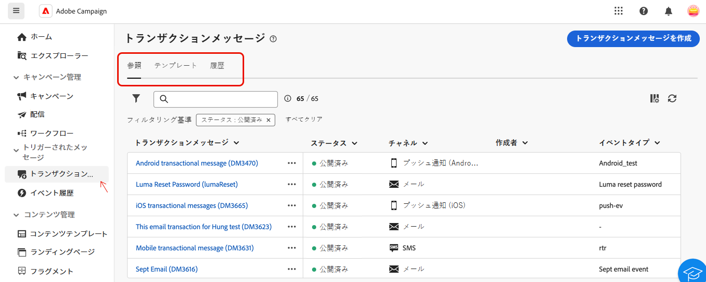

# トランザクションメッセージについて {#transactional-messaging}

>[!CONTEXTUALHELP]
>id="acw_transacmessages"
>title="トランザクションメッセージ"
>abstract="トランザクションメッセージは、トリガー済みメッセージを処理するために設計された Adobe Campaign の特殊なモジュールです。"

>[!CONTEXTUALHELP]
>id="acw_homepage_welcome_rn1"
>title="トランザクションメッセージ"
>abstract="トランザクションメッセージは、Adobe Campaignの特殊なモジュールで、トリガーメッセージを処理するために設計されています。 これらのメッセージは、情報システムからのイベントに応答して自動的に生成されます。"
>additional-url="https://experienceleague.adobe.com/docs/campaign-web/v8/release-notes/release-notes.html?lang=ja" text="リリースノートを参照してください"

<!-- >>[!CONTEXTUALHELP]
>id="acw_transacmessages_exclusionlogs"
>title="Transactional messaging exclusion logs"
>abstract="Transactional messaging exclusion logs" -->

トランザクションメッセージは、Adobe Campaignの特殊なモジュールで、トリガーメッセージを処理するために設計されています。 これらのメッセージは、情報システムからのイベントに応答して自動的に生成されます。 このようなイベントの一般的な例としては、ボタンやリンクのクリック、買い物かごの放棄、製品可用性アラートのリクエスト、アカウントの作成や変更などがあります。

トランザクションメッセージは、次の送信に使用します。

* 重要な通知（注文確認、パスワードのリセットなど）
* 顧客のアクションに対するリアルタイムの応答（アカウントの作成、購入完了など）、
* 顧客とのやり取りにとって重要な、プロモーション以外のコンテンツ。

トランザクションメッセージモジュールは、情報システムとシームレスに統合されます。 顧客のアクションなどのイベントは、Adobe Campaignにプッシュされ、対応するパーソナライズされたメッセージが送信されます。 これらのメッセージは、メール、SMS、プッシュ通知などの様々なチャネルを介して、個別に、またはバッチで送信できます。

**[!UICONTROL トランザクションメッセージ]** モジュールは、「**[!UICONTROL トリガーメッセージ]** セクションにあります。

{zoomable="yes"}

**[!UICONTROL トランザクションメッセージ]** ページには、次の 3 つのタブがあります。

* **[!UICONTROL 参照]** トランザクションメッセージのリストと、そのステータスが表示されている場所。
* **[!UICONTROL テンプレート]** トランザクションメッセージテンプレートを検索および作成する場所。
* **[!UICONTROL 履歴]**：実行されたすべてのトランザクションメッセージに関する詳細が表示されます。

このドキュメントでは、次の方法について説明します。

* テンプレートを利用して [ トランザクションメッセージを作成 ](create-transactional.md) し、必要な設定を学びます。
* [ トランザクションメッセージの内容を検証 ](validate-transactional.md) し、パーソナライゼーションをシミュレートします。
* [ トランザクションメッセージの監視 ](monitor-transactional.md)。
