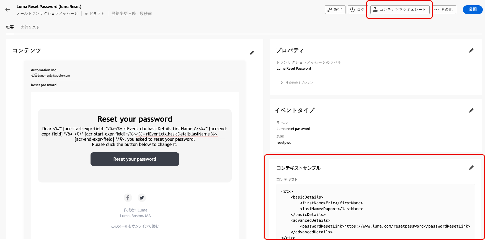
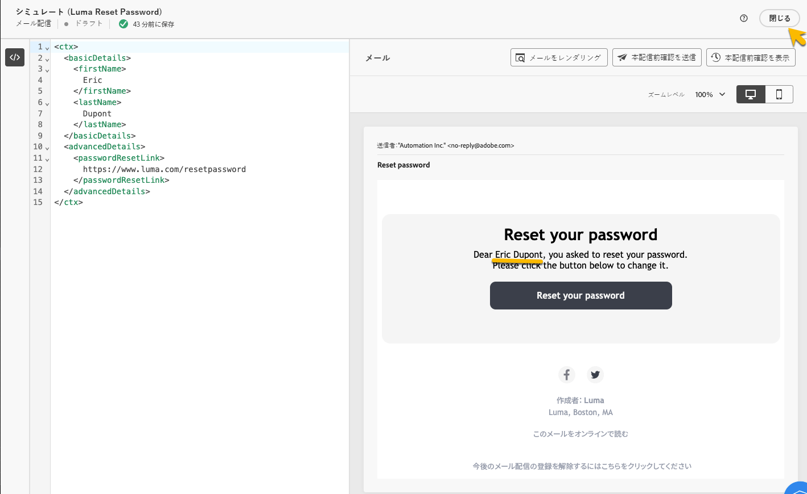
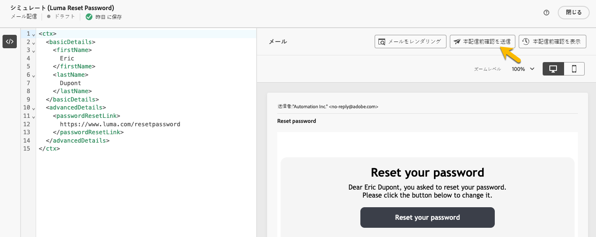
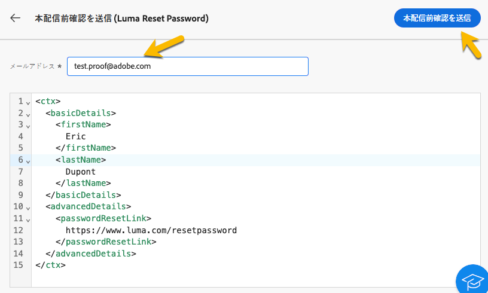

# トランザクションメッセージの検証

トランザクションメッセージの作成中または作成後に、データサンプルを使用してコンテンツを検証する必要がある場合があります。

## コンテンツのシミュレート {#simulate-content}

メッセージのコンテンツをシミュレートするには、次の手順に従います。

* メッセージコンテンツのパーソナライゼーションパスがコンテキストサンプルと一致することを確認します。次の例では、テストプロファイルの名を表示するために、パス *rtEvent.ctx.basicDetails.firstName* を使用します。

  メッセージのコンテンツやコンテキストサンプルを変更して、整列させることができます。

  {zoomable="yes"}

* 「**[!UICONTROL コンテンツをシミュレート]**」ボタンをクリックして、コンテキストサンプルに入力したデータを使用してトランザクションメッセージをプレビューします。

  {zoomable="yes"}

  コンテンツを確認した後、「**[!UICONTROL 閉じる]**」ボタンをクリックします。

* コンテンツを変更した場合は、必ず「**[!UICONTROL 再公開]**」ボタンをクリックしてください。

## 配達確認の送信

メール、SMS、プッシュ通知など、選択したチャネルを通じて配信されるトランザクションメッセージをテストして、エクスペリエンスを実現するには、配達確認機能を使用できます。

[シミュレーションコンテンツウィンドウ](#simulate-content)で、「**[!UICONTROL 配達確認を送信]**」ボタンをクリックします。

{zoomable="yes"}

表示された新しいウィンドウで、チャネルに応じて、配達確認を受信するメールアドレスまたは電話番号を入力します。目的のアドレスを入力したら、「**[!UICONTROL 配達確認を送信]**」ボタンと「**[!UICONTROL 確認]**」ボタンをクリックします。このアクションにより、トランザクションメッセージのサンプルを送信して、すべてのパーソナライゼーション、動的コンテンツおよび書式設定がエンドユーザーに対して正しく表示されることを確認できます。

{zoomable="yes"}

この手順は、トランザクションメッセージを公開する前に、潜在的な問題を特定するのに不可欠です。