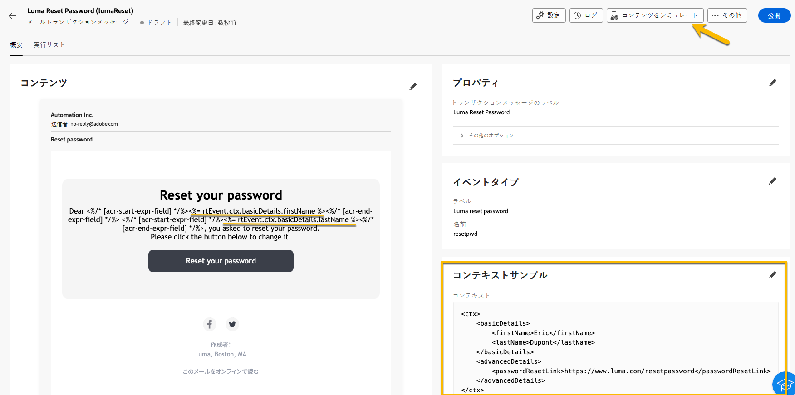

# トランザクションメッセージの検証

トランザクションメッセージの作成中または作成後に、データサンプルを使用してコンテンツを検証する必要がある場合があります。

## コンテンツのシミュレート {#simulate-content}

メッセージのコンテンツをシミュレートするには、次の手順に従います。

* メッセージコンテンツのパーソナライゼーションパスがコンテキストサンプルと一致することを確認します。次の例で、テストプロファイルの名を表示するには、パス *rtEvent.ctx.basicDetails.firstName* を使用します。

  メッセージコンテンツやコンテキストサンプルを変更して、位置を合わせることができます。

  {zoomable="yes"}

* 「**[!UICONTROL コンテンツをシミュレート]**」ボタンをクリックして、コンテキストサンプルに入力されたデータを使用してトランザクションメッセージをプレビューします。

  {zoomable="yes"}

  コンテンツを確認したら、「**[!UICONTROL 閉じる]**」ボタンをクリックします。

* コンテンツに変更を加えた場合は、「**[!UICONTROL 再公開]**」ボタンをクリックするようにしてください。

## 配達確認の送信

選択したチャネル（メール、SMS、プッシュ通知など）で配信されるとおりにトランザクションメッセージをテストしエクスペリエンスを得るには、配達確認機能を使用します。

[シミュレーションコンテンツウィンドウ](#simulate-content)で、「**[!UICONTROL 配達確認を送信]**」ボタンをクリックします。

{zoomable="yes"}

表示される新しいウィンドウで、配達確認を受信するチャネルに応じて、メールアドレスまたは電話番号を入力します。 目的のアドレスを入力したら、**[!UICONTROL 配達確認を送信]** および **[!UICONTROL 確認]** ボタンをクリックします。 このアクションは、トランザクションメッセージのサンプルを送信し、すべてのパーソナライゼーション、動的コンテンツ、書式設定が、エンドユーザーの場合と同様に正しく表示されるようにします。

{zoomable="yes"}

この手順は、トランザクションメッセージを公開する前に潜在的な問題を特定するために不可欠です。