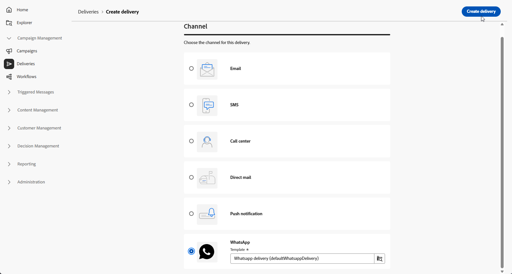

# WhatsApp メッセージの作成 {#create-whatsapp}

**Adobe Campaign Web ユーザーインターフェイス**&#x200B;を使用すると、Metaで承認されたテンプレートを使用するWhatsApp メッセージをデザインし、各プロファイルに合わせてパーソナライズして、送信前にテストできます。

+++ サポートされているメッセージ要素とCTAの詳細

WhatsAppでは、次のメッセージタイプがサポートされています。

| メッセージ機能 | 説明 |
|-|-|
| ヘッダー | メッセージの本文の上に表示されるオプションのテキスト。 |
| テキスト | パラメーターによる動的コンテンツのサポート。 |
| ヘッダー画像 | メッセージの本文の上に表示されるオプション画像。 |
| Body Text | パラメーターによる動的コンテンツのサポート。 |
| フッターテキスト | パラメーターによる動的コンテンツのサポート。 |

+++

## WhatsApp配信の作成 {#create-whatsapp-journey-campaign}

>[!IMPORTANT]
>
>WhatsApp メッセージフィードバックは現在サポートされていません。

Adobe Campaign Web ユーザーインターフェイスで、次の手順に従ってスタンドアロン WhatsApp配信を作成します。

1. **[!UICONTROL 配信]** メニューを参照し、**[!UICONTROL 配信の作成]**&#x200B;をクリックします。

   

1. **[!UICONTROL WhatsApp]**&#x200B;を選択し、配信テンプレートを選択します。 [&#x200B; テンプレートの詳細](../msg/delivery-template.md)。

   

1. 「**[!UICONTROL 配信を作成]**」をクリックして確認します。

1. テンプレートに関連付けられた詳細オプションについては、**[!UICONTROL 設定]**&#x200B;をクリックします。 [詳細情報](../advanced-settings/delivery-settings.md)

   

1. 配信の&#x200B;**[!UICONTROL ラベル]**&#x200B;を入力します。内部の名前、フォルダー、配信コード、説明、または性質が必要な場合は、他のチャネルと同じパターンで&#x200B;**[!UICONTROL 追加オプション]**&#x200B;を使用します。

1. 「**[!UICONTROL オーディエンスを選択]**」をクリックして、既存のオーディエンスをターゲットにするか、作成します。 [詳しくは、オーディエンスを参照してください](../audience/about-recipients.md)。

1. 「**[!UICONTROL コンテンツを編集]**」をクリックしてWhatsApp コンテンツエディターを開きます。[WhatsApp コンテンツの定義](#whatsapp-content)を参照してください。

   

1. **[!UICONTROL スケジュールを有効にする]**&#x200B;を有効にして、特定の日時に送信できます。 [詳細情報](../msg/gs-deliveries.md#gs-schedule)。

## WhatsApp コンテンツを定義する{#whatsapp-content}

>[!BEGINSHADEBOX]

Adobe Campaign Web ユーザーインターフェイスでWhatsApp メッセージをデザインする前に、Metaでテンプレートを作成して送信します。 [詳細情報](https://www.facebook.com/business/help/2055875911147364?id=2129163877102343)

WhatsApp テンプレートは、使用前にMetaで承認する必要があります。 承認には数時間かかることが多いものの、最大で24時間かかることもあります。 [詳細情報](https://developers.facebook.com/docs/whatsapp/message-templates/guidelines/#approval-process)

>[!ENDSHADEBOX]

1. Adobe Campaign Web ユーザーインターフェイスの配信設定ページで、**[!UICONTROL コンテンツを編集]**&#x200B;をクリックして、WhatsApp メッセージを設定します。

1. **テンプレートカテゴリ**&#x200B;としてマーケティングを選択します。

   [&#x200B; テンプレートカテゴリの詳細](https://developers.facebook.com/docs/whatsapp/updates-to-pricing/new-template-guidelines/#template-category-guidelines)

   

1. **WhatsApp テンプレート** ドロップダウンから、Meta承認済みテンプレートを選択します。

   [WhatsApp テンプレートの作成方法について詳しく見る](https://www.facebook.com/business/help/2055875911147364?id=2129163877102343)

   

1. Meta承認済みテンプレートに画像が含まれる場合は、**[!UICONTROL 画像URL]**&#x200B;を指定します。

   

1. **Personalization プレースホルダー** フィールドで、パーソナライゼーションエディターを使用して、プロファイルフィールドとエクスプレッションをテンプレートパラメーターにマッピングします。 [詳細情報](../personalization/personalize.md)。

   

メッセージの準備ができたら：

* **スタンドアロンまたはキャンペーン配信**：配信ダッシュボードで&#x200B;**[!UICONTROL レビューと送信]**&#x200B;および&#x200B;**[!UICONTROL 送信]**&#x200B;を使用します。

* **ワークフロー**：実行によってワークフローアクティビティから配信を開き、配信ダッシュボードを同じ方法で使用します。 [詳細情報](../workflows/start-monitor-workflows.md)

次に、配信&#x200B;**[!UICONTROL レポート]**&#x200B;のエントリポイントと[配信レポート &#x200B;](../reporting/delivery-reports.md)の結果を追跡できます。
