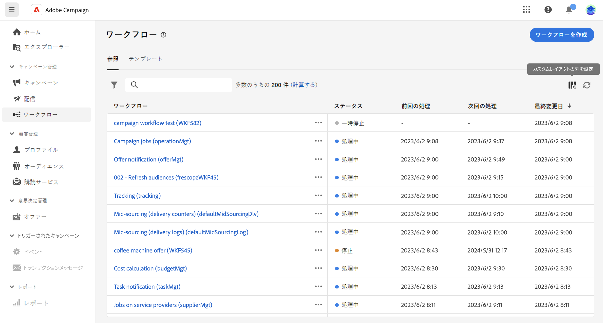

# ワークフローへのアクセスと管理 {#access-monitor}

>[!CONTEXTUALHELP]
>id="acw_targeting_workflow_list"
>title="ワークフロー"
>abstract="この画面では、スタンドアロンワークフローとキャンペーンワークフローの完全なリストにアクセスし、現在のステータス、最後／次回の実行日を確認して、新しいワークフローを作成できます。 「テンプレート」タブを参照して、使用可能なワークフローテンプレートにアクセスします。"

**[!UICONTROL ワークフロー]**&#x200B;メニューから、ワークフローの完全なリストにアクセスできます。 このリストには、この画面から作成された&#x200B;**スタンドアロンワークフロー**&#x200B;と、キャンペーン内で作成された&#x200B;**キャンペーンワークフロー**&#x200B;の両方が含まれています。

{zoomable="yes"}

リスト内の各ワークフローには、現在の[ステータス](#status)、前回の実行または変更日時、および次にスケジュールされた実行日時に関する情報が表示されます。

リストの右上隅にある「**[!UICONTROL カスタムレイアウトの列を設定]**」アイコンをクリックして、表示される列をカスタマイズします。 これにより、各ワークフローでエラーになった最後のアクティビティや、適用されたターゲティングディメンションなどの情報をリストに追加できます。

また、検索バーとフィルターを使用すると、リスト内での検索がシンプルになります。 例えば、ワークフローをフィルタリングして、キャンペーンに属するワークフローや、特定の日付範囲中に処理されたワークフローのみを表示します。

ワークフローを複製または削除するには、省略記号ボタンをクリックし、「**[!UICONTROL 複製]**」または「**[!UICONTROL 削除]**」を選択します。

>[!NOTE]
>
>進行中のワークフローを複製できますが、削除することはできません。

## ワークフローのステータス {#status}

ワークフローには、次の複数のステータスを設定できます。

* **[!UICONTROL ドラフト]**：ワークフローが作成され、保存されました。
* **[!UICONTROL 処理中]**：ワークフローは現在実行中です。
* **[!UICONTROL 完了]**：ワークフローの実行が完了しました。
* **[!UICONTROL 一時停止]**：ワークフローは、エラー発生後、手動または自動で一時停止されました。ワークフローがエラーにより一時停止された場合は、ワークフローを開き、ログとタスクにアクセスして問題を特定し、解決します。[ログとタスクの監視方法を学ぶ](start-monitor-workflows.md#logs-tasks)

ワークフローの実行を開始および監視する方法について詳しくは、[このページ](start-monitor-workflows.md)を参照してください。

## ワークフローテンプレート {#templates}

「**[!UICONTROL テンプレート]**」タブに、使用可能なすべてのワークフローテンプレートが表示されます。

ワークフローテンプレートには、新しいワークフローの作成に再利用できる、事前に設定されたアクティビティと全体的なプロパティ設定が含まれています。

ワークフローテンプレートは、既存のワークフローから作成するか、ゼロから作成します。 [ワークフローテンプレートの作成方法の詳細を学ぶ](create-workflow.md#workflow-templates)