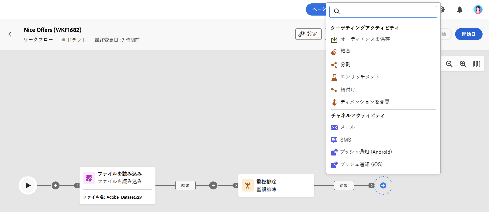

# ワークフローアクティビティについて {#workflow-activities}

ワークフローアクティビティは、3 つのカテゴリにグループ化されます。使用可能なアクティビティは、コンテキストに応じて異なる場合があります。

すべてのアクティビティについて、以下の節で詳しく説明します。

* [ターゲティングアクティビティ](#targeting)
* [チャネルアクティビティ](#channel)
* [フロー制御アクティビティ](#flow-control)

## ターゲティングアクティビティ {#targeting}

これらのアクティビティは、母集団データのターゲティング、操作およびエンリッチメントに固有です。オーディエンスを定義するか、積集合、和集合、除外の各操作を使用して分割または結合することで、1 つまたは複数のターゲットを作成できます。

* [オーディエンスを作成](build-audience.md)アクティビティでは、ターゲット母集団を定義できます。既存のオーディエンスを選択するか、ルールビルダーを使用して独自のクエリを定義できます。
* [結合](combine.md)アクティビティでは、インバウンド母集団に対してセグメント化を実行できます。和集合、積集合または除外を使用できます。
* [エンリッチメント](enrichment.md)アクティビティでは、ワークフローで処理する追加のデータを定義できます。このアクティビティでは、インバウンドトランジションを利用し、追加のデータで出力トランジションを補完するようにアクティビティを設定できます。
* [分割](split.md)アクティビティを使用すると、入力母集団を複数のサブセットにセグメント化できます。

## チャネルアクティビティ {#channel}

Adobe Campaign web を使用すると、メール、SMS、プッシュなど複数のチャネルをまたいでマーケティングキャンペーンを自動化および実行できます。チャネルアクティビティをキャンバスに組み合わせて、顧客の行動に基づいてアクションをトリガーできるクロスチャネルワークフローを作成できます。

次の&#x200B;**チャネル**&#x200B;アクティビティを使用できます。

* メール
* プッシュ
* SMS

[こちら](channels.md)を参照してください。

## フロー制御アクティビティ {#flow-control}

>[!CONTEXTUALHELP]
>id="acw_orchestration_end"
>title="終了アクティビティ"
>abstract="**終了**&#x200B;アクティビティを使用すると、ワークフローの終了を視覚的に示すことができます。このアクティビティは、機能上の影響はないので、省略可能です。"

次のアクティビティは、ワークフローの整理と実行に固有です。主なタスクは、他のアクティビティの調整です。

* [AND 結合](and-join.md)アクティビティを使用すると、ワークフローの複数の実行分岐を同期できます。
* **終了**&#x200B;アクティビティを使用すると、ワークフローの終了を視覚的に示すことができます。このアクティビティは、機能上の影響はないので、省略可能です。
* [分岐](fork.md)アクティビティを使用すると、アウトバウンドトランジションを作成して、複数のアクティビティを同時に開始できます。
* [待機](wait.md)アクティビティは、ワークフローの一部の実行を一時的に中断します。

<!--
## Data management activities {#data-management}

overview: what they're used for
which use case you can perform with them

list available activites + short description + ref to section
-->

