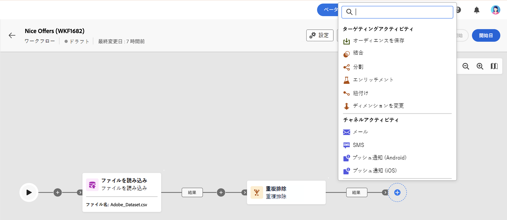

<?xml version="1.0" encoding="UTF-8"?>
<xliff xmlns="urn:oasis:names:tc:xliff:document:1.2" xmlns:okp="okapi-framework:xliff-extensions" xmlns:its="http://www.w3.org/2005/11/its" xmlns:itsxlf="http://www.w3.org/ns/its-xliff/" version="1.2" its:version="2.0">
<file original="help/v8/workflows/activities/about-activities.md.mdsc" source-language="en-US" target-language="en-XX" datatype="x-text/markdown">
<body>
<trans-unit id="tu1" restype="x-YAML_METADATA_HEADER_VALUE" xml:space="preserve">
<source xml:lang="en-US">Work with workflows activities</source>
<target xml:lang="en-XX">ワークフローアクティビティの操作</target>
</trans-unit>
<trans-unit id="tu2" restype="x-YAML_METADATA_HEADER_VALUE" xml:space="preserve">
<source xml:lang="en-US">Learn how to workflow activities</source>
<target xml:lang="en-XX">ワークフローアクティビティの操作方法を学ぶ</target>
</trans-unit>
<trans-unit id="tu3" xml:space="preserve">
<source xml:lang="en-US">About workflow activities</source>
<target xml:lang="en-XX">ワークフローアクティビティについて</target>
</trans-unit>
<trans-unit id="tu4" xml:space="preserve">
<source xml:lang="en-US">Workflow activities are grouped into three categories. Depending on the context, available activities may differ.</source>
<target xml:lang="en-XX">ワークフローアクティビティは、3 つのカテゴリにグループ化されます。 使用可能なアクティビティは、コンテキストに応じて異なる場合があります。</target>
</trans-unit>
<trans-unit id="tu5" xml:space="preserve">
<source xml:lang="en-US">All activities are detailed in the sections below:</source>
<target xml:lang="en-XX">すべてのアクティビティについて、以下の節で詳しく説明します。</target>
</trans-unit>
<trans-unit id="tu6" xml:space="preserve">
<source xml:lang="en-US">Targeting and data management activities</source>
<target xml:lang="en-XX">ターゲティングとデータ管理アクティビティ</target>
</trans-unit>
<trans-unit id="tu7" xml:space="preserve">
<source xml:lang="en-US">Channel activities</source>
<target xml:lang="en-XX">チャネルアクティビティ</target>
</trans-unit>
<trans-unit id="tu8" xml:space="preserve">
<source xml:lang="en-US">Flow control activities</source>
<target xml:lang="en-XX">フロー制御アクティビティ</target>
</trans-unit>
<trans-unit id="tu9" xml:space="preserve">
<source xml:lang="en-US"><ph id="1" ctype="x-IMAGE"></ph></source>
<target xml:lang="en-XX"><ph id="1" ctype="x-IMAGE"></ph></target>
</trans-unit>
<trans-unit id="tu10" xml:space="preserve">
<source xml:lang="en-US">Targeting activities</source>
<target xml:lang="en-XX">ターゲティングアクティビティ</target>
</trans-unit>
<trans-unit id="tu11" xml:space="preserve">
<source xml:lang="en-US">These activities are specific to targeting. They allow you to build one or more target audiences by defining an audience and splitting or combining these audiences using intersection, union, or exclusion operations.</source>
<target xml:lang="en-XX">これらのアクティビティは、ターゲティングに固有です。 オーディエンスを定義するか、積集合、和集合、除外の各操作を使用して分割または結合することで、1 つまたは複数のターゲットオーディエンスを作成できます。</target>
</trans-unit>
<trans-unit id="tu12" xml:space="preserve">
<source xml:lang="en-US"><ph id="1" ctype="x-LINK">[</ph>Build audience<ph id="2" ctype="x-LINK">](build-audience.md)</ph>: Define your target population. Select an existing audience or use the query modeler to define your own query. You can also configure <ph id="3" ctype="x-STRONG_EMPHASIS">**</ph>Enrichment data<ph id="4" ctype="x-STRONG_EMPHASIS">**</ph> (available for queries).</source>
<target xml:lang="en-XX"><ph id="1" ctype="x-LINK">[</ph>オーディエンスを作成<ph id="2" ctype="x-LINK">](build-audience.md)</ph>：ターゲット母集団を定義します。 既存のオーディエンスを選択するか、クエリモデラーを使用して独自のクエリを定義します。 また、<ph id="3" ctype="x-STRONG_EMPHASIS">**</ph>エンリッチメントデータ<ph id="4" ctype="x-STRONG_EMPHASIS">**</ph>を設定することもできます（クエリに使用できます）。</target>
</trans-unit>
<trans-unit id="tu13" xml:space="preserve">
<source xml:lang="en-US"><ph id="1" ctype="x-LINK">[</ph>Change data source<ph id="2" ctype="x-LINK">](change-data-source.md)</ph>: Change the data source for the working table of your workflow.</source>
<target xml:lang="en-XX"><ph id="1" ctype="x-LINK">[</ph>データソースを変更<ph id="2" ctype="x-LINK">](change-data-source.md)</ph>：ワークフローの作業用テーブルのデータソースを変更します。</target>
</trans-unit>
<trans-unit id="tu14" xml:space="preserve">
<source xml:lang="en-US"><ph id="1" ctype="x-LINK">[</ph>Change dimension<ph id="2" ctype="x-LINK">](change-dimension.md)</ph>: Change the targeting dimension while building your workflow.</source>
<target xml:lang="en-XX"><ph id="1" ctype="x-LINK">[</ph>ディメンションを変更<ph id="2" ctype="x-LINK">](change-dimension.md)</ph>：ワークフローの作成時にターゲティングディメンションを変更します。</target>
</trans-unit>
<trans-unit id="tu15" xml:space="preserve">
<source xml:lang="en-US"><ph id="1" ctype="x-LINK">[</ph>Combine<ph id="2" ctype="x-LINK">](combine.md)</ph>: Perform segmentation on your inbound population. Use a union, an intersection, or an exclusion.</source>
<target xml:lang="en-XX"><ph id="1" ctype="x-LINK">[</ph>結合<ph id="2" ctype="x-LINK">](combine.md)</ph>：インバウンド母集団に対してセグメント化を実行します。 和集合、積集合または除外を使用します。</target>
</trans-unit>
<trans-unit id="tu16" xml:space="preserve">
<source xml:lang="en-US"><ph id="1" ctype="x-LINK">[</ph>Deduplication<ph id="2" ctype="x-LINK">](deduplication.md)</ph>: Remove duplicates in the results of inbound activities.</source>
<target xml:lang="en-XX"><ph id="1" ctype="x-LINK">[</ph>重複排除 - 重複<ph id="2" ctype="x-LINK">](deduplication.md)</ph>：インバウンドアクティビティの結果から重複を削除します。</target>
</trans-unit>
<trans-unit id="tu17" xml:space="preserve">
<source xml:lang="en-US"><ph id="1" ctype="x-LINK">[</ph>Enrichment<ph id="2" ctype="x-LINK">](enrichment.md)</ph>: Define additional data to process in your workflow. Configure the activity to complete the output transition with additional data.</source>
<target xml:lang="en-XX"><ph id="1" ctype="x-LINK">[</ph>エンリッチメント<ph id="2" ctype="x-LINK">](enrichment.md)</ph>：ワークフローで処理する追加のデータを定義します。 追加のデータで出力トランジションを補完するようにアクティビティを設定します。</target>
</trans-unit>
<trans-unit id="tu18" xml:space="preserve">
<source xml:lang="en-US"><ph id="1" ctype="x-LINK">[</ph>Incremental query<ph id="2" ctype="x-LINK">](incremental-query.md)</ph>: Query the database on a scheduled basis. Each time this activity runs, it excludes results from previous executions, targeting only new elements.</source>
<target xml:lang="en-XX"><ph id="1" ctype="x-LINK">[</ph>増分クエリ<ph id="2" ctype="x-LINK">](incremental-query.md)</ph>：スケジュールに従ってデータベースに対してクエリを実行します。 このアクティビティを実行するたびに、以前の実行の結果が除外され、新しい要素のみをターゲティングします。</target>
</trans-unit>
<trans-unit id="tu19" xml:space="preserve">
<source xml:lang="en-US"><ph id="1" ctype="x-LINK">[</ph>Reconciliation<ph id="2" ctype="x-LINK">](reconciliation.md)</ph>: Define the link between the data in the Adobe Campaign database and the data in a work table, such as data loaded from an external file.</source>
<target xml:lang="en-XX"><ph id="1" ctype="x-LINK">[</ph>紐付け<ph id="2" ctype="x-LINK">](reconciliation.md)</ph>：Adobe Campaign データベース内のデータとワークテーブル内のデータ（外部ファイルから読み込まれたデータなど）を結ぶリンクを定義します。</target>
</trans-unit>
<trans-unit id="tu20" xml:space="preserve">
<source xml:lang="en-US"><ph id="1" ctype="x-LINK">[</ph>Save audience<ph id="2" ctype="x-LINK">](save-audience.md)</ph>: Update an existing audience or create a new audience from the population computed upstream in a workflow.</source>
<target xml:lang="en-XX"><ph id="1" ctype="x-LINK">[</ph>オーディエンスを保存<ph id="2" ctype="x-LINK">](save-audience.md)</ph>：既存のオーディエンスを更新するか、ワークフローの上流で計算された母集団から新しいオーディエンスを作成します。</target>
</trans-unit>
<trans-unit id="tu21" xml:space="preserve">
<source xml:lang="en-US"><ph id="1" ctype="x-LINK">[</ph>Split<ph id="2" ctype="x-LINK">](split.md)</ph>: Segment the incoming population into several subsets.</source>
<target xml:lang="en-XX"><ph id="1" ctype="x-LINK">[</ph>分割<ph id="2" ctype="x-LINK">](split.md)</ph>：入力母集団を複数のサブセットにセグメント化します。</target>
</trans-unit>
<trans-unit id="tu22" xml:space="preserve">
<source xml:lang="en-US">Data management activities</source>
<target xml:lang="en-XX">データ管理アクティビティ</target>
</trans-unit>
<trans-unit id="tu23" xml:space="preserve">
<source xml:lang="en-US">These activities are specific to manipulating and enriching population data.</source>
<target xml:lang="en-XX">これらのアクティビティは、母集団データの操作およびエンリッチメントに固有です。</target>
</trans-unit>
<trans-unit id="tu24" xml:space="preserve">
<source xml:lang="en-US"><ph id="1" ctype="x-LINK">[</ph>Data loading (RDBMS)<ph id="2" ctype="x-LINK">](data-loading-rdbms.md)</ph>: Load data directly from an external relational database into your workflow.</source>
<target xml:lang="en-XX"><ph id="1" ctype="x-LINK">[</ph>データ読み込み（RDBMS）<ph id="2" ctype="x-LINK">](data-loading-rdbms.md)</ph>：外部リレーショナルデータベースからワークフローに直接データを読み込みます。</target>
</trans-unit>
<trans-unit id="tu25" xml:space="preserve">
<source xml:lang="en-US"><ph id="1" ctype="x-LINK">[</ph>Extract file<ph id="2" ctype="x-LINK">](extract-file.md)</ph>: Export data from Adobe Campaign to another system as an external file.</source>
<target xml:lang="en-XX"><ph id="1" ctype="x-LINK">[</ph>ファイルを抽出<ph id="2" ctype="x-LINK">](extract-file.md)</ph>：Adobe Campaign から別のシステムにデータを外部ファイルとしてエクスポートします。</target>
</trans-unit>
<trans-unit id="tu26" xml:space="preserve">
<source xml:lang="en-US"><ph id="1" ctype="x-LINK">[</ph>Load file<ph id="2" ctype="x-LINK">](load-file.md)</ph>: Work with profiles and data stored in an external file.</source>
<target xml:lang="en-XX"><ph id="1" ctype="x-LINK">[</ph>ファイルを読み込み<ph id="2" ctype="x-LINK">](load-file.md)</ph>：外部ファイルに保存されたプロファイルとデータを操作します。</target>
</trans-unit>
<trans-unit id="tu27" xml:space="preserve">
<source xml:lang="en-US"><ph id="1" ctype="x-LINK">[</ph>Transfer file<ph id="2" ctype="x-LINK">](transfer-file.md)</ph>: Receive or send files, test for file presence, or list files on a server. The protocol used can be either server-to-server protocol or HTTP protocol.</source>
<target xml:lang="en-XX"><ph id="1" ctype="x-LINK">[</ph>ファイルを転送<ph id="2" ctype="x-LINK">](transfer-file.md)</ph>：ファイルの送受信、ファイルの有無の確認、サーバー上のファイルのリストアップを行います。 使用されるプロトコルは、サーバー間プロトコルまたは HTTP プロトコルのいずれかです。</target>
</trans-unit>
<trans-unit id="tu28" xml:space="preserve">
<source xml:lang="en-US"><ph id="1" ctype="x-LINK">[</ph>JavaScript code<ph id="2" ctype="x-LINK">](javascript-code.md)</ph>: Execute a JavaScript code snippet within the context of a workflow.</source>
<target xml:lang="en-XX"><ph id="1" ctype="x-LINK">[</ph>JavaScript コード<ph id="2" ctype="x-LINK">](javascript-code.md)</ph>：ワークフローのコンテキスト内で JavaScript コードスニペットを実行します。</target>
</trans-unit>
<trans-unit id="tu29" xml:space="preserve">
<source xml:lang="en-US"><ph id="1" ctype="x-LINK">[</ph>Subscription services<ph id="2" ctype="x-LINK">](subscription-services.md)</ph>: Subscribe or unsubscribe multiple profiles to or from a service in a single action.</source>
<target xml:lang="en-XX"><ph id="1" ctype="x-LINK">[</ph>購読サービス<ph id="2" ctype="x-LINK">](subscription-services.md)</ph>：1 回のアクションで、サービスに複数のプロファイルを購読またはサービスから購読解除します。</target>
</trans-unit>
<trans-unit id="tu30" xml:space="preserve">
<source xml:lang="en-US"><ph id="1" ctype="x-LINK">[</ph>Update data<ph id="2" ctype="x-LINK">](update-data.md)</ph>: Perform mass updates on fields in the database. Several options allow you to personalize the data update.</source>
<target xml:lang="en-XX"><ph id="1" ctype="x-LINK">[</ph>データを更新<ph id="2" ctype="x-LINK">](update-data.md)</ph>：データベースのフィールドに対して一括更新を実行します。 データ更新は、いくつかのオプションを使用してパーソナライズすることができます。</target>
</trans-unit>
<trans-unit id="tu31" xml:space="preserve">
<source xml:lang="en-US">Channel activities</source>
<target xml:lang="en-XX">チャネルアクティビティ</target>
</trans-unit>
<trans-unit id="tu32" xml:space="preserve">
<source xml:lang="en-US">Adobe Campaign Web allows you to automate and execute marketing campaigns across multiple channels. Combine channel activities into the canvas to create cross-channel workflows that trigger actions based on customer behavior. The following <ph id="1" ctype="x-STRONG_EMPHASIS">**</ph>Channel<ph id="2" ctype="x-STRONG_EMPHASIS">**</ph> activities are available: Email, SMS, Android, and iOS Push notifications. <ph id="3" ctype="x-LINK">[</ph>Learn how to set up a delivery in the context of a workflow<ph id="4" ctype="x-LINK">](channels.md)</ph>.</source>
<target xml:lang="en-XX">Adobe Campaign Web を使用すると、複数のチャネル間でマーケティングキャンペーンを自動化および実行できます。 チャネルアクティビティをキャンバスに組み合わせて、顧客の行動に基づいてアクションをトリガーするクロスチャネルワークフローを作成します。 メール、SMS、Android および iOS プッシュ通知の<ph id="1" ctype="x-STRONG_EMPHASIS">**</ph>チャネル<ph id="2" ctype="x-STRONG_EMPHASIS">**</ph>アクティビティが使用可能です。 <ph id="3" ctype="x-LINK">[</ph>詳しくは、ワークフローのコンテキストでの配信の設定方法を参照してください<ph id="4" ctype="x-LINK">](channels.md)</ph>。</target>
</trans-unit>
<trans-unit id="tu33" xml:space="preserve">
<source xml:lang="en-US">Flow control activities</source>
<target xml:lang="en-XX">フロー制御アクティビティ</target>
</trans-unit>
<trans-unit id="tu34" xml:space="preserve">
<source xml:lang="en-US">End activity</source>
<target xml:lang="en-XX">終了アクティビティ</target>
</trans-unit>
<trans-unit id="tu35" xml:space="preserve">
<source xml:lang="en-US">The <ph id="1" ctype="x-STRONG_EMPHASIS">**</ph>Start<ph id="2" ctype="x-STRONG_EMPHASIS">**</ph> activity allows you to graphically mark the start of a workflow. This activity has no functional impact and is therefore optional.</source>
<target xml:lang="en-XX"><ph id="1" ctype="x-STRONG_EMPHASIS">**</ph>開始<ph id="2" ctype="x-STRONG_EMPHASIS">**</ph>アクティビティを使用すると、ワークフローの開始をグラフィカルにマークできます。 このアクティビティは、機能上の影響はないので、省略可能です。</target>
</trans-unit>
<trans-unit id="tu36" xml:space="preserve">
<source xml:lang="en-US">The following activities are specific to organizing and executing workflows. Their main task is to coordinate the other activities:</source>
<target xml:lang="en-XX">次のアクティビティは、ワークフローの整理と実行に固有です。 主なタスクは、他のアクティビティの調整です。</target>
</trans-unit>
<trans-unit id="tu37" xml:space="preserve">
<source xml:lang="en-US"><ph id="1" ctype="x-LINK">[</ph>Approval<ph id="2" ctype="x-LINK">](approval.md)</ph>: Assign a task to a group or an individual operator, and route the workflow based on their answer.</source>
<target xml:lang="en-XX"><ph id="1" ctype="x-LINK">[</ph>承認<ph id="2" ctype="x-LINK">](approval.md)</ph>：グループまたは個々のオペレーターにタスクを割り当て、その回答に基づいてワークフローをルーティングします。</target>
</trans-unit>
<trans-unit id="tu38" xml:space="preserve">
<source xml:lang="en-US"><ph id="1" ctype="x-LINK">[</ph>External signal<ph id="2" ctype="x-LINK">](external-signal.md)</ph>: Trigger the execution of a workflow from another workflow or an API call.</source>
<target xml:lang="en-XX"><ph id="1" ctype="x-LINK">[</ph>外部シグナル<ph id="2" ctype="x-LINK">](external-signal.md)</ph>：別のワークフローまたは API 呼び出しからワークフローの実行をトリガーします。</target>
</trans-unit>
<trans-unit id="tu39" xml:space="preserve">
<source xml:lang="en-US"><ph id="1" ctype="x-LINK">[</ph>Fork<ph id="2" ctype="x-LINK">](fork.md)</ph>: Create outbound transitions to start several activities simultaneously.</source>
<target xml:lang="en-XX"><ph id="1" ctype="x-LINK">[</ph>分岐<ph id="2" ctype="x-LINK">](fork.md)</ph>：アウトバウンドトランジションを作成して、複数のアクティビティを同時に開始します。</target>
</trans-unit>
<trans-unit id="tu40" xml:space="preserve">
<source xml:lang="en-US"><ph id="1" ctype="x-LINK">[</ph>Join<ph id="2" ctype="x-LINK">](join.md)</ph>: Synchronize multiple execution branches of a workflow.</source>
<target xml:lang="en-XX"><ph id="1" ctype="x-LINK">[</ph>結合<ph id="2" ctype="x-LINK">](join.md)</ph>：ワークフローの複数の実行分岐を同期します。</target>
</trans-unit>
<trans-unit id="tu41" xml:space="preserve">
<source xml:lang="en-US"><ph id="1" ctype="x-LINK">[</ph>Scheduler<ph id="2" ctype="x-LINK">](scheduler.md)</ph>: Schedule when the workflow starts.</source>
<target xml:lang="en-XX"><ph id="1" ctype="x-LINK">[</ph>スケジューラー<ph id="2" ctype="x-LINK">](scheduler.md)</ph>：ワークフローの開始日時をスケジュールします。</target>
</trans-unit>
<trans-unit id="tu42" xml:space="preserve">
<source xml:lang="en-US"><ph id="1" ctype="x-STRONG_EMPHASIS">**</ph>Start<ph id="2" ctype="x-STRONG_EMPHASIS">**</ph> and <ph id="3" ctype="x-LINK">[</ph>End<ph id="4" ctype="x-LINK">](end.md)</ph>: Graphically mark the beginning and end of a workflow. They are optional and have no functional impact on their own.</source>
<target xml:lang="en-XX">「<ph id="1" ctype="x-STRONG_EMPHASIS">**</ph>開始<ph id="2" ctype="x-STRONG_EMPHASIS">**</ph>」および「<ph id="3" ctype="x-LINK">[</ph>終了<ph id="4" ctype="x-LINK">](end.md)</ph>」：ワークフローの開始と終了を視覚的に示します。 これらはオプションであり、単独では機能への影響はありません。</target>
</trans-unit>
<trans-unit id="tu43" xml:space="preserve">
<source xml:lang="en-US"><ph id="1" ctype="x-regxph" equiv-text="[!NOTE">[!NOTE]</ph></source>
<target xml:lang="en-XX"><ph id="1" ctype="x-regxph" equiv-text="[!NOTE">[!NOTE]</ph></target>
</trans-unit>
<trans-unit id="tu44" xml:space="preserve">
<source xml:lang="en-US">Note that the <ph id="1" ctype="x-STRONG_EMPHASIS">**</ph>Start<ph id="2" ctype="x-STRONG_EMPHASIS">**</ph> activity is automatically added to all workflows created before the 26.3 release. It is not inserted by default in new workflows.</source>
<target xml:lang="en-XX"><ph id="1" ctype="x-STRONG_EMPHASIS">**</ph>開始<ph id="2" ctype="x-STRONG_EMPHASIS">**</ph>アクティビティは、26.3 リリースより前に作成されたすべてのワークフローに自動的に追加されます。 このアクティビティはオプションであるため、デフォルトでは新しいワークフローには挿入されません。</target>
</trans-unit>
<trans-unit id="tu45" xml:space="preserve">
<source xml:lang="en-US"><ph id="1" ctype="x-LINK">[</ph>Test<ph id="2" ctype="x-LINK">](test.md)</ph>: Enable transitions based on specified conditions.</source>
<target xml:lang="en-XX"><ph id="1" ctype="x-LINK">[</ph>テスト<ph id="2" ctype="x-LINK">](test.md)</ph>：指定した条件に基づいてトランジションを有効にします。</target>
</trans-unit>
<trans-unit id="tu46" xml:space="preserve">
<source xml:lang="en-US"><ph id="1" ctype="x-LINK">[</ph>Wait<ph id="2" ctype="x-LINK">](wait.md)</ph>: Pause execution of a part of a workflow temporarily.</source>
<target xml:lang="en-XX"><ph id="1" ctype="x-LINK">[</ph>待機<ph id="2" ctype="x-LINK">](wait.md)</ph>：ワークフローの一部の実行を一時的に中断します。</target>
</trans-unit>
</body>
</file>
</xliff>