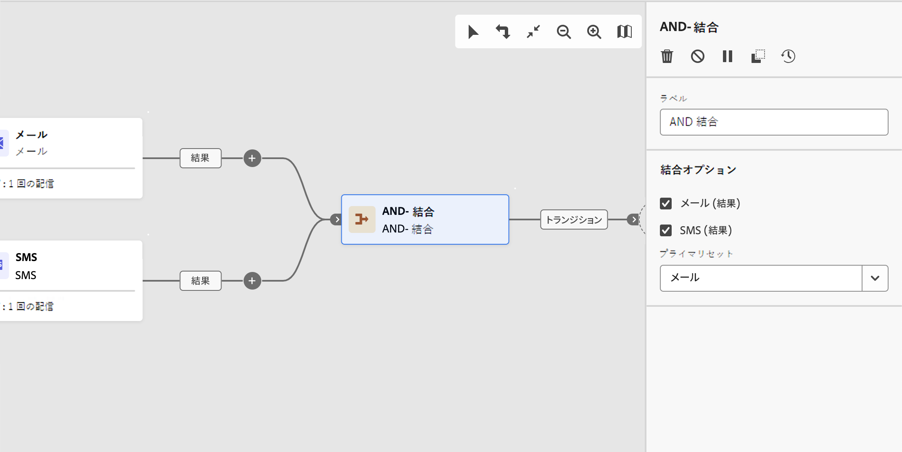
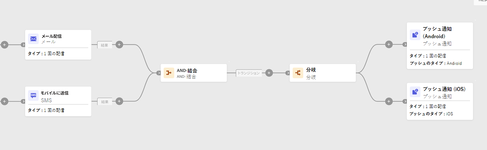

# AND 結合 {#join}

>[!CONTEXTUALHELP]
>id="acw_orchestration_and-join"
>title="「AND 結合」アクティビティ"
>abstract="**AND 結合**&#x200B;アクティビティを使用すると、ワークフローの複数の実行分岐を同期できます。前のアクティビティがすべて完了するとトリガーされます。これにより、ワークフローを続行する前に、特定のアクティビティを確実に完了させるようにできます。"

**AND 結合**&#x200B;アクティビティは、**フロー制御**&#x200B;アクティビティです。これを使用すると、ワークフローの複数の実行分岐を同期できます。

このアクティビティは、すべてのインバウンドトランジションが有効化された（つまり、前のアクティビティがすべて終了した）ときにのみ、アウトバウンドトランジションをトリガーします。これにより、ワークフローを続行する前に、特定のアクティビティを確実に完了させるようにできます。

## AND 結合アクティビティの設定{#and-join-configuration}

>[!CONTEXTUALHELP]
>id="acw_orchestration_and-join_merging"
>title="AND 結合アクティビティの設定"
>abstract="結合するアクティビティを選択します。**プライマリセット**&#x200B;ドロップダウンで、保持するインバウンドトランジションの母集団を選択します。"

**AND 結合**&#x200B;アクティビティを設定するには、次の手順に従います。

1. チャネルアクティビティなど、複数のアクティビティを追加して、2 つ以上の異なる実行分岐を形成します。
1. **AND 結合**&#x200B;アクティビティを任意の分岐に追加します。
1. 「**結合オプション**」セクションで、結合する以前のアクティビティをすべて確認します。
1. **プライマリセット**&#x200B;ドロップダウンで、保持するインバウンドトランジションの母集団を選択します。アウトバウンドトランジションには、インバウンドトランジションの母集団の 1 つのみを含むことができます。

## 例{#and-join-example}

次の例は、メールと SMS 配信を含む 2 つのワークフロー分岐を示しています。両方のインバウンドトランジションが有効な場合、AND 結合がトリガーします。プッシュ通知は、両方の配信が完了した後にのみ送信されます。

