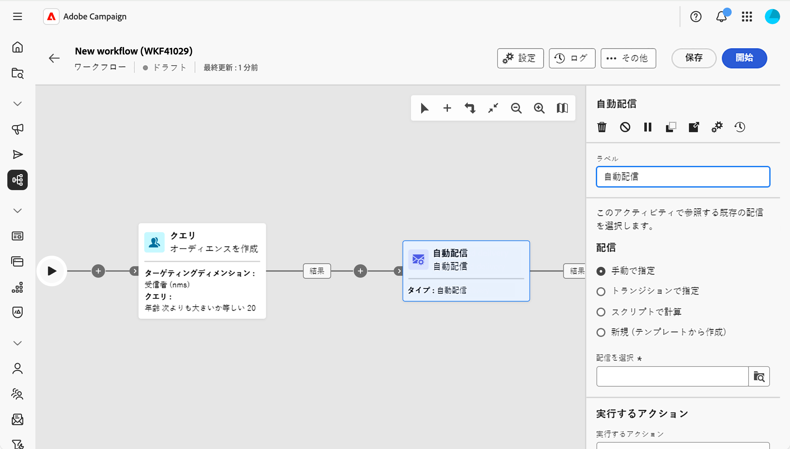
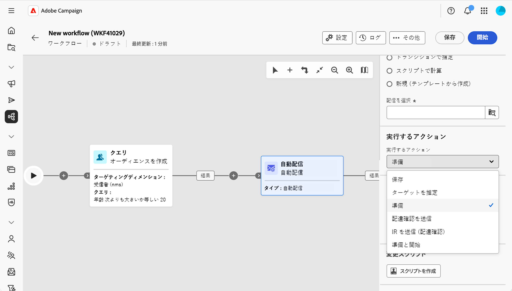
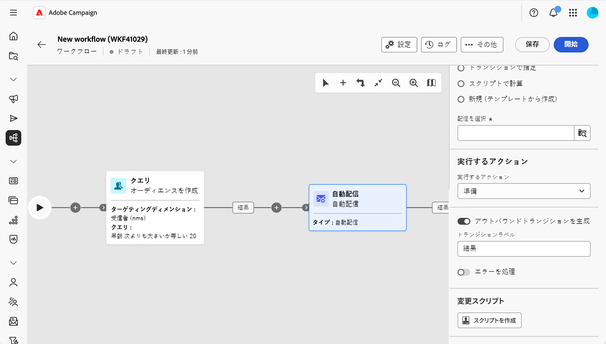

# 自動配信 {#automated-delivery}

>[!CONTEXTUALHELP]
>id="acw_homepage_welcome_rn4"
>title="配信アクティビティの自動化"
>abstract="自動配信ワークフローアクティビティがワークフローパレットで使用できるようになりました。 ワークフロー内で配信アクション（準備、プルーフの送信、準備、開始など）を直接作成または実行するために使用できます。"
>additional-url="https://experienceleague.adobe.com/docs/campaign-web/v8/release-notes/release-notes.html?lang=ja" text="リリースノートを参照してください"

>[!CONTEXTUALHELP]
>id="acw_orchestration_automated-delivery"
>title="配信アクティビティの自動化"
>abstract="**自動配信** アクティビティは、自動化に使用されます。ワークフローで配信を作成または再利用してから、実行するアクション（準備、準備、開始、プルーフの送信など）を選択します。 ワークフローの外部で作成された既存の明示的な配信を選択するか、アクティビティが実行されるたびにテンプレートから新しい配信を作成できます。"

**自動配信** アクティビティを使用すると、ワークフロー内で直接配信アクションを作成、設定、実行できます。 スケジュール上または自動フローの一部として定義済みの配信を実行する場合、またはアクティビティが実行されるたびにテンプレートから新しい配信を生成する場合に使用します。

<!--
**[Continuous delivery](continuous-delivery.md)** always uses a template. The first run creates one delivery; later runs send to new recipients through that same delivery. **Automated delivery** is different: you either reuse one existing delivery every run, or you create a new delivery from a template each time—so each run can be its own delivery if you want. 
-->

このアクティビティを設定するには、次の手順に従います。

1. 配信設定を定義します。[詳細情報](#delivery-settings)
1. 実行するアクションを選択します。[詳細情報](#action-to-execute)
1. トランジションを設定します。[詳細を読む](#transition-to-execute)
1. 修正スクリプトを定義します。[詳細情報](#script)

## 配信設定の定義 {#delivery-settings}

アクティビティを設定する際に、配信の送信元を選択します。 このセクションでは、次の2つのオプションを使用できます。

自動配信を示す{zoomable="yes"}

* スタンドアロン配信やキャンペーンから作成された配信など、既存の配信を操作する場合は、**明示的な配信**&#x200B;を選択します。 「**配信を選択**」ボタンを使用して配信を選択します。 ワークフローが実行され、このアクティビティに到達するたびに、**同じ**&#x200B;の配信に作用します。 実行ごとに新しい配信は作成されません。 アクティビティは、同じ配信を再利用します。 これは、スケジュールや承認ステップの後など、繰り返し準備または送信する配信が1つしかない場合に便利です。

<!-- by default, the list shows unfinished deliveries in the Deliveries folder. You can browse other folders to select a delivery from another campaign. You choose the action to perform (prepare, prepare and start, send a proof, and so on).-->

* アクティビティが実行されるたびに&#x200B;**new**&#x200B;配信を作成する場合は、「**New, created from a template**」を選択します。 「**テンプレートを選択**」ボタンを使用して、配信テンプレートを選択します。 各実行は、そのテンプレートに基づいて新しい配信を生成します。 このオプションは、各ワークフローの実行ごとに独自の配信を行う必要がある場合（1回の実行につき1通のメールなど）に使用します。

<!-- Unlike the Continuous delivery activity, there is no “append” to a previous execution—each run produces a separate delivery. -->

>[!NOTE]
>
>移行&#x200B;**で指定された**&#x200B;および&#x200B;**スクリプトで計算** オプションは、高度なユースケースに使用され、クライアントコンソールでのみ設定できます。 [Campaign v8 ドキュメント](https://experienceleague.adobe.com/ja/docs/campaign/automation/workflows/wf-activities/action-activities/delivery){target="_blank"}を参照してください。

## 実行するアクションを選択 {#action-to-execute}

このセクションでは、アクティビティで配信に対して行う処理を選択します。 次のオプションを使用できます。

自動配信で実行するアクションを示す{zoomable="yes"}

* **保存**：分析または送信せずに配信を作成および保存します。
* **ターゲットの見積もり**：配信ターゲットを計算して、その可能性を評価します（最初の分析フェーズ）。
* **Prepare**：完全な分析（ターゲット計算とコンテンツの準備）を実行します。 配信は送信されません。
* **プルーフを送信**：配信のプルーフを送信します。
* **準備と開始**：完全な分析（ターゲット計算とコンテンツ準備）を実行し、配信を送信します。

## トランジションの設定 {#transition-to-execute}

このセクションでは、アクティビティの後にトランジションを生成するかどうかを選択できます。 次のオプションを使用できます。

自動配信のトランジションを示す{zoomable="yes"}

* **アウトバウンドトランジションを生成**: アクティビティの完了時にアウトバウンドトランジションを生成します。
* **遷移ラベル**: キャンバスの遷移に表示されるラベルをカスタマイズできます。
* **プロセスエラー**：エラーを処理するための追加の移行を追加します。

## 修正スクリプトの定義 {#script}

スクリプトを使用して、アクティビティの動作（例：配信パラメーター（アクティビティラベルなど）を変更できます。 このアクティビティのカスタムロジックが必要な場合に使用します。

「**スクリプトを作成**」をクリックし、エディターで修正ロジックを記述します。

## 関連トピック {#related}

* [ワークフローアクティビティについて](about-activities.md)
* [連続配信](continuous-delivery.md)
* [メール, SMS, プッシュ, ダイレクトメールアクティビティ](channels.md)
* [配信テンプレート](../../msg/delivery-template.md)
