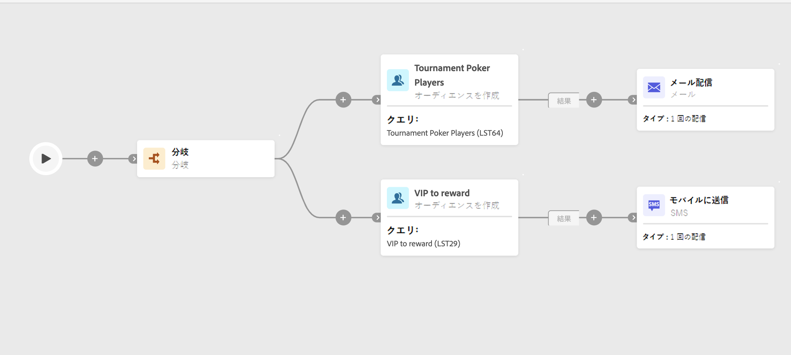
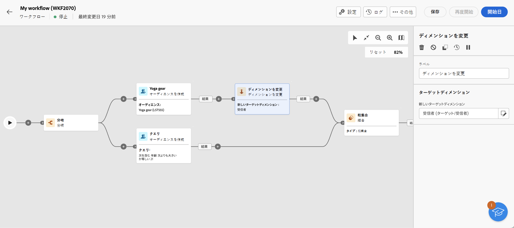

# オーディエンスを作成 {#build-audience}

>[!CONTEXTUALHELP]
>id="acw_orchestration_build_audience"
>title="オーディエンスアクティビティの作成"
>abstract="The **オーディエンスの構築** 「 」アクティビティでは、ワークフローに入るオーディエンスを定義できます。 ワークフローのコンテキストでメッセージを送信する場合、メッセージオーディエンスは、チャネルアクティビティではなく、 **オーディエンスの構築** アクティビティ。"

**オーディエンスを作成**&#x200B;アクティビティは、**ターゲティング**&#x200B;アクティビティです。このアクティビティを使用すると、ワークフローに入るオーディエンスを定義できます。ワークフローのコンテキストでメッセージを送信する場合、メッセージオーディエンスは、チャネルアクティビティではなく、 **オーディエンスの構築** アクティビティ。

オーディエンス母集団を定義するには、次の操作を実行します。

* クライアントコンソールでリストとして作成した既存のオーディエンスを選択します。
* Adobe Experience Platform オーディエンスを選択します。
* フィルタリング条件を定義し組み合わせて、ルールビルダーを使用して新しいオーディエンスを作成します。

>[!NOTE]
>
>このコンテキストでは、ファイルからオーディエンスを読み込むことはできません。この場合は、スタンドアロンの E メール配信を作成する必要があります。 [詳細情報](../../audience/about-audiences.md)

<!--
The **Build audience** activity can be placed at the beginning of the workflow or after any other activity. Any activity can be placed after the **Build audience**.
-->

## 「オーディエンスを作成」アクティビティを設定する

>[!CONTEXTUALHELP]
>id="acw_orchestration_build_audience_dimension"
>title="ターゲティングディメンションを選択"
>abstract="ターゲティングディメンションは、受信者、契約の受益者、オペレーター、サブスクライバーなど、ターゲットされる母集団を操作ごとに定義します。デフォルトでは、ターゲットが受信者から選択されます。"

**オーディエンスを作成**&#x200B;アクティビティを設定するには、次の手順に従います。

1. **オーディエンスを作成**&#x200B;アクティビティを追加します。
1. ラベルを定義します。
1. **独自に作成**&#x200B;または&#x200B;**オーディエンスを読み取り**&#x200B;のオーディエンスタイプを定義します。

独自のクエリを作成するには、さらに次の手順を行います。

1. 「**独自のクエリを作成**」を選択します。
1. 「**ターゲティングディメンション**」を選択します。ターゲティングディメンションは、受信者、契約の受益者、オペレーター、サブスクライバーなど、ターゲットされる母集団を操作ごとに定義します。デフォルトでは、ターゲットが受信者から選択されます。[v8 ドキュメント](https://experienceleague.adobe.com/docs/campaign/automation/workflows/introduction/wf-type/targeting-workflows.html?lang=ja#targeting-and-filtering-dimensions){target="_blank"}を参照してください。
1. 「**続行**」をクリックします。
1. 新しいメールをデザインする際にオーディエンスを作成するのと同じ方法で、ルールビルダーを使用してクエリを定義します。[こちら](../../audience/segment-builder.md)を参照してください。

既存のオーディエンスを選択するには、次の手順に従います。

1. 「**オーディエンスを読み取り**」を選択します。
1. 「**続行**」をクリックします。
1. 新しいメールをデザインする際にオーディエンスを使用するのと同じ方法で、オーディエンスを選択します。[こちら](../../audience/add-audience.md)を参照してください。

>[!IMPORTANT]
>
>を使用する場合、 **[!UICONTROL オーディエンスの構築]** Experience Platformオーディエンスをターゲットとするアクティビティには、 **[!UICONTROL ディメンションを変更]** アクティビティを作成して、オーディエンスのターゲティングディメンションが「受信者」に設定されていることを確認します。 このページの下部には、ワークフローの例が表示されます。

## 例

2 つの&#x200B;**オーディエンスを作成**&#x200B;アクティビティを使用したワークフローの例を次に示します。最初のアクティビティは、ポーカープレーヤーのオーディエンスをターゲットにし、次にメール配信が続きます。2 番目のアクティビティは VIP クライアントオーディエンスをターゲットにし、次に SMS 配信が続きます。

Adobe Experience PlatformオーディエンスとAdobe Campaignオーディエンスを組み合わせた別のワークフローの例を以下に示します。 これらのオーディエンスを組み合わせるには、 **[!UICONTROL ディメンションを変更]** 「受信者」ターゲティングディメンションを含むアクティビティは、Adobe Experience Platformオーディエンスの後に追加されます。 [「ディメンションを変更」アクティビティの設定方法を説明します](change-dimension.md)

