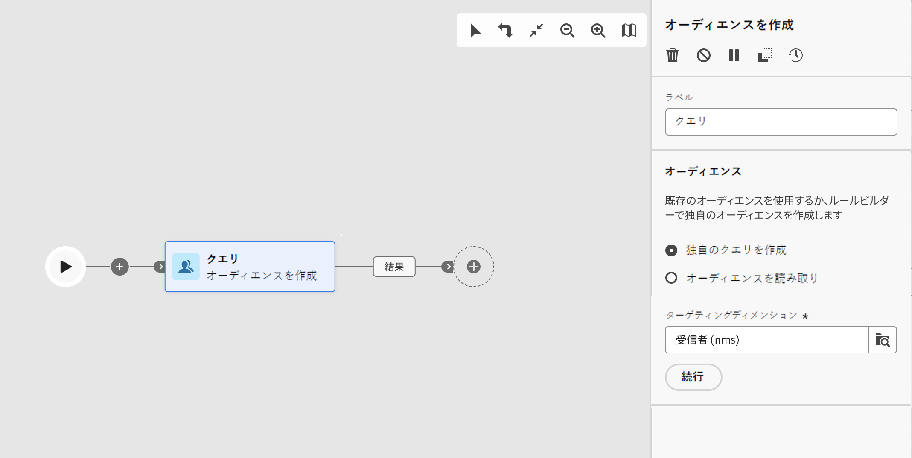

# オーディエンスを作成 {#build-audience}

>[!CONTEXTUALHELP]
>id="acw_orchestration_build_audience"
>title="オーディエンスを作成アクティビティ"
>abstract="**オーディエンスを作成**&#x200B;アクティビティを使用すると、ワークフローに入るオーディエンスを定義できます。ワークフローのコンテキストでメッセージを送信する場合、メッセージオーディエンスはチャネルアクティビティではなく、**オーディエンスを作成**&#x200B;アクティビティで定義されます。"

**オーディエンスを作成**&#x200B;アクティビティは、**ターゲティング**&#x200B;アクティビティです。このアクティビティを使用すると、ワークフローに入るオーディエンスを定義できます。ワークフローのコンテキストでメッセージを送信する場合、メッセージオーディエンスはチャネルアクティビティではなく、**オーディエンスを作成**&#x200B;アクティビティで定義されます。

オーディエンス母集団を定義するには、次の操作を実行します。

* クライアントコンソールでリストとして作成した既存のオーディエンスを選択します。
* Adobe Experience Platform オーディエンスを選択します。
* フィルタリング条件を定義および組み合わせて、Query Modeler Builder を使用して新しいオーディエンスを作成します。

>[!NOTE]
>
>このコンテキストでは、ファイルからオーディエンスを読み込むことはできません。この場合、スタンドアロンのメール配信を作成する必要があります。[詳細情報](../../audience/about-recipients.md)

<!--
The **Build audience** activity can be placed at the beginning of the workflow or after any other activity. Any activity can be placed after the **Build audience**.
-->

## オーディエンスを作成アクティビティの設定{#build-audience-configuration}

>[!CONTEXTUALHELP]
>id="acw_orchestration_build_audience_dimension"
>title="ターゲティングディメンションの選択"
>abstract="ターゲティングディメンションは、受信者、契約の受益者、オペレーター、サブスクライバーなど、ターゲットされる母集団を操作ごとに定義します。デフォルトでは、ターゲットが受信者から選択されます。"

**オーディエンスを作成**&#x200B;アクティビティを設定するには、次の手順に従います。

1. **オーディエンスを作成**&#x200B;アクティビティを追加します。
1. ラベルを定義します。
1. **独自に作成**&#x200B;または&#x200B;**オーディエンスを読み取り**&#x200B;のオーディエンスタイプを定義します。
1. 以下のタブに示す手順に従って、オーディエンスを設定します。

>[!BEGINTABS]

>[!TAB 独自の（クエリ）を作成]

独自のクエリを作成するには、次の手順に従います。

1. 「**独自のクエリを作成**」を選択します。
1. 「**ターゲティングディメンション**」を選択します。ターゲティングディメンションは、受信者、契約の受益者、オペレーター、サブスクライバーなど、ターゲットされる母集団を操作ごとに定義します。デフォルトでは、ターゲットが受信者から選択されます。[ターゲティングディメンションの詳細を説明します](../../audience/about-recipients.md#targeting-dimensions)
1. 「**続行**」をクリックします。
1. クエリモデラーを使用してクエリを定義します。新しい E メールをデザインする際に、オーディエンスを作成するのと同じ方法です。 [クエリモデラーの操作方法を説明します。](../../audience/../query/query-modeler-overview.md)

>[!TAB オーディエンスの閲覧]

既存のオーディエンスを選択するには、次の手順に従います。

1. 「**オーディエンスを読み取り**」を選択します。
1. 「**続行**」をクリックします。
1. 新しい配信をデザインする際にオーディエンスを使用する場合と同じ方法で、オーディエンスを選択します。 [こちら](../../audience/add-audience.md)を参照してください。

>[!IMPORTANT]
>
>Experience Platform オーディエンスをターゲットとする&#x200B;**[!UICONTROL オーディエンスを作成]**&#x200B;アクティビティを使用する場合は、その後に&#x200B;**[!UICONTROL ディメンションを変更]**&#x200B;アクティビティを追加して、オーディエンスのターゲティングディメンションが「受信者」に設定されていることを確認する必要があります。ワークフローの例は、このページの下部にあります。

>[!ENDTABS]

## 例{#build-audience-examples}

2 つの&#x200B;**オーディエンスを作成**&#x200B;アクティビティを使用したワークフローの例を次に示します。最初のアクティビティは、ポーカープレーヤーのオーディエンスをターゲットにし、次にメール配信が続きます。2 番目のアクティビティは VIP クライアントオーディエンスをターゲットにし、次に SMS 配信が続きます。

Adobe Experience Platform オーディエンスと Adobe Campaign オーディエンスを組み合わせた別のワークフローの例を以下に示します。これらのオーディエンスを組み合わせるには、「受信者」ターゲティングディメンションを含む&#x200B;**[!UICONTROL ディメンションを変更]**&#x200B;アクティビティを Adobe Experience Platform オーディエンスの後に追加します。[詳しくは、ディメンションを変更アクティビティの設定方法を参照してください](change-dimension.md)

